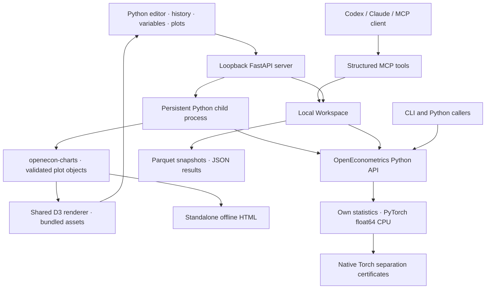

# OpenEconometrics workbench architecture

<!-- BEGIN source-generated capability scope -->
Current source: **157 registered fit names**, **92 Dataset fit routes**, **74 common saved predict/margins adapters**. The [generated method/option inventory](capabilities.md) states conditions, exclusions and devices.

Fit routes, common prediction adapters and family-specific helpers/forecasts have separate contracts. Source implementation does not establish independent scientific validation, installed-package verification or public shipment for a method/option. Those require their own dated, source-pinned evidence; historical measurements retain their original scope.
<!-- END source-generated capability scope -->

OpenEconometrics's primary interaction is writing Python in a local, persistent session.
The same statistical library also serves structured CLI, HTTP and MCP calls.
Statistical specifications describe the model; there is one PyTorch float64 CPU
implementation and no user-facing engine selector.

The child process shares the local user's operating-system permissions. Process
separation permits interruption and recovery, but it is not a security sandbox.
MCP exposes only structured tools and cannot submit arbitrary console code.

## Source map

| Component | Responsibility |
| --- | --- |
| `models.py` | Strict statistical specification and persistable result contracts; text summaries |
| `analysis.py` | Generic input coercion, sample selection, categorical coding, inference and provenance |
| `engines/torch_engine.py` | Float64 QR/likelihood estimation and covariance |
| `engines/{distributions,linalg,covariance,absorb,optimize}.py` | Shared kernels: reference distributions, weighted QR least squares, sandwich meats, fixed-effect absorption, Newton/BFGS maximizers |
| `econometrics/registry.py` | Torch-free catalogue of every estimator; validates `ModelSpec`, drives `fit` and `capabilities` |
| `econometrics/core.py` | Shared sample/design/result layer for registry estimators (`ModelFrame`, `build_result`) |
| `econometrics/<family>/` | Estimator families (linear, panel, IV, GLM, ...); see [econometrics/coverage.md](econometrics/coverage.md) |
| `engines/contracts.py` | Internal numerical results and explicit errors |
| `data.py` | Bounded file loading, compatible hashes, profiles and frozen synthetic fixture |
| `workspace.py` | Local snapshots, integrity checks, structured result persistence and replay exports |
| Console worker and API | Persistent namespace, stdout/results, execution history, timeout, interrupt and reset |
| `packages/openecon-charts` | Independent dependency-free Python chart API, bundled D3 renderer, HTML export |
| `plotting.py` | Compatibility re-exports of the independent chart package |
| `server.py` | Loopback HTTP, session tokens, origin checks and console/structured routes |
| `mcp_server.py` | Dataset IDs, compact model summaries and bounded explicit previews |
| `web/src` | Code editor, command history, results, variable/data inspector and the shared D3 chart host |

## Execution semantics

Commands execute as actual Python in the worker's persistent namespace. The final
expression is displayed automatically; `display(...)` permits multiple outputs.
Tables and OpenEconometrics plot objects have rich representations. The worker preserves
variables after successful commands and ordinary Python exceptions. It does not
undo statements executed before an exception. Stop, timeout and reset terminate
the process; a fresh worker starts without the former variables. History is
persisted locally, but an in-memory session is not restored after server restart.

Console output is bounded: captured Python stdout is limited to 64 KiB, a command returns at most
20 display outputs, table previews have at most 50 rows and 30 columns, and saved
history is limited to 500 records and 8 MiB in total; oldest records expire when
either bound is reached. Local desktop commands have no automatic deadline;
an explicit timeout remains optional and Stop terminates the worker. Cloud
console sessions retain the 60-second default and 120-second maximum. There is
no hard local memory quota or arbitrary-code sandbox.

Workspace fits and MCP `run_analysis` use their synchronous path. Per-process
serialization is not a global queue across independent processes. MCP background
jobs instead use a workspace OS lease and a spawned, interruptible worker, with
durable request IDs and staged publication. Job status/cancellation use a separate
record lock so they do not wait for estimation. Synchronous fits and console
computations do not participate in that background-job lease. Console code
can call the library directly and manipulate arbitrary local files; its session
history must not be confused with immutable structured analysis records.

## Scientific and storage boundaries

The library accepts pandas DataFrames, dictionaries of columns and lists of
records. The registered Dataset subset has replayable CSV/Parquet fitting routes
through `oe.scan()`, subject to its explicit option contracts; other registered
estimators require resident inputs. Large numeric
DataFrames can route to the bounded TSQR estimator. See the source-generated
[current capability inventory](capabilities.md) and [streaming contracts](streaming.md). Every fit
uses the same public model checks and native statistical implementation.
Missing-row policy, category references, covariance settings, degrees of freedom,
solver diagnostics and exact estimation counts are recorded. Dense fits retain
all estimation positions; streaming fits retain positional hashes and up to 400
prediction rows. Generic column
names and datasets are supported; the 480-row wage example is a frozen teaching
fixture, not a special analysis mode.

PyTorch supplies numerical primitives. OpenEconometrics implements estimator and inference
logic, including native float64 separation certificates. SciPy and third-party
estimators are development reference oracles; frozen desktop packaging excludes
SciPy. pandas provides tabular interoperability. Runtime packages retain
transitive NumPy dependencies. Removing a NumPy estimator does not remove all
NumPy code from the environment.

Saved snapshots and results preserve original provenance. Old result JSON is not
silently relabeled as the current engine. The current strict model schema rejects
removed execution selectors; users needing an exact old replay must use the
recorded historical OpenEcon version and environment.

## Chart rendering boundary

The console returns JSON plot specifications, not arbitrary browser code. The
web interface loads the chart package's CSS, D3 and renderer from `/chart-assets`.
It destroys chart observers/listeners when an output unmounts and invalidates
pending mounts. The same package assets are embedded in standalone HTML exports,
so Python scripts and the workbench share the renderer. Source data remain local.

The chart library uses standard Python adapters and performs no statistical
estimation. Category helpers require explicit aggregation by the caller; the
renderer does not infer business metrics or materiality thresholds. Numeric
lines use numeric x distances, histograms count all valid observations and
coefficient plots use model-provided confidence intervals. Missing observations
and sampling metadata are retained. Dependency licenses ship with the package.

## Remaining work

Full process memory isolation and recovery of in-memory Python variables remain
separate work. Panel, IV/GMM, weighted, time-series and survival estimators already
have registered native routes; their documented restrictions remain explicit.
Survey and imputation procedures have separate resident helper/result contracts;
registration alone does not establish their Dataset support. Broader SEM remains
a separate scope. Common saved prediction
currently covers a subset of estimator names; family-specific forecasts and helpers
are separate. The [generated inventory](capabilities.md) is the current source of
counts, options and devices. Full Stata coverage requires per-method sample,
coefficient, covariance, inference and failure-contract comparisons.

See [native-engine.md](native-engine.md) for numerical methods and
[performance.md](performance.md) for explicitly historical performance records.
