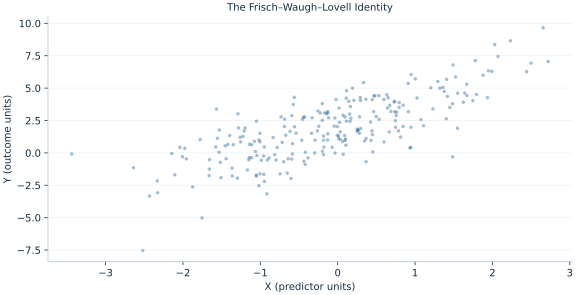

# Lab 01 · The Frisch–Waugh–Lovell Identity

> Why can residualizing both outcome and exposure recover a controlled regression slope?

## Start with the supplied observations

Download [partialling_out.xlsx](partialling_out.xlsx) and [the complete Python analysis](lab.py). Import the workbook into OpenEconometrics without renaming it. Open the complete Python file in an empty Python document and run the whole file. The first sheet, **Data**, contains the observations. **Dictionary** explains variables, coding, units and missing cells.

For ordinary Python, keep the workbook beside `lab.py`. For another location, use `from lab import run_lab`, then `run_lab(data_path="/path/to/partialling_out.xlsx")`. Keep the supplied workbook intact and use a copy for transformations. The [LaTeX result table](table.tex) accompanies the chapter.

The workbook contains **240 original synthetic observations**. Its observational unit is: One synthetic independent unit; dependence is stated explicitly where groups are supplied. These are teaching observations, not an empirical estimate about an actual business, population or policy. Every student starts from the same stored values and missing cells.

| Variable | Meaning | Unit or coding | Missing cells |
|---|---|---|---:|
| `row_id` | Stable record identifier | integer ID | 0 |
| `x` | Exposure or predictor X | centered units | 0 |
| `z` | Observed covariate Z | centered units | 0 |
| `y` | Outcome | outcome units | 0 |

## 1. Build the comparison

Multiple regression compares exposure variation remaining after linear controls. FWL makes that comparison explicit: remove the projection on the intercept and Z from both X and Y, then regress the residualized outcome on residualized exposure without adding another intercept.

The coefficient identity is exact for the same sample and linear least squares. It does not imply that a naive residual regression reports the correct standard error, because degrees of freedom and leverage must reflect the original model. This chapter takes HC3 uncertainty from the full fitted model while using residualization to explain the slope.

$$
\hat\beta_x=(x^TM_Zx)^{-1}x^TM_Zy,\quad M_Z=I-Z(Z^TZ)^{-1}Z^T.
$$

Z includes the constant and observed control. Orthogonal projection makes residual X uncorrelated with those columns. Multiplying the normal equations by the annihilator leaves one exposure coefficient. Use identical rows in all three regressions.

## 2. State the assumptions and sample

The design has full column rank and the same 240 complete rows in all projections. Exogeneity is supplied by the synthetic mechanism; it does not follow from residualization itself. HC3 assumes independent observational units.

**Pause before running.** Should the two slopes differ?

## 3. Follow the application

The complete file loads the supplied observations, applies the chapter's explicit sample rule, computes the procedure and displays the result, a chart and a compact numerical table. The following shortened call highlights the statistical operation. `load_data()` and the other chapter helpers are defined in the full file; run that file before using the snippet.

```python
import openecon as oe

raw = load_data()
full = fit(raw, ["x", "z"])
outcome_controls = fit(raw, ["z"])
exposure_controls = fit(raw, ["z"], y="x")
display(full)
```

Read the output in this order: establish which observations were used, identify the quantity being compared, inspect the amount of variation or uncertainty, and then interpret the result in the units of the question. A large statistic without its denominator, sample and comparison cannot explain the result. The final numerical table puts the quantities used in the worked discussion together; the procedure output retains the fuller set of tables.

## 4. Interpret the executed example

| Quantity | Computed value |
|---|---:|
| Full x slope | 1.18823 |
| Residualized x slope | 1.18823 |
| Full x hc3 se | 0.111878 |
| Observations | 240 |

The full slope is 1.18823 and the residualized slope 1.18823. The full-model HC3 SE is 0.111878. Equality of slopes explains a computation, while the SE still belongs to the full specification.



The plotted coordinates come from the same retained observations and calculations as the saved result. A visual pattern is a diagnostic to interpret under the chapter’s assumptions; it does not substitute for the covariance, sample definition or identification argument.

## 5. Decide what the evidence supports

Partialling out is an algebraic identity. It does not remove unobserved confounding or justify using residual-regression degrees of freedom for the original model.

## 6. Try it yourself

**A.** Should the two slopes differ?

**B.** What belongs in Z?

**C.** Where should inference be taken from?

**D.** Does FWL establish causality?

## Further reading

[Bruce Hansen’s Econometrics](https://users.ssc.wisc.edu/~behansen/econometrics/) provides optional advanced reading. The examples, synthetic mechanisms and exercises here are original; no textbook datasets, figures or exercise solutions are reproduced.
