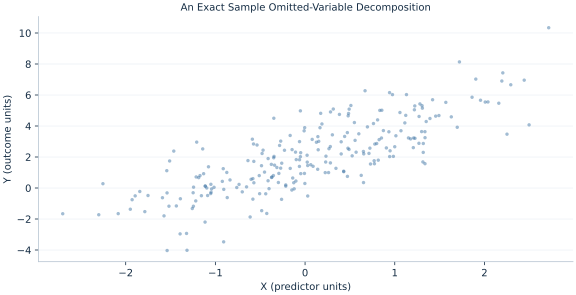

# Lab 02 · An Exact Sample Omitted-Variable Decomposition

> How does omitting a correlated control change a regression coefficient?

## Start with the supplied observations

Download [omitted_variable_bias.xlsx](omitted_variable_bias.xlsx) and [the complete Python analysis](lab.py). Import the workbook into OpenEconometrics without renaming it. Open the complete Python file in an empty Python document and run the whole file. The first sheet, **Data**, contains the observations. **Dictionary** explains variables, coding, units and missing cells.

For ordinary Python, keep the workbook beside `lab.py`. For another location, use `from lab import run_lab`, then `run_lab(data_path="/path/to/omitted_variable_bias.xlsx")`. Keep the supplied workbook intact and use a copy for transformations. The [LaTeX result table](table.tex) accompanies the chapter.

The workbook contains **240 original synthetic observations**. Its observational unit is: One synthetic independent unit; dependence is stated explicitly where groups are supplied. These are teaching observations, not an empirical estimate about an actual business, population or policy. Every student starts from the same stored values and missing cells.

| Variable | Meaning | Unit or coding | Missing cells |
|---|---|---|---:|
| `row_id` | Stable record identifier | integer ID | 0 |
| `x` | Exposure or predictor X | centered units | 0 |
| `z` | Observed covariate Z | centered units | 0 |
| `y` | Outcome | outcome units | 0 |

## 1. Build the comparison

An omitted variable affects a short-regression slope when it both predicts the outcome conditional on exposure and covaries with exposure. The omitted-variable formula is often presented as a population bias expression. On one common sample, least-squares projections also satisfy an exact decomposition of short and controlled slopes.

The decomposition uses the estimated full-model coefficient on Z and the auxiliary slope of Z on X. Its sign is their product. This is not a test that Z belongs in the model for a causal purpose: controls may be confounders, mediators or colliders, which require a substantive design decision.

$$
\hat b_x^{short}=\hat b_x^{full}+\hat b_z^{full}\hat\pi_x,\quad z_i=\pi_0+\pi_xx_i+v_i.
$$

Substitute the full fitted equation into the short regression. The full residual is orthogonal to X, leaving the projected contribution of Z. Common rows and intercept conventions are essential to the identity.

## 2. State the assumptions and sample

The three regressions use exactly the same complete data and intercept. Synthetic Z is correlated with X and enters the outcome mechanism. HC3 uncertainty is retained separately for every fitted equation.

**Pause before running.** Predict the sign of the gap.

## 3. Follow the application

The complete file loads the supplied observations, applies the chapter's explicit sample rule, computes the procedure and displays the result, a chart and a compact numerical table. The following shortened call highlights the statistical operation. `load_data()` and the other chapter helpers are defined in the full file; run that file before using the snippet.

```python
import openecon as oe

raw = load_data()
short = fit(raw, ["x"])
full = fit(raw, ["x", "z"])
auxiliary = fit(raw, ["x"], y="z")
gap = coef(full, "z").estimate * coef(auxiliary, "x").estimate
display(full)
print("Decomposed slope gap:", gap)
```

Read the output in this order: establish which observations were used, identify the quantity being compared, inspect the amount of variation or uncertainty, and then interpret the result in the units of the question. A large statistic without its denominator, sample and comparison cannot explain the result. The final numerical table puts the quantities used in the worked discussion together; the procedure output retains the fuller set of tables.

## 4. Interpret the executed example

| Quantity | Computed value |
|---|---:|
| Short x slope | 1.76993 |
| Controlled x slope | 1.22427 |
| Z slope in full | 0.735798 |
| Z on x slope | 0.741588 |
| Observed slope gap | 0.545659 |
| Decomposed gap | 0.545659 |

The short slope is 1.76993 versus controlled 1.22427. Their gap 0.545659 equals the product 0.545659 from the full Z slope and the Z-on-X slope.



The plotted coordinates come from the same retained observations and calculations as the saved result. A visual pattern is a diagnostic to interpret under the chapter’s assumptions; it does not substitute for the covariance, sample definition or identification argument.

## 5. Decide what the evidence supports

An exact sample decomposition is not a generic justification for adding every available variable. A control’s causal role and measurement quality matter.

## 6. Try it yourself

**A.** Predict the sign of the gap.

**B.** Verify the arithmetic decomposition.

**C.** What if X and Z are sample-uncorrelated?

**D.** Should a post-treatment mediator always be controlled?

## Further reading

[Bruce Hansen’s Econometrics](https://users.ssc.wisc.edu/~behansen/econometrics/) provides optional advanced reading. The examples, synthetic mechanisms and exercises here are original; no textbook datasets, figures or exercise solutions are reproduced.
