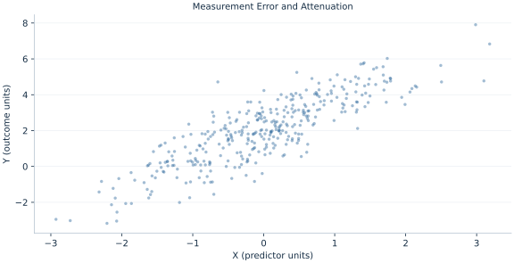

# Lab 03 · Measurement Error and Attenuation

> Why can noisy exposure measurement shrink an ordinary regression slope?

## Start with the supplied observations

Download [measurement_error.xlsx](measurement_error.xlsx) and [the complete Python analysis](lab.py). Import the workbook into OpenEconometrics without renaming it. Open the complete Python file in an empty Python document and run the whole file. The first sheet, **Data**, contains the observations. **Dictionary** explains variables, coding, units and missing cells.

For ordinary Python, keep the workbook beside `lab.py`. For another location, use `from lab import run_lab`, then `run_lab(data_path="/path/to/measurement_error.xlsx")`. Keep the supplied workbook intact and use a copy for transformations. The [LaTeX result table](table.tex) accompanies the chapter.

The workbook contains **360 original synthetic observations**. Its observational unit is: One synthetic independent unit; dependence is stated explicitly where groups are supplied. These are teaching observations, not an empirical estimate about an actual business, population or policy. Every student starts from the same stored values and missing cells.

| Variable | Meaning | Unit or coding | Missing cells |
|---|---|---|---:|
| `row_id` | Stable record identifier | integer ID | 0 |
| `x` | Latent exposure, visible for teaching | units | 0 |
| `observed_x` | Exposure plus independent error | units | 0 |
| `y` | Outcome | outcome units | 0 |

## 1. Build the comparison

Classical measurement error adds mean-zero noise independent of the latent exposure and structural disturbance. Covariance between observed exposure and outcome preserves the latent signal, while observed exposure variance gains the noise variance. Their ratio therefore shrinks the population slope toward zero.

The supplied workbook reveals latent exposure only to permit a teaching benchmark. A real researcher often cannot observe it. The attenuation formula is a population statement; realized slopes need not equal the reliability prediction exactly in a finite sample because sample cross-covariances are not exactly zero.

$$
w=x+v,\quad plim\hat b_w=\beta\frac{Var(x)}{Var(x)+Var(v)};\quad \beta=1.5,\ Var(x)=Var(v)=1.
$$

Compute Cov(w,y)/Var(w) under independence. The numerator is β Var(x), while the denominator is Var(x)+Var(v). Equal population variances give a reliability of one half and an attenuation target .75.

## 2. State the assumptions and sample

The simulation uses independent unit-variance latent X, measurement error and outcome error. Both regressions use the same 360 rows. Latent X is labeled as visible for teaching rather than an available empirical control.

**Pause before running.** What is the population target?

## 3. Follow the application

The complete file loads the supplied observations, applies the chapter's explicit sample rule, computes the procedure and displays the result, a chart and a compact numerical table. The following shortened call highlights the statistical operation. `load_data()` and the other chapter helpers are defined in the full file; run that file before using the snippet.

```python
import openecon as oe

raw = load_data()
latent = fit(raw, ["x"])
observed = fit(raw, ["observed_x"])
display(latent)
display(observed)
```

Read the output in this order: establish which observations were used, identify the quantity being compared, inspect the amount of variation or uncertainty, and then interpret the result in the units of the question. A large statistic without its denominator, sample and comparison cannot explain the result. The final numerical table puts the quantities used in the worked discussion together; the procedure output retains the fuller set of tables.

## 4. Interpret the executed example

| Quantity | Computed value |
|---|---:|
| Latent slope | 1.55595 |
| Observed slope | 0.823586 |
| Sample variance reliability | 0.528187 |
| Population attenuation target | 0.75 |
| Observations | 360 |

Latent-regression slope is 1.55595; noisy-exposure slope 0.823586. The sample variance reliability is 0.528187 and the population noisy-slope target 0.75. Differences from the target reflect this finite realization.



The plotted coordinates come from the same retained observations and calculations as the saved result. A visual pattern is a diagnostic to interpret under the chapter’s assumptions; it does not substitute for the covariance, sample definition or identification argument.

## 5. Decide what the evidence supports

Nonclassical error can bias estimates in other directions. HC3 does not correct measurement bias, and an estimated reliability from an unvalidated proxy is not automatically known.

## 6. Try it yourself

**A.** What is the population target?

**B.** Why need the sample noisy slope not equal .75?

**C.** Does HC3 restore the latent slope?

**D.** Could outcome measurement error behave differently?

## Further reading

[Bruce Hansen’s Econometrics](https://users.ssc.wisc.edu/~behansen/econometrics/) provides optional advanced reading. The examples, synthetic mechanisms and exercises here are original; no textbook datasets, figures or exercise solutions are reproduced.
