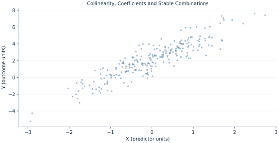

# Lab 04 · Collinearity, Coefficients and Stable Combinations

> Why can individual slopes be uncertain while their sum is estimated well?

## Start with the supplied observations

Download [collinearity.xlsx](collinearity.xlsx) and [the complete Python analysis](lab.py). Import the workbook into OpenEconometrics without renaming it. Open the complete Python file in an empty Python document and run the whole file. The first sheet, **Data**, contains the observations. **Dictionary** explains variables, coding, units and missing cells.

For ordinary Python, keep the workbook beside `lab.py`. For another location, use `from lab import run_lab`, then `run_lab(data_path="/path/to/collinearity.xlsx")`. Keep the supplied workbook intact and use a copy for transformations. The [LaTeX result table](table.tex) accompanies the chapter.

The workbook contains **240 original synthetic observations**. Its observational unit is: One synthetic independent unit; dependence is stated explicitly where groups are supplied. These are teaching observations, not an empirical estimate about an actual business, population or policy. Every student starts from the same stored values and missing cells.

| Variable | Meaning | Unit or coding | Missing cells |
|---|---|---|---:|
| `row_id` | Stable record identifier | integer ID | 0 |
| `x` | Exposure or predictor X | centered units | 0 |
| `z` | Observed covariate Z | centered units | 0 |
| `y` | Outcome | outcome units | 0 |

## 1. Build the comparison

When regressors nearly move together, little independent variation distinguishes their separate effects. The design remains identified if columns are not exactly collinear, but small data changes can produce large movements in individual coefficients. Predictions along the observed common direction can remain relatively stable.

The variance of a coefficient sum includes twice their covariance. Near-collinear slopes often have strongly negative estimation covariance: increasing one and decreasing the other gives similar fitted values. Reading only separate standard errors misses that a combination can be precise.

$$
Var(\hat\beta_x+\hat\beta_z)=V_{xx}+V_{zz}+2V_{xz}.
$$

Construct the contrast vector with ones for X and Z and zero for the intercept, then compute c′Vc. The same covariance matrix that produces large separate standard errors can yield a small standard error for their sum.

## 2. State the assumptions and sample

Z equals X plus small independent variation; the design is full rank. Errors are independent across rows, HC3 is used and the covariance matrix is retained in full. No regularization is applied.

**Pause before running.** Can separate SEs simply be added?

## 3. Follow the application

The complete file loads the supplied observations, applies the chapter's explicit sample rule, computes the procedure and displays the result, a chart and a compact numerical table. The following shortened call highlights the statistical operation. `load_data()` and the other chapter helpers are defined in the full file; run that file before using the snippet.

```python
import openecon as oe

raw = load_data()
model = fit(raw, ["x", "z"])
combination = oe.lincom(model, {"x": 1., "z": 1.})
display(model)
print("Sum and its covariance-based inference:", combination)
```

Read the output in this order: establish which observations were used, identify the quantity being compared, inspect the amount of variation or uncertainty, and then interpret the result in the units of the question. A large statistic without its denominator, sample and comparison cannot explain the result. The final numerical table puts the quantities used in the worked discussion together; the procedure output retains the fuller set of tables.

## 4. Interpret the executed example

| Quantity | Computed value |
|---|---:|
| X coefficient | 0.163617 |
| Z coefficient | 1.86823 |
| X se | 2.06762 |
| Z se | 2.06274 |
| Sum coefficient | 2.03184 |
| Sum se | 0.0645731 |
| X z correlation | 0.999558 |

X/Z correlation is 0.999558. Separate slopes 0.163617 and 1.86823 have SEs 2.06762 and 2.06274. Their sum is 2.03184 with SE 0.0645731, using the covariance term.



The plotted coordinates come from the same retained observations and calculations as the saved result. A visual pattern is a diagnostic to interpret under the chapter’s assumptions; it does not substitute for the covariance, sample definition or identification argument.

## 5. Decide what the evidence supports

High collinearity does not itself cause endogeneity, and deleting a substantively required control can introduce bias. Precision depends on the contrast of interest and where predictions are made.

## 6. Try it yourself

**A.** Can separate SEs simply be added?

**B.** Is the design exactly singular?

**C.** Why may predictions be stable?

**D.** Does collinearity prove causal bias?

## Further reading

[Bruce Hansen’s Econometrics](https://users.ssc.wisc.edu/~behansen/econometrics/) provides optional advanced reading. The examples, synthetic mechanisms and exercises here are original; no textbook datasets, figures or exercise solutions are reproduced.
