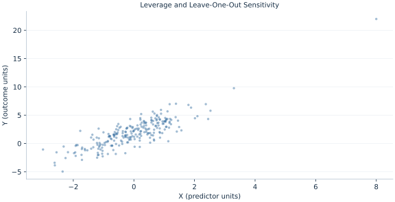

# Lab 05 · Leverage and Leave-One-Out Sensitivity

> How do unusual predictor values affect a fit and its uncertainty?

## Start with the supplied observations

Download [leverage_influence.xlsx](leverage_influence.xlsx) and [the complete Python analysis](lab.py). Import the workbook into OpenEconometrics without renaming it. Open the complete Python file in an empty Python document and run the whole file. The first sheet, **Data**, contains the observations. **Dictionary** explains variables, coding, units and missing cells.

For ordinary Python, keep the workbook beside `lab.py`. For another location, use `from lab import run_lab`, then `run_lab(data_path="/path/to/leverage_influence.xlsx")`. Keep the supplied workbook intact and use a copy for transformations. The [LaTeX result table](table.tex) accompanies the chapter.

The workbook contains **240 original synthetic observations**. Its observational unit is: One synthetic independent unit; dependence is stated explicitly where groups are supplied. These are teaching observations, not an empirical estimate about an actual business, population or policy. Every student starts from the same stored values and missing cells.

| Variable | Meaning | Unit or coding | Missing cells |
|---|---|---|---:|
| `row_id` | Stable record identifier | integer ID | 0 |
| `x` | Exposure or predictor X | centered units | 0 |
| `z` | Observed covariate Z | centered units | 0 |
| `y` | Outcome | outcome units | 0 |

## 1. Build the comparison

Leverage measures how strongly a row’s predictor location can influence its own fitted value. It depends on the design matrix, not on the outcome. An observation can have high leverage with a small residual; influence combines leverage with outcome discrepancy.

The chapter deliberately includes one flagged synthetic row. It reports a leave-one-out sensitivity comparison without declaring the row invalid. HC3 scales residual contributions by 1/(1−h), increasing covariance contributions from high-leverage observations. This adjustment is not the same as deleting an observation.

$$
h_i=x_i^T(X^TX)^{-1}x_i,\quad \sum_i h_i=k,\quad HC3:\ e_i^2/(1-h_i)^2.
$$

Calculate the diagonal of the projection matrix without forming its full n-by-n representation. Its trace equals the number of independent columns, three here. Fit the full data and an explicitly labeled sensitivity sample excluding row ID 1.

## 2. State the assumptions and sample

The flagged row is a valid synthetic stress observation, not a proven recording error. Both models retain full states, and the sensitivity model’s row positions refer to its reset analysis frame. HC3 still relies on independent units.

**Pause before running.** What is average leverage?

## 3. Follow the application

The complete file loads the supplied observations, applies the chapter's explicit sample rule, computes the procedure and displays the result, a chart and a compact numerical table. The following shortened call highlights the statistical operation. `load_data()` and the other chapter helpers are defined in the full file; run that file before using the snippet.

```python
import openecon as oe

raw = load_data()
full = fit(raw, ["x", "z"])
sensitivity = fit(raw.iloc[1:].reset_index(drop=True), ["x", "z"])
display(full)
display(sensitivity)
```

Read the output in this order: establish which observations were used, identify the quantity being compared, inspect the amount of variation or uncertainty, and then interpret the result in the units of the question. A large statistic without its denominator, sample and comparison cannot explain the result. The final numerical table puts the quantities used in the worked discussion together; the procedure output retains the fuller set of tables.

## 4. Interpret the executed example

| Quantity | Computed value |
|---|---:|
| Flagged row leverage | 0.264835 |
| Average leverage | 0.0125 |
| Flagged residual | 7.42763 |
| Hc3 scaled residual | 10.1033 |
| Full x slope | 1.5693 |
| Deleted x slope | 1.24042 |
| Slope change | -0.328882 |

Flagged leverage is 0.264835 versus average 0.0125. Its residual 7.42763 becomes 10.1033 in HC3 scaling. The X slope moves from 1.5693 to 1.24042 when the flagged row is omitted.



The plotted coordinates come from the same retained observations and calculations as the saved result. A visual pattern is a diagnostic to interpret under the chapter’s assumptions; it does not substitute for the covariance, sample definition or identification argument.

## 5. Decide what the evidence supports

Sensitivity does not justify removing a valid row merely to change significance. Data-quality evidence, sampling scope and robustness should be discussed separately.

## 6. Try it yourself

**A.** What is average leverage?

**B.** Does leverage depend on Y?

**C.** What does deletion change?

**D.** Does HC3 remove the row?

## Further reading

[Bruce Hansen’s Econometrics](https://users.ssc.wisc.edu/~behansen/econometrics/) provides optional advanced reading. The examples, synthetic mechanisms and exercises here are original; no textbook datasets, figures or exercise solutions are reproduced.
