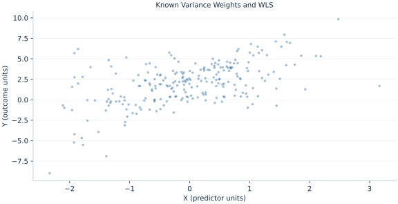

# Lab 06 · Known Variance Weights and WLS

> How do inverse-variance weights change a least-squares fit?

## Start with the supplied observations

Download [weighted_least_squares.xlsx](weighted_least_squares.xlsx) and [the complete Python analysis](lab.py). Import the workbook into OpenEconometrics without renaming it. Open the complete Python file in an empty Python document and run the whole file. The first sheet, **Data**, contains the observations. **Dictionary** explains variables, coding, units and missing cells.

For ordinary Python, keep the workbook beside `lab.py`. For another location, use `from lab import run_lab`, then `run_lab(data_path="/path/to/weighted_least_squares.xlsx")`. Keep the supplied workbook intact and use a copy for transformations. The [LaTeX result table](table.tex) accompanies the chapter.

The workbook contains **240 original synthetic observations**. Its observational unit is: One synthetic independent unit; dependence is stated explicitly where groups are supplied. These are teaching observations, not an empirical estimate about an actual business, population or policy. Every student starts from the same stored values and missing cells.

| Variable | Meaning | Unit or coding | Missing cells |
|---|---|---|---:|
| `row_id` | Stable record identifier | integer ID | 0 |
| `x` | Exposure or predictor X | centered units | 0 |
| `z` | Observed covariate Z | centered units | 0 |
| `y` | Outcome | outcome units | 0 |
| `variance` | Known error variance | outcome units squared | 0 |
| `weight` | Inverse error variance | inverse outcome units squared | 0 |

## 1. Build the comparison

WLS minimizes a weighted residual sum of squares. If conditional error variances are known up to a common scale, inverse-variance weights put less weight on noisier observations and can improve efficiency. Multiplying outcome and every design column by sqrt(weight) converts WLS into ordinary least squares on transformed data.

Weights here are analytic precision weights, not replication counts or survey sampling probabilities. Their meaning determines the uncertainty convention. The classical OLS SE is retained as a deliberately misspecified homoskedastic comparison, while the WLS variance model matches the supplied mechanism.

$$
\hat\beta_W=(X^TWX)^{-1}X^TWy,\quad w_i=1/\sigma_i^2,\quad X_i^*=\sqrt{w_i}X_i.
$$

Transform the intercept column as well as the covariates and outcome. Omitting that transformed intercept would fit a different model. Scaling all analytic weights by the same positive constant leaves coefficient estimates unchanged.

## 2. State the assumptions and sample

The supplied variance column is known in the teaching mechanism, all weights are positive and rows independent. The model labels aweights explicitly. No claim is made that empirical precision weights are usually known.

**Pause before running.** Which rows receive less weight?

## 3. Follow the application

The complete file loads the supplied observations, applies the chapter's explicit sample rule, computes the procedure and displays the result, a chart and a compact numerical table. The following shortened call highlights the statistical operation. `load_data()` and the other chapter helpers are defined in the full file; run that file before using the snippet.

```python
import openecon as oe

raw = load_data()
weighted = fit(raw, ["x", "z"], covariance="nonrobust",
               weights="weight", weight_type="aweight")
display(weighted)
```

Read the output in this order: establish which observations were used, identify the quantity being compared, inspect the amount of variation or uncertainty, and then interpret the result in the units of the question. A large statistic without its denominator, sample and comparison cannot explain the result. The final numerical table puts the quantities used in the worked discussion together; the procedure output retains the fuller set of tables.

## 4. Interpret the executed example

| Quantity | Computed value |
|---|---:|
| Ols x | 1.44672 |
| Wls x | 1.44552 |
| Ols x classical se | 0.129896 |
| Wls x classical se | 0.151301 |
| Minimum weight | 0.057674 |
| Maximum weight | 0.992414 |

OLS X slope is 1.44672 with classical SE 0.129896; WLS gives 1.44552 with SE 0.151301. Weights range from 0.057674 to 0.992414. Independent transformed-design arithmetic reproduces the WLS coefficients.



The plotted coordinates come from the same retained observations and calculations as the saved result. A visual pattern is a diagnostic to interpret under the chapter’s assumptions; it does not substitute for the covariance, sample definition or identification argument.

## 5. Decide what the evidence supports

Misspecified weights can reduce efficiency or alter the appropriate covariance. Survey and frequency weights require their own contracts and must not be relabeled as precision weights.

## 6. Try it yourself

**A.** Which rows receive less weight?

**B.** Must the intercept also be transformed?

**C.** Does multiplying all weights by ten change coefficients?

**D.** Why is classical OLS SE only a comparison here?

## Further reading

[Bruce Hansen’s Econometrics](https://users.ssc.wisc.edu/~behansen/econometrics/) provides optional advanced reading. The examples, synthetic mechanisms and exercises here are original; no textbook datasets, figures or exercise solutions are reproduced.
