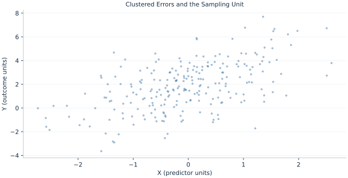

# Lab 07 · Clustered Errors and the Sampling Unit

> Which observations provide independent information when errors share a group shock?

## Start with the supplied observations

Download [clustered_inference.xlsx](clustered_inference.xlsx) and [the complete Python analysis](lab.py). Import the workbook into OpenEconometrics without renaming it. Open the complete Python file in an empty Python document and run the whole file. The first sheet, **Data**, contains the observations. **Dictionary** explains variables, coding, units and missing cells.

For ordinary Python, keep the workbook beside `lab.py`. For another location, use `from lab import run_lab`, then `run_lab(data_path="/path/to/clustered_inference.xlsx")`. Keep the supplied workbook intact and use a copy for transformations. The [LaTeX result table](table.tex) accompanies the chapter.

The workbook contains **240 original synthetic observations**. Its observational unit is: One synthetic observation within an independent cluster of six rows. These are teaching observations, not an empirical estimate about an actual business, population or policy. Every student starts from the same stored values and missing cells.

| Variable | Meaning | Unit or coding | Missing cells |
|---|---|---|---:|
| `row_id` | Stable record identifier | integer ID | 0 |
| `x` | Exposure or predictor X | centered units | 0 |
| `z` | Observed covariate Z | centered units | 0 |
| `y` | Outcome | outcome units | 0 |
| `group` | Independent cluster identifier | integer group ID | 0 |

## 1. Build the comparison

Rows within a group share an unobserved shock, so treating their score contributions as independent omits cross-products. Cluster covariance first adds scores within each group, then forms outer products of those group totals. Independent information for asymptotics comes from groups, not simply the row count.

Changing covariance leaves the OLS point estimates unchanged. The one-way cluster calculation uses its stated finite-sample correction and t inference with G−1 degrees of freedom. A cluster SE need not exceed HC3 for every coefficient in every realization; dependence and predictor patterns determine the difference.

$$
S_g=\sum_{i\in g}x_ie_i,\quad V_{cl}=\frac G{G-1}\frac{n-1}{n-k}(X^TX)^{-1}\sum_gS_gS_g^T(X^TX)^{-1}.
$$

Compare summing individual outer products with taking an outer product after within-group summation. The latter retains all within-cluster score cross-products. Use the group column for the covariance and report G explicitly.

## 2. State the assumptions and sample

There are 40 independent groups of six rows, with unrestricted within-group error dependence. Group identifiers are complete; covariance is one-way cluster with the documented finite-sample correction.

**Pause before running.** What is the independent count?

## 3. Follow the application

The complete file loads the supplied observations, applies the chapter's explicit sample rule, computes the procedure and displays the result, a chart and a compact numerical table. The following shortened call highlights the statistical operation. `load_data()` and the other chapter helpers are defined in the full file; run that file before using the snippet.

```python
import openecon as oe

raw = load_data()
clustered = fit(raw, ["x", "z"], covariance="cluster", cluster="group")
display(clustered)
```

Read the output in this order: establish which observations were used, identify the quantity being compared, inspect the amount of variation or uncertainty, and then interpret the result in the units of the question. A large statistic without its denominator, sample and comparison cannot explain the result. The final numerical table puts the quantities used in the worked discussion together; the procedure output retains the fuller set of tables.

## 4. Interpret the executed example

| Quantity | Computed value |
|---|---:|
| Rows | 240 |
| Independent clusters | 40 |
| X slope | 1.20802 |
| Hc3 x se | 0.0906793 |
| Cluster x se | 0.0874794 |
| Cluster inference df | 39 |

For 240 rows and 40 clusters, X slope=1.20802. HC3 SE is 0.0906793 and cluster SE 0.0874794. Cluster t inference uses 39 degrees of freedom.



The plotted coordinates come from the same retained observations and calculations as the saved result. A visual pattern is a diagnostic to interpret under the chapter’s assumptions; it does not substitute for the covariance, sample definition or identification argument.

## 5. Decide what the evidence supports

With very few clusters, ordinary cluster asymptotics may be unreliable. Choosing groups after searching for favorable significance does not supply a valid sampling design.

## 6. Try it yourself

**A.** What is the independent count?

**B.** Do covariance choices change the slope?

**C.** Which t degrees of freedom are used?

**D.** Must clustered SE always be larger?

## Further reading

[Bruce Hansen’s Econometrics](https://users.ssc.wisc.edu/~behansen/econometrics/) provides optional advanced reading. The examples, synthetic mechanisms and exercises here are original; no textbook datasets, figures or exercise solutions are reproduced.
