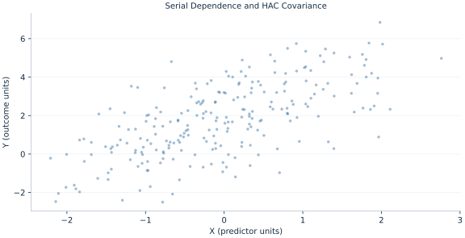

# Lab 08 · Serial Dependence and HAC Covariance

> How can uncertainty account for correlated scores over time?

## Start with the supplied observations

Download [hac_inference.xlsx](hac_inference.xlsx) and [the complete Python analysis](lab.py). Import the workbook into OpenEconometrics without renaming it. Open the complete Python file in an empty Python document and run the whole file. The first sheet, **Data**, contains the observations. **Dictionary** explains variables, coding, units and missing cells.

For ordinary Python, keep the workbook beside `lab.py`. For another location, use `from lab import run_lab`, then `run_lab(data_path="/path/to/hac_inference.xlsx")`. Keep the supplied workbook intact and use a copy for transformations. The [LaTeX result table](table.tex) accompanies the chapter.

The workbook contains **240 original synthetic observations**. Its observational unit is: One synthetic time observation. These are teaching observations, not an empirical estimate about an actual business, population or policy. Every student starts from the same stored values and missing cells.

| Variable | Meaning | Unit or coding | Missing cells |
|---|---|---|---:|
| `row_id` | Stable record identifier | integer ID | 0 |
| `x` | Exposure or predictor X | centered units | 0 |
| `z` | Observed covariate Z | centered units | 0 |
| `y` | Outcome | outcome units | 0 |
| `time` | Ordered observation time | integer period | 0 |

## 1. Build the comparison

HAC covariance estimates long-run score variation, adding lagged cross-products to contemporaneous variation. Bartlett weights decline linearly toward the chosen lag cutoff. This adjusts uncertainty for serially dependent and heteroskedastic disturbances under suitable weak-dependence conditions.

HAC does not alter OLS coefficients or remove dynamic misspecification. A chosen bandwidth is a modeling convention that must be reported. The supplied time column is regular and unique, so four calendar lags correspond to four consecutive observation gaps.

$$
\hat S=\Gamma_0+\sum_{\ell=1}^L(1-\ell/(L+1))(\Gamma_\ell+\Gamma_\ell^T),\quad V=\frac n{n-k}(X^TX)^{-1}\hat S(X^TX)^{-1}.
$$

Form score vectors xi ei and their lagged products. Add both orientations so the meat matrix is symmetric. The finite-sample factor n/(n−k) is retained here. Time order and gaps matter for deciding which scores form a lag pair.

## 2. State the assumptions and sample

Synthetic disturbances follow a stable AR(1) mechanism with coefficient .6; regressors are independent of shocks. The analysis uses Bartlett HAC with four lags and t inference on residual df. No unit-root or long-memory behavior is assumed.

**Pause before running.** Does HAC change the OLS slope?

## 3. Follow the application

The complete file loads the supplied observations, applies the chapter's explicit sample rule, computes the procedure and displays the result, a chart and a compact numerical table. The following shortened call highlights the statistical operation. `load_data()` and the other chapter helpers are defined in the full file; run that file before using the snippet.

```python
import openecon as oe

raw = load_data()
hac = fit(raw, ["x", "z"], covariance="hac", time="time", lags=4, kernel="bartlett")
display(hac)
```

Read the output in this order: establish which observations were used, identify the quantity being compared, inspect the amount of variation or uncertainty, and then interpret the result in the units of the question. A large statistic without its denominator, sample and comparison cannot explain the result. The final numerical table puts the quantities used in the worked discussion together; the procedure output retains the fuller set of tables.

## 4. Interpret the executed example

| Quantity | Computed value |
|---|---:|
| X slope | 1.26994 |
| Hc3 x se | 0.0708847 |
| Hac x se | 0.0614262 |
| Hac lags | 4 |
| Observations | 240 |

The slope is 1.26994 under both covariance choices. HC3 SE=0.0708847 and Bartlett-four HAC SE=0.0614262 across 240 periods.



The plotted coordinates come from the same retained observations and calculations as the saved result. A visual pattern is a diagnostic to interpret under the chapter’s assumptions; it does not substitute for the covariance, sample definition or identification argument.

## 5. Decide what the evidence supports

HAC is not a cure for omitted dynamics, endogenous regressors or nonstationarity. Different lag choices change the estimated covariance and should be sensitivity analyses rather than significance searches.

## 6. Try it yourself

**A.** Does HAC change the OLS slope?

**B.** What are the Bartlett weights for lags 1 and 4?

**C.** Which finite-sample correction is used?

**D.** Could HAC repair a spurious levels regression?

## Further reading

[Bruce Hansen’s Econometrics](https://users.ssc.wisc.edu/~behansen/econometrics/) provides optional advanced reading. The examples, synthetic mechanisms and exercises here are original; no textbook datasets, figures or exercise solutions are reproduced.
