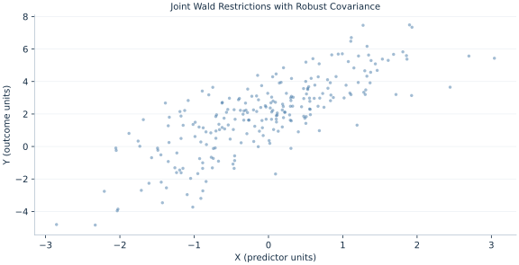

# Lab 09 · Joint Wald Restrictions with Robust Covariance

> Why is a joint test different from reading two individual p values?

## Start with the supplied observations

Download [joint_restrictions.xlsx](joint_restrictions.xlsx) and [the complete Python analysis](lab.py). Import the workbook into OpenEconometrics without renaming it. Open the complete Python file in an empty Python document and run the whole file. The first sheet, **Data**, contains the observations. **Dictionary** explains variables, coding, units and missing cells.

For ordinary Python, keep the workbook beside `lab.py`. For another location, use `from lab import run_lab`, then `run_lab(data_path="/path/to/joint_restrictions.xlsx")`. Keep the supplied workbook intact and use a copy for transformations. The [LaTeX result table](table.tex) accompanies the chapter.

The workbook contains **240 original synthetic observations**. Its observational unit is: One synthetic independent unit; dependence is stated explicitly where groups are supplied. These are teaching observations, not an empirical estimate about an actual business, population or policy. Every student starts from the same stored values and missing cells.

| Variable | Meaning | Unit or coding | Missing cells |
|---|---|---|---:|
| `row_id` | Stable record identifier | integer ID | 0 |
| `x` | Exposure or predictor X | centered units | 0 |
| `z` | Observed covariate Z | centered units | 0 |
| `y` | Outcome | outcome units | 0 |

## 1. Build the comparison

A joint null constrains several coefficients simultaneously. Its Wald statistic uses their covariance, so two separate t tests do not reproduce the joint comparison. Correlated estimation errors affect which combinations of deviations are unusual.

With t/F inference the quadratic Wald statistic is divided by the number of independent restrictions and compared with an F distribution. The same quadratic form is asymptotically chi-squared under normal inference. Naming the statistic and degrees of freedom avoids reporting a chi-square number with an F p value.

$$
W=(R\hat\beta-r)^T(RVR^T)^{-1}(R\hat\beta-r),\quad F=W/q,\quad H_0:\beta_x=\beta_z=0.
$$

R selects the two slope coefficients. Build their 2-by-2 covariance submatrix, invert that restriction covariance and form the quadratic statistic. The intercept is unrestricted; q=2, while denominator degrees of freedom come from the full model.

## 2. State the assumptions and sample

Both restrictions are linearly independent and estimable. HC3 covariance and t/F inference are retained from the full 240-row model. The null was specified before examining the output.

**Pause before running.** How are W and F related?

## 3. Follow the application

The complete file loads the supplied observations, applies the chapter's explicit sample rule, computes the procedure and displays the result, a chart and a compact numerical table. The following shortened call highlights the statistical operation. `load_data()` and the other chapter helpers are defined in the full file; run that file before using the snippet.

```python
import openecon as oe

raw = load_data()
model = fit(raw, ["x", "z"])
joint = oe.test(model, ["x", "z"])
display(model)
print(joint)
```

Read the output in this order: establish which observations were used, identify the quantity being compared, inspect the amount of variation or uncertainty, and then interpret the result in the units of the question. A large statistic without its denominator, sample and comparison cannot explain the result. The final numerical table puts the quantities used in the worked discussion together; the procedure output retains the fuller set of tables.

## 4. Interpret the executed example

| Quantity | Computed value |
|---|---:|
| Wald chi squared | 510.212 |
| Joint f | 255.106 |
| Joint p | 8.02745e-60 |
| Restrictions | 2 |
| Residual df | 237 |

W=510.212 and the reported joint F=255.106 for 2 restrictions and 237 denominator df. The corresponding joint p is 8.02745e-60.



The plotted coordinates come from the same retained observations and calculations as the saved result. A visual pattern is a diagnostic to interpret under the chapter’s assumptions; it does not substitute for the covariance, sample definition or identification argument.

## 5. Decide what the evidence supports

A joint rejection says at least one restricted direction differs; it does not prove each slope differs from zero or establish causal effects.

## 6. Try it yourself

**A.** How are W and F related?

**B.** Is the intercept tested?

**C.** Why not combine individual p values?

**D.** Does joint rejection imply both slopes are nonzero?

## Further reading

[Bruce Hansen’s Econometrics](https://users.ssc.wisc.edu/~behansen/econometrics/) provides optional advanced reading. The examples, synthetic mechanisms and exercises here are original; no textbook datasets, figures or exercise solutions are reproduced.
