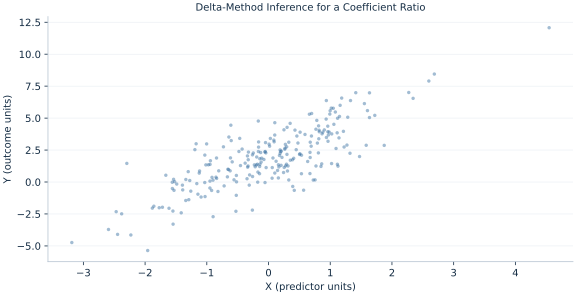

# Lab 10 · Delta-Method Inference for a Coefficient Ratio

> How should uncertainty be propagated through a nonlinear function of coefficients?

## Start with the supplied observations

Download [nonlinear_delta.xlsx](nonlinear_delta.xlsx) and [the complete Python analysis](lab.py). Import the workbook into OpenEconometrics without renaming it. Open the complete Python file in an empty Python document and run the whole file. The first sheet, **Data**, contains the observations. **Dictionary** explains variables, coding, units and missing cells.

For ordinary Python, keep the workbook beside `lab.py`. For another location, use `from lab import run_lab`, then `run_lab(data_path="/path/to/nonlinear_delta.xlsx")`. Keep the supplied workbook intact and use a copy for transformations. The [LaTeX result table](table.tex) accompanies the chapter.

The workbook contains **240 original synthetic observations**. Its observational unit is: One synthetic independent unit; dependence is stated explicitly where groups are supplied. These are teaching observations, not an empirical estimate about an actual business, population or policy. Every student starts from the same stored values and missing cells.

| Variable | Meaning | Unit or coding | Missing cells |
|---|---|---|---:|
| `row_id` | Stable record identifier | integer ID | 0 |
| `x` | Exposure or predictor X | centered units | 0 |
| `z` | Observed covariate Z | centered units | 0 |
| `y` | Outcome | outcome units | 0 |

## 1. Build the comparison

The delta method approximates a smooth function near the estimated coefficient vector with a first-order Taylor expansion. Multiplying the full covariance by the gradient propagates both individual variances and covariances. This chapter uses the ratio of two slopes, a nonlinear contrast whose units depend on the two predictor scales.

The approximation can become poor when the denominator is near zero. A symmetric interval for the ratio is not guaranteed to have reliable coverage in that setting; a narrow-looking result should not conceal denominator uncertainty. The native nonlinear-combination routine differentiates a small stored parameter function without refitting the data.

$$
g(\beta)=\beta_x/\beta_z,\quad \nabla g=(0,1/\beta_z,-\beta_x/\beta_z^2)^T,\quad SE_g=\sqrt{\nabla g^TV\nabla g}.
$$

Differentiate with respect to each slope and include a zero derivative for the intercept. The negative denominator derivative creates a covariance contribution whose sign matters. Compare manual gradient propagation with oe.nlcom on the same model.

## 2. State the assumptions and sample

The denominator estimate is separated from zero in this realized example; the function is differentiable there. HC3 covariance and full-model t critical values are used. The delta interval is a local approximation.

**Pause before running.** Write the denominator derivative.

## 3. Follow the application

The complete file loads the supplied observations, applies the chapter's explicit sample rule, computes the procedure and displays the result, a chart and a compact numerical table. The following shortened call highlights the statistical operation. `load_data()` and the other chapter helpers are defined in the full file; run that file before using the snippet.

```python
import openecon as oe

raw = load_data()
model = fit(raw, ["x", "z"])
ratio = oe.nlcom(model, lambda b: b["x"] / b["z"])
display(model)
print(ratio)
```

Read the output in this order: establish which observations were used, identify the quantity being compared, inspect the amount of variation or uncertainty, and then interpret the result in the units of the question. A large statistic without its denominator, sample and comparison cannot explain the result. The final numerical table puts the quantities used in the worked discussion together; the procedure output retains the fuller set of tables.

## 4. Interpret the executed example

| Quantity | Computed value |
|---|---:|
| X slope | 1.35364 |
| Z slope | 0.779958 |
| Slope ratio | 1.73553 |
| Delta se | 0.271862 |
| Ratio ci low | 1.19996 |
| Ratio ci high | 2.27111 |

The slope ratio is 1.73553 with delta SE 0.271862 and interval [1.19996, 2.27111]. It divides X slope 1.35364 by Z slope 0.779958.



The plotted coordinates come from the same retained observations and calculations as the saved result. A visual pattern is a diagnostic to interpret under the chapter’s assumptions; it does not substitute for the covariance, sample definition or identification argument.

## 5. Decide what the evidence supports

Delta approximations for ratios can fail near a zero denominator. The contrast does not become causal merely because it is calculated from controlled coefficients.

## 6. Try it yourself

**A.** Write the denominator derivative.

**B.** Can separate slope SEs be divided to get ratio SE?

**C.** What if βz is nearly zero?

**D.** Does the routine refit the model?

## Further reading

[Bruce Hansen’s Econometrics](https://users.ssc.wisc.edu/~behansen/econometrics/) provides optional advanced reading. The examples, synthetic mechanisms and exercises here are original; no textbook datasets, figures or exercise solutions are reproduced.
