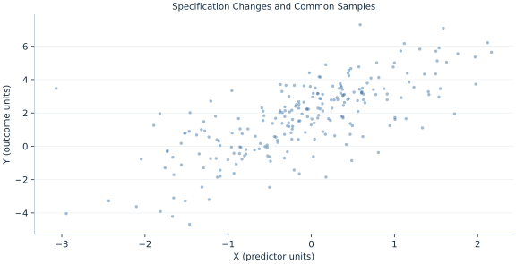

# Lab 11 · Specification Changes and Common Samples

> When coefficients change after adding a control, how much came from changing rows?

## Start with the supplied observations

Download [common_sample.xlsx](common_sample.xlsx) and [the complete Python analysis](lab.py). Import the workbook into OpenEconometrics without renaming it. Open the complete Python file in an empty Python document and run the whole file. The first sheet, **Data**, contains the observations. **Dictionary** explains variables, coding, units and missing cells.

For ordinary Python, keep the workbook beside `lab.py`. For another location, use `from lab import run_lab`, then `run_lab(data_path="/path/to/common_sample.xlsx")`. Keep the supplied workbook intact and use a copy for transformations. The [LaTeX result table](table.tex) accompanies the chapter.

The workbook contains **240 original synthetic observations**. Its observational unit is: One synthetic independent unit; dependence is stated explicitly where groups are supplied. These are teaching observations, not an empirical estimate about an actual business, population or policy. Every student starts from the same stored values and missing cells.

| Variable | Meaning | Unit or coding | Missing cells |
|---|---|---|---:|
| `row_id` | Stable record identifier | integer ID | 0 |
| `x` | Exposure or predictor X | centered units | 0 |
| `z` | Observed covariate Z | centered units | 3 |
| `y` | Outcome | outcome units | 0 |

## 1. Build the comparison

Adding a variable can change both the specification and the estimation sample. If the new control has missing values, comparing the short available-case fit with the complete controlled fit mixes two changes. A common-sample short fit separates the sample component from the control component.

This decomposition is descriptive: it partitions the observed coefficient movement, not the causal bias of missingness. The workbook retains all raw rows and missing cells. The scripts form explicitly named analysis frames, reset their positions and preserve the model sample within each frame.

$$
b_{short,avail}-b_{full,common}=[b_{short,avail}-b_{short,common}]+[b_{short,common}-b_{full,common}].
$$

Fit the short model first on all available X/Y rows, then on rows complete for X/Y/Z. Fit the controlled model on exactly that second frame. Add the two differences and reconcile to the original comparison.

## 2. State the assumptions and sample

Three Z cells are missing while X and Y are complete. The generation mechanism computes Y before setting those Z cells missing. Complete cases are explicit; missing controls are never replaced with zero.

**Pause before running.** How many rows are excluded by the control?

## 3. Follow the application

The complete file loads the supplied observations, applies the chapter's explicit sample rule, computes the procedure and displays the result, a chart and a compact numerical table. The following shortened call highlights the statistical operation. `load_data()` and the other chapter helpers are defined in the full file; run that file before using the snippet.

```python
import openecon as oe

raw = load_data()
common = raw.dropna(subset=["y", "x", "z"]).reset_index(drop=True)
short = fit(common, ["x"])
full = fit(common, ["x", "z"])
display(short)
display(full)
```

Read the output in this order: establish which observations were used, identify the quantity being compared, inspect the amount of variation or uncertainty, and then interpret the result in the units of the question. A large statistic without its denominator, sample and comparison cannot explain the result. The final numerical table puts the quantities used in the worked discussion together; the procedure output retains the fuller set of tables.

## 4. Interpret the executed example

| Quantity | Computed value |
|---|---:|
| Raw rows | 240 |
| Available rows | 240 |
| Common rows | 237 |
| Short available x | 1.66539 |
| Short common x | 1.64726 |
| Full common x | 1.1627 |
| Sample component | 0.0181348 |
| Control component | 0.484555 |

Raw and available counts are 240 and 240; the common sample has 237 rows. The sample contribution is 0.0181348 and the control contribution 0.484555. The common-sample controlled X slope is 1.1627.



The plotted coordinates come from the same retained observations and calculations as the saved result. A visual pattern is a diagnostic to interpret under the chapter’s assumptions; it does not substitute for the covariance, sample definition or identification argument.

## 5. Decide what the evidence supports

An arithmetic decomposition does not establish that complete cases represent excluded rows. Missingness assumptions are required for a population interpretation.

## 6. Try it yourself

**A.** How many rows are excluded by the control?

**B.** Which comparison isolates adding Z?

**C.** Do the two changes add exactly?

**D.** Would filling Z blanks with zero preserve the question?

## Further reading

[Bruce Hansen’s Econometrics](https://users.ssc.wisc.edu/~behansen/econometrics/) provides optional advanced reading. The examples, synthetic mechanisms and exercises here are original; no textbook datasets, figures or exercise solutions are reproduced.
