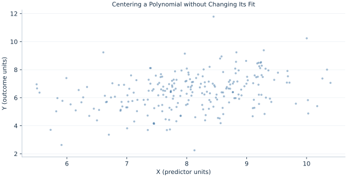

# Lab 12 · Centering a Polynomial without Changing Its Fit

> Why does centering change coefficients while leaving a polynomial fit unchanged?

## Start with the supplied observations

Download [polynomial_centering.xlsx](polynomial_centering.xlsx) and [the complete Python analysis](lab.py). Import the workbook into OpenEconometrics without renaming it. Open the complete Python file in an empty Python document and run the whole file. The first sheet, **Data**, contains the observations. **Dictionary** explains variables, coding, units and missing cells.

For ordinary Python, keep the workbook beside `lab.py`. For another location, use `from lab import run_lab`, then `run_lab(data_path="/path/to/polynomial_centering.xlsx")`. Keep the supplied workbook intact and use a copy for transformations. The [LaTeX result table](table.tex) accompanies the chapter.

The workbook contains **240 original synthetic observations**. Its observational unit is: One synthetic independent unit; dependence is stated explicitly where groups are supplied. These are teaching observations, not an empirical estimate about an actual business, population or policy. Every student starts from the same stored values and missing cells.

| Variable | Meaning | Unit or coding | Missing cells |
|---|---|---|---:|
| `row_id` | Stable record identifier | integer ID | 0 |
| `x` | Exposure or predictor X | centered units | 0 |
| `z` | Observed covariate Z | centered units | 0 |
| `y` | Outcome | outcome units | 0 |

## 1. Build the comparison

Replacing X with X−c changes the basis spanning the same polynomial space. With an intercept and both linear and quadratic terms retained, predictions and residuals remain identical. Individual coefficients change interpretation because zero in the centered variable corresponds to X=c.

The centered linear coefficient is the marginal slope at c, while the raw linear coefficient is the slope at X=0. Centering can reduce numerical correlation between polynomial columns; it does not reduce the complexity of the fitted function or create new information.

$$
y=b_0+b_1x+b_2x^2+b_zz+u=a_0+a_1(x-c)+a_2(x-c)^2+a_zz+u,\quad a_1=b_1+2cb_2.
$$

Expand (x−c)² and equate powers. The quadratic coefficient is unchanged, the linear coefficient shifts by 2cb2, and the intercept shifts accordingly. Use the same rows and covariance convention in both parameterizations.

## 2. State the assumptions and sample

The entire quadratic basis and intercept are retained. c is the sample mean of X, all rows complete and HC3 applies to both fits. Prediction equality is checked over retained observations.

**Pause before running.** Which coefficient remains unchanged?

## 3. Follow the application

The complete file loads the supplied observations, applies the chapter's explicit sample rule, computes the procedure and displays the result, a chart and a compact numerical table. The following shortened call highlights the statistical operation. `load_data()` and the other chapter helpers are defined in the full file; run that file before using the snippet.

```python
import openecon as oe

raw = load_data()
center = raw.x.mean()
data = raw.assign(xc=raw.x-center, xc2=(raw.x-center)**2)
centered = fit(data, ["xc", "xc2", "z"])
display(centered)
```

Read the output in this order: establish which observations were used, identify the quantity being compared, inspect the amount of variation or uncertainty, and then interpret the result in the units of the question. A large statistic without its denominator, sample and comparison cannot explain the result. The final numerical table puts the quantities used in the worked discussion together; the procedure output retains the fuller set of tables.

## 4. Interpret the executed example

| Quantity | Computed value |
|---|---:|
| Centering value | 8.05467 |
| Raw linear coefficient | 0.281549 |
| Centered linear coefficient | -0.131454 |
| Marginal slope at mean | -0.131454 |
| Quadratic coefficient | -0.0256374 |
| Max fitted difference | 1.77636e-15 |

At c=8.05467, the centered linear slope is -0.131454, matching the derivative -0.131454. The raw linear coefficient is 0.281549. Maximum fitted difference is 1.77636e-15.



The plotted coordinates come from the same retained observations and calculations as the saved result. A visual pattern is a diagnostic to interpret under the chapter’s assumptions; it does not substitute for the covariance, sample definition or identification argument.

## 5. Decide what the evidence supports

Dropping the quadratic term after centering changes the model. Centering alone does not justify extrapolation outside the observed X support.

## 6. Try it yourself

**A.** Which coefficient remains unchanged?

**B.** What does the centered linear slope mean?

**C.** Why are predictions identical?

**D.** Would omitting the intercept preserve the identity?

## Further reading

[Bruce Hansen’s Econometrics](https://users.ssc.wisc.edu/~behansen/econometrics/) provides optional advanced reading. The examples, synthetic mechanisms and exercises here are original; no textbook datasets, figures or exercise solutions are reproduced.
