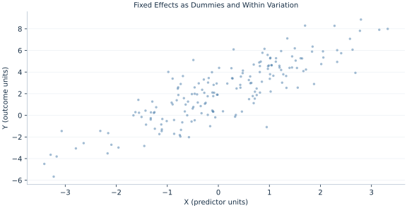

# Lab 13 · Fixed Effects as Dummies and Within Variation

> How do unit dummies recover the same slope as within-unit demeaning?

## Start with the supplied observations

Download [fixed_effects_algebra.xlsx](fixed_effects_algebra.xlsx) and [the complete Python analysis](lab.py). Import the workbook into OpenEconometrics without renaming it. Open the complete Python file in an empty Python document and run the whole file. The first sheet, **Data**, contains the observations. **Dictionary** explains variables, coding, units and missing cells.

For ordinary Python, keep the workbook beside `lab.py`. For another location, use `from lab import run_lab`, then `run_lab(data_path="/path/to/fixed_effects_algebra.xlsx")`. Keep the supplied workbook intact and use a copy for transformations. The [LaTeX result table](table.tex) accompanies the chapter.

The workbook contains **180 original synthetic observations**. Its observational unit is: One synthetic panel-period observation. These are teaching observations, not an empirical estimate about an actual business, population or policy. Every student starts from the same stored values and missing cells.

| Variable | Meaning | Unit or coding | Missing cells |
|---|---|---|---:|
| `row_id` | Stable record identifier | integer ID | 0 |
| `x` | Exposure or predictor X | centered units | 0 |
| `z` | Observed covariate Z | centered units | 0 |
| `y` | Outcome | outcome units | 0 |
| `unit` | Panel unit identifier | integer ID | 0 |
| `time` | Within-unit period | integer period | 0 |

## 1. Build the comparison

A unit fixed effect permits each panel unit its own intercept. The exposure coefficient then uses changes within units rather than level differences between them. FWL implies that projecting out the full set of unit indicators is equivalent to subtracting unit means in a balanced or unbalanced panel with ordinary unweighted least squares.

The chapter fits explicit dummies through OLS so every parameter and covariance is visible. A separate Torch calculation estimates the two slopes from demeaned variables without an intercept. Inference is taken from the complete dummy model with unit-cluster covariance, not from naive residual degrees of freedom in the within calculation.

$$
y_{it}=a_i+\beta_xx_{it}+\beta_zz_{it}+u_{it},\quad \tilde y_{it}=\beta_x\tilde x_{it}+\beta_z\tilde z_{it}+\tilde u_{it}.
$$

Subtract each unit’s own mean for Y, X and Z. A time-invariant unit intercept disappears. One unit dummy is omitted alongside the global intercept to maintain full rank.

## 2. State the assumptions and sample

Thirty units each have six periods. The synthetic unit effect is correlated with X, while within-unit shocks satisfy strict exogeneity. Inference permits within-unit dependence and uses 29 cluster df.

**Pause before running.** Why omit one dummy?

## 3. Follow the application

The complete file loads the supplied observations, applies the chapter's explicit sample rule, computes the procedure and displays the result, a chart and a compact numerical table. The following shortened call highlights the statistical operation. `load_data()` and the other chapter helpers are defined in the full file; run that file before using the snippet.

```python
import openecon as oe

raw = load_data()
data = raw.copy()
dummies = []
for unit in sorted(raw.unit.unique())[1:]:
    name = "unit_" + str(unit)
    data[name] = (raw.unit == unit).astype(float)
    dummies.append(name)
model = fit(data, ["x", "z"] + dummies, covariance="cluster", cluster="unit")
display(model)
```

Read the output in this order: establish which observations were used, identify the quantity being compared, inspect the amount of variation or uncertainty, and then interpret the result in the units of the question. A large statistic without its denominator, sample and comparison cannot explain the result. The final numerical table puts the quantities used in the worked discussion together; the procedure output retains the fuller set of tables.

## 4. Interpret the executed example

| Quantity | Computed value |
|---|---:|
| Units | 30 |
| Periods per unit | 6 |
| X within slope | 1.28195 |
| X dummy slope | 1.28195 |
| X cluster se | 0.088063 |
| Cluster df | 29 |

The within X slope 1.28195 matches the dummy slope 1.28195. Cluster SE=0.088063 across 30 units; inference df=29.



The plotted coordinates come from the same retained observations and calculations as the saved result. A visual pattern is a diagnostic to interpret under the chapter’s assumptions; it does not substitute for the covariance, sample definition or identification argument.

## 5. Decide what the evidence supports

Fixed effects remove time-invariant unit components, not time-varying confounding. Time-invariant regressors cannot be separately identified from unit intercepts.

## 6. Try it yourself

**A.** Why omit one dummy?

**B.** Which variation identifies X?

**C.** What is the independent cluster count?

**D.** Do fixed effects eliminate all confounding?

## Further reading

[Bruce Hansen’s Econometrics](https://users.ssc.wisc.edu/~behansen/econometrics/) provides optional advanced reading. The examples, synthetic mechanisms and exercises here are original; no textbook datasets, figures or exercise solutions are reproduced.
