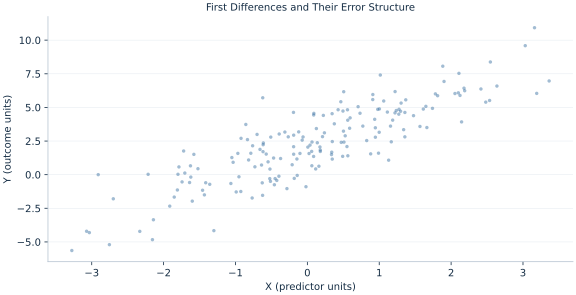

# Lab 14 · First Differences and Their Error Structure

> What does differencing remove, and what dependence can it introduce?

## Start with the supplied observations

Download [first_differences.xlsx](first_differences.xlsx) and [the complete Python analysis](lab.py). Import the workbook into OpenEconometrics without renaming it. Open the complete Python file in an empty Python document and run the whole file. The first sheet, **Data**, contains the observations. **Dictionary** explains variables, coding, units and missing cells.

For ordinary Python, keep the workbook beside `lab.py`. For another location, use `from lab import run_lab`, then `run_lab(data_path="/path/to/first_differences.xlsx")`. Keep the supplied workbook intact and use a copy for transformations. The [LaTeX result table](table.tex) accompanies the chapter.

The workbook contains **180 original synthetic observations**. Its observational unit is: One synthetic panel-period observation. These are teaching observations, not an empirical estimate about an actual business, population or policy. Every student starts from the same stored values and missing cells.

| Variable | Meaning | Unit or coding | Missing cells |
|---|---|---|---:|
| `row_id` | Stable record identifier | integer ID | 0 |
| `x` | Exposure or predictor X | centered units | 0 |
| `z` | Observed covariate Z | centered units | 0 |
| `y` | Outcome | outcome units | 0 |
| `unit` | Panel unit identifier | integer ID | 0 |
| `time` | Within-unit period | integer period | 0 |

## 1. Build the comparison

First differences subtract consecutive periods within the same unit. A stable unit intercept cancels. This provides another way to remove fixed unit components, but it is not identical to demeaning when panels have more than two periods.

Even independent level errors generate correlated adjacent differences because the middle level error enters one change positively and the next negatively. Treating all differenced rows as independent can therefore misstate uncertainty. Unit-cluster covariance retains dependence within each panel.

$$
\Delta y_{it}=\beta_x\Delta x_{it}+\beta_z\Delta z_{it}+\Delta u_{it},\quad Cov(\Delta u_{it},\Delta u_{i,t-1})=-\sigma_u^2\ \text{for iid level errors}.
$$

Sort by unit and time before applying within-group differences. Each unit loses its first period. Never difference the final row of one unit against the first row of the next. An intercept in this differences regression allows a common average change.

## 2. State the assumptions and sample

The panel has regular consecutive periods and independent units. Within-unit strict exogeneity is assumed. No calendar gaps are present; a gap would require deciding whether a difference over several periods has the same interpretation.

**Pause before running.** How many rows are lost?

## 3. Follow the application

The complete file loads the supplied observations, applies the chapter's explicit sample rule, computes the procedure and displays the result, a chart and a compact numerical table. The following shortened call highlights the statistical operation. `load_data()` and the other chapter helpers are defined in the full file; run that file before using the snippet.

```python
import openecon as oe

raw = load_data()
data = raw.sort_values(["unit", "time"]).copy()
data[["y", "x", "z"]] = data.groupby("unit")[["y", "x", "z"]].diff()
data = data.dropna(subset=["y", "x", "z"]).reset_index(drop=True)
model = fit(data, ["x", "z"], covariance="cluster", cluster="unit")
display(model)
```

Read the output in this order: establish which observations were used, identify the quantity being compared, inspect the amount of variation or uncertainty, and then interpret the result in the units of the question. A large statistic without its denominator, sample and comparison cannot explain the result. The final numerical table puts the quantities used in the worked discussion together; the procedure output retains the fuller set of tables.

## 4. Interpret the executed example

| Quantity | Computed value |
|---|---:|
| Level rows | 180 |
| Difference rows | 150 |
| Units | 30 |
| X difference slope | 1.38709 |
| X cluster se | 0.0775893 |
| Mean y change | -0.156967 |

From 180 level rows, 150 changes remain across 30 units. The X change slope is 1.38709 with cluster SE 0.0775893. Mean outcome change is -0.156967.



The plotted coordinates come from the same retained observations and calculations as the saved result. A visual pattern is a diagnostic to interpret under the chapter’s assumptions; it does not substitute for the covariance, sample definition or identification argument.

## 5. Decide what the evidence supports

Differencing can amplify measurement error and does not remove time-varying confounding. With more than two periods its efficiency and estimand weighting can differ from within estimation.

## 6. Try it yourself

**A.** How many rows are lost?

**B.** Why sort before differencing?

**C.** Can iid level errors yield dependent changes?

**D.** Must FD and within slopes match for six periods?

## Further reading

[Bruce Hansen’s Econometrics](https://users.ssc.wisc.edu/~behansen/econometrics/) provides optional advanced reading. The examples, synthetic mechanisms and exercises here are original; no textbook datasets, figures or exercise solutions are reproduced.
