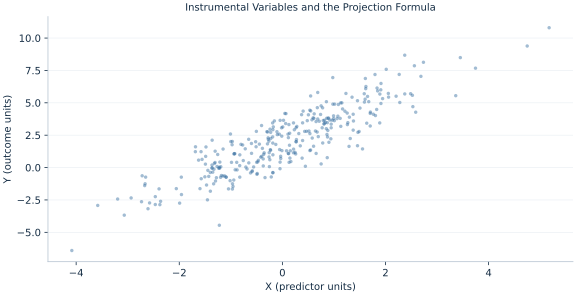

# Lab 15 · Instrumental Variables and the Projection Formula

> How does an instrument isolate exposure variation that is orthogonal to the structural error?

## Start with the supplied observations

Download [iv_moment_condition.xlsx](iv_moment_condition.xlsx) and [the complete Python analysis](lab.py). Import the workbook into OpenEconometrics without renaming it. Open the complete Python file in an empty Python document and run the whole file. The first sheet, **Data**, contains the observations. **Dictionary** explains variables, coding, units and missing cells.

For ordinary Python, keep the workbook beside `lab.py`. For another location, use `from lab import run_lab`, then `run_lab(data_path="/path/to/iv_moment_condition.xlsx")`. Keep the supplied workbook intact and use a copy for transformations. The [LaTeX result table](table.tex) accompanies the chapter.

The workbook contains **320 original synthetic observations**. Its observational unit is: One synthetic independent unit; dependence is stated explicitly where groups are supplied. These are teaching observations, not an empirical estimate about an actual business, population or policy. Every student starts from the same stored values and missing cells.

| Variable | Meaning | Unit or coding | Missing cells |
|---|---|---|---:|
| `row_id` | Stable record identifier | integer ID | 0 |
| `x` | Endogenous exposure | units | 0 |
| `z` | Excluded instrument | units | 0 |
| `control` | Exogenous control | units | 0 |
| `y` | Outcome | outcome units | 0 |

## 1. Build the comparison

An endogenous exposure is correlated with the structural error, so ordinary least squares mixes the response of interest with that correlation. An excluded instrument can supply variation correlated with exposure but orthogonal to the structural disturbance, conditional on included exogenous controls.

2SLS projects every endogenous regressor onto the instrument space and solves the corresponding moment equations. Exogenous controls and the intercept instrument themselves. A naive second-stage OLS standard error on fitted exposure is incorrect because it uses a different residual and covariance construction. The native IV result retains structural residuals and complete inference.

$$
\hat\beta_{IV}=(X^TP_ZX)^{-1}X^TP_Zy,\quad P_Z=Z(Z^TZ)^{-1}Z^T,\quad E[Zu]=0.
$$

X contains intercept, control and endogenous X; Z contains intercept, control and excluded Z. Compute projected X without forming an n-by-n projection, then solve the IV normal equations. The instrument’s role is separate from the included control.

## 2. State the assumptions and sample

The synthetic Z is independent of the shared exposure/outcome disturbance and relevant in the first stage. One excluded instrument identifies one endogenous variable. Homoskedastic structural error supports unadjusted covariance; small=True uses residual-df t inference.

**Pause before running.** What instruments the exogenous control?

## 3. Follow the application

The complete file loads the supplied observations, applies the chapter's explicit sample rule, computes the procedure and displays the result, a chart and a compact numerical table. The following shortened call highlights the statistical operation. `load_data()` and the other chapter helpers are defined in the full file; run that file before using the snippet.

```python
import openecon as oe

raw = load_data()
iv = oe.ivregress(data=raw, y="y", x=["control"], endog=["x"], instruments=["z"],
                   covariance="unadjusted", small=True, missing="raise")
display(iv)
```

Read the output in this order: establish which observations were used, identify the quantity being compared, inspect the amount of variation or uncertainty, and then interpret the result in the units of the question. A large statistic without its denominator, sample and comparison cannot explain the result. The final numerical table puts the quantities used in the worked discussion together; the procedure output retains the fuller set of tables.

## 4. Interpret the executed example

| Quantity | Computed value |
|---|---:|
| Ols x | 1.51039 |
| Iv x | 1.07921 |
| Iv x se | 0.080732 |
| First stage instrument slope | 0.84711 |
| Matrix iv x | 1.07921 |

OLS X slope=1.51039 while IV gives 1.07921 with SE 0.080732. First-stage instrument slope=0.84711. Independent projection arithmetic gives 1.07921.



The plotted coordinates come from the same retained observations and calculations as the saved result. A visual pattern is a diagnostic to interpret under the chapter’s assumptions; it does not substitute for the covariance, sample definition or identification argument.

## 5. Decide what the evidence supports

Exclusion is an assumption about the mechanism, not proved by first-stage strength. Exactly identified IV supplies no overidentification test, and weak instruments can make usual inference unreliable.

## 6. Try it yourself

**A.** What instruments the exogenous control?

**B.** Verify the two IV computations.

**C.** Does a strong first stage prove exclusion?

**D.** Why not report naive second-stage OLS SE?

## Further reading

[Bruce Hansen’s Econometrics](https://users.ssc.wisc.edu/~behansen/econometrics/) provides optional advanced reading. The examples, synthetic mechanisms and exercises here are original; no textbook datasets, figures or exercise solutions are reproduced.
