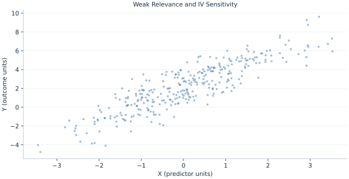

# Lab 16 · Weak Relevance and IV Sensitivity

> What changes when an otherwise valid instrument barely predicts exposure?

## Start with the supplied observations

Download [weak_instruments.xlsx](weak_instruments.xlsx) and [the complete Python analysis](lab.py). Import the workbook into OpenEconometrics without renaming it. Open the complete Python file in an empty Python document and run the whole file. The first sheet, **Data**, contains the observations. **Dictionary** explains variables, coding, units and missing cells.

For ordinary Python, keep the workbook beside `lab.py`. For another location, use `from lab import run_lab`, then `run_lab(data_path="/path/to/weak_instruments.xlsx")`. Keep the supplied workbook intact and use a copy for transformations. The [LaTeX result table](table.tex) accompanies the chapter.

The workbook contains **320 original synthetic observations**. Its observational unit is: One synthetic independent unit; dependence is stated explicitly where groups are supplied. These are teaching observations, not an empirical estimate about an actual business, population or policy. Every student starts from the same stored values and missing cells.

| Variable | Meaning | Unit or coding | Missing cells |
|---|---|---|---:|
| `row_id` | Stable record identifier | integer ID | 0 |
| `x` | Endogenous exposure | units | 0 |
| `z` | Excluded instrument | units | 0 |
| `control` | Exogenous control | units | 0 |
| `y` | Outcome | outcome units | 0 |
| `weak_x` | Exposure with a weak instrument coefficient | units | 0 |

## 1. Build the comparison

Relevance requires more than a nonzero population coefficient: weak first-stage signal can make the IV denominator unstable in finite samples. Conventional normal or t approximations may then be poor. A large standard error is a warning, but finite-sample distortion is broader than merely low power.

The chapter constructs strong and weak exposure scenarios from the same supplied primitive disturbances. It adjusts the outcome so the structural slope and error are held fixed. The first-stage squared t statistic is an F statistic for one excluded instrument under the stated homoskedastic convention; it is a diagnostic, not a universal validity threshold.

$$
x^{strong}=.9z+.4c+v,\quad x^{weak}=.08z+.4c+v,\quad y^{scenario}=2+1.2x^{scenario}+.6c+u.
$$

For the weak scenario subtract 1.2 times strong X from the supplied outcome and add 1.2 times weak X. This keeps the structural disturbance unchanged. Compare first-stage relevance and IV uncertainty without changing exclusion by construction.

## 2. State the assumptions and sample

The same 320 units and valid excluded Z are used in both scenarios. Error covariance and the structural slope are held fixed. Ordinary small-sample t intervals are reported as conventional diagnostics, not claimed weak-IV-robust intervals.

**Pause before running.** What is held fixed across scenarios?

## 3. Follow the application

The complete file loads the supplied observations, applies the chapter's explicit sample rule, computes the procedure and displays the result, a chart and a compact numerical table. The following shortened call highlights the statistical operation. `load_data()` and the other chapter helpers are defined in the full file; run that file before using the snippet.

```python
import openecon as oe

raw = load_data()
weak = raw.assign(x=raw.weak_x, y=raw.y-1.2*raw.x+1.2*raw.weak_x)
first_stage = fit(weak, ["control", "z"], y="x", covariance="nonrobust")
iv = oe.ivregress(data=weak, y="y", x=["control"], endog=["x"], instruments=["z"],
                   covariance="unadjusted", small=True, missing="raise")
display(first_stage)
display(iv)
```

Read the output in this order: establish which observations were used, identify the quantity being compared, inspect the amount of variation or uncertainty, and then interpret the result in the units of the question. A large statistic without its denominator, sample and comparison cannot explain the result. The final numerical table puts the quantities used in the worked discussion together; the procedure output retains the fuller set of tables.

## 4. Interpret the executed example

| Quantity | Computed value |
|---|---:|
| Strong first stage f | 289.966 |
| Weak first stage f | 2.11473 |
| Strong iv x | 1.25378 |
| Weak iv x | 1.82976 |
| Strong iv se | 0.0751755 |
| Weak iv se | 0.756993 |

Strong/weak first-stage F values are 289.966 and 2.11473. IV slopes are 1.25378 and 1.82976, with SEs 0.0751755 and 0.756993. The weak case is a sensitivity illustration.



The plotted coordinates come from the same retained observations and calculations as the saved result. A visual pattern is a diagnostic to interpret under the chapter’s assumptions; it does not substitute for the covariance, sample definition or identification argument.

## 5. Decide what the evidence supports

A fixed F cutoff is not a universal guarantee. Weak-IV-robust procedures such as inversion of suitable moment tests answer an additional question and are not implemented by these ordinary intervals.

## 6. Try it yourself

**A.** What is held fixed across scenarios?

**B.** Which relevance statistic is smaller?

**C.** Are the reported intervals weak-IV robust?

**D.** Does instrument validity remove weak-relevance concerns?

## Further reading

[Bruce Hansen’s Econometrics](https://users.ssc.wisc.edu/~behansen/econometrics/) provides optional advanced reading. The examples, synthetic mechanisms and exercises here are original; no textbook datasets, figures or exercise solutions are reproduced.
