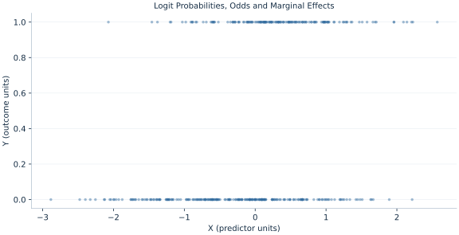

# Lab 17 · Logit Probabilities, Odds and Marginal Effects

> Why is a logit coefficient not a probability change?

## Start with the supplied observations

Download [logit_marginal_effects.xlsx](logit_marginal_effects.xlsx) and [the complete Python analysis](lab.py). Import the workbook into OpenEconometrics without renaming it. Open the complete Python file in an empty Python document and run the whole file. The first sheet, **Data**, contains the observations. **Dictionary** explains variables, coding, units and missing cells.

For ordinary Python, keep the workbook beside `lab.py`. For another location, use `from lab import run_lab`, then `run_lab(data_path="/path/to/logit_marginal_effects.xlsx")`. Keep the supplied workbook intact and use a copy for transformations. The [LaTeX result table](table.tex) accompanies the chapter.

The workbook contains **400 original synthetic observations**. Its observational unit is: One synthetic independent unit; dependence is stated explicitly where groups are supplied. These are teaching observations, not an empirical estimate about an actual business, population or policy. Every student starts from the same stored values and missing cells.

| Variable | Meaning | Unit or coding | Missing cells |
|---|---|---|---:|
| `row_id` | Stable record identifier | integer ID | 0 |
| `x` | Exposure or predictor X | centered units | 0 |
| `z` | Observed covariate Z | centered units | 0 |
| `y` | Binary event outcome | 0=no event, 1=event | 0 |

## 1. Build the comparison

Logit makes the log odds linear in predictors and maps them into probabilities with a sigmoid. The coefficient on X is a change in log odds per unit, while its exponential is an odds multiplier. A probability response depends on the starting probability, so the same coefficient can imply different marginal effects for different observations.

The derivative of the sigmoid is p(1−p), giving a row-specific effect βX p(1−p). Averaging these derivatives produces the average marginal effect. This differs from evaluating the derivative at average covariates because the probability mapping is nonlinear. The chapter reports the point AME and does not attach an invented SE to it.

$$
p_i=\Lambda(x_i^T\beta),\quad \frac{\partial p_i}{\partial x_i}=\beta_xp_i(1-p_i),\quad AME_x=n^{-1}\sum_i\beta_xp_i(1-p_i).
$$

Compute the linear predictor with the fitted intercept and both slopes, apply the sigmoid, and average the derivatives. The fitted intercept score implies the average predicted probability matches the observed event rate up to optimizer tolerance.

## 2. State the assumptions and sample

Binary outcomes and independent rows follow the stated logistic mechanism. Predictors are complete, finite and the fit has no separation. The native nonrobust maximum-likelihood covariance uses normal inference.

**Pause before running.** What scale is the coefficient on?

## 3. Follow the application

The complete file loads the supplied observations, applies the chapter's explicit sample rule, computes the procedure and displays the result, a chart and a compact numerical table. The following shortened call highlights the statistical operation. `load_data()` and the other chapter helpers are defined in the full file; run that file before using the snippet.

```python
import openecon as oe

raw = load_data()
model = oe.logit(data=raw, y="y", x=["x", "z"], covariance="nonrobust", missing="raise")
display(model)
print("Odds ratio for X:", math.exp(coef(model, "x").estimate))
```

Read the output in this order: establish which observations were used, identify the quantity being compared, inspect the amount of variation or uncertainty, and then interpret the result in the units of the question. A large statistic without its denominator, sample and comparison cannot explain the result. The final numerical table puts the quantities used in the worked discussion together; the procedure output retains the fuller set of tables.

## 4. Interpret the executed example

| Quantity | Computed value |
|---|---:|
| Rows | 400 |
| Observed event rate | 0.4075 |
| Average predicted probability | 0.4075 |
| Log odds x | 0.951863 |
| Odds ratio x | 2.59053 |
| Average marginal effect x | 0.190116 |

The X log-odds coefficient is 0.951863, its odds ratio 2.59053 and point AME 0.190116 probability units per X. Observed rate 0.4075 matches average predicted probability 0.4075.



The plotted coordinates come from the same retained observations and calculations as the saved result. A visual pattern is a diagnostic to interpret under the chapter’s assumptions; it does not substitute for the covariance, sample definition or identification argument.

## 5. Decide what the evidence supports

Odds ratios are not risk ratios or percentage-point effects. A descriptive AME is not causal without an identification argument; uncertainty for the AME requires its own delta or resampling calculation.

## 6. Try it yourself

**A.** What scale is the coefficient on?

**B.** Calculate the odds multiplier.

**C.** Express AME in percentage points.

**D.** Does the chapter report an AME SE?

## Further reading

[Bruce Hansen’s Econometrics](https://users.ssc.wisc.edu/~behansen/econometrics/) provides optional advanced reading. The examples, synthetic mechanisms and exercises here are original; no textbook datasets, figures or exercise solutions are reproduced.
