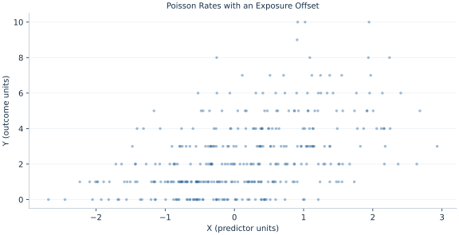

# Lab 18 · Poisson Rates with an Exposure Offset

> How can counts from different observation exposures be compared?

## Start with the supplied observations

Download [poisson_exposure.xlsx](poisson_exposure.xlsx) and [the complete Python analysis](lab.py). Import the workbook into OpenEconometrics without renaming it. Open the complete Python file in an empty Python document and run the whole file. The first sheet, **Data**, contains the observations. **Dictionary** explains variables, coding, units and missing cells.

For ordinary Python, keep the workbook beside `lab.py`. For another location, use `from lab import run_lab`, then `run_lab(data_path="/path/to/poisson_exposure.xlsx")`. Keep the supplied workbook intact and use a copy for transformations. The [LaTeX result table](table.tex) accompanies the chapter.

The workbook contains **360 original synthetic observations**. Its observational unit is: One synthetic independent unit; dependence is stated explicitly where groups are supplied. These are teaching observations, not an empirical estimate about an actual business, population or policy. Every student starts from the same stored values and missing cells.

| Variable | Meaning | Unit or coding | Missing cells |
|---|---|---|---:|
| `row_id` | Stable record identifier | integer ID | 0 |
| `x` | Exposure or predictor X | centered units | 0 |
| `z` | Observed covariate Z | centered units | 0 |
| `y` | Observed event count | nonnegative integer events | 0 |
| `exposure` | Positive observation exposure | exposure units | 0 |

## 1. Build the comparison

A count over two exposure units has more opportunity to occur than a count over one. A log-exposure offset adds log exposure to the linear predictor with its coefficient fixed at one, modeling a rate while retaining the count as outcome. This differs from regressing a raw count without exposure or estimating an unrestricted exposure slope.

Under a log link, exp(βX) multiplies the expected rate per unit increase in X, holding other predictors fixed. The Poisson likelihood assumes conditional variance equals the mean for its model-based covariance. Overdispersion in real data would require a different uncertainty or count model.

$$
Y_i|X_i,e_i\sim Poisson(\mu_i),\quad \log\mu_i=\log e_i+\beta_0+\beta_xx_i+\beta_zz_i.
$$

Exponentiating gives μ=e exp(Xβ), so dividing by exposure yields the modeled rate. Doubling exposure doubles expected events at fixed covariates, while the rate stays unchanged. The intercept score reconciles total fitted and observed counts.

## 2. State the assumptions and sample

Exposure is strictly positive, outcomes are nonnegative integer counts, rows independent and the supplied mechanism is Poisson. The offset coefficient is fixed at one; model-based normal covariance is reported.

**Pause before running.** What happens when exposure doubles?

## 3. Follow the application

The complete file loads the supplied observations, applies the chapter's explicit sample rule, computes the procedure and displays the result, a chart and a compact numerical table. The following shortened call highlights the statistical operation. `load_data()` and the other chapter helpers are defined in the full file; run that file before using the snippet.

```python
import openecon as oe

raw = load_data()
model = oe.glm(data=raw, y="y", x=["x", "z"], family="poisson", link="log",
               exposure="exposure", covariance="nonrobust", missing="raise")
display(model)
```

Read the output in this order: establish which observations were used, identify the quantity being compared, inspect the amount of variation or uncertainty, and then interpret the result in the units of the question. A large statistic without its denominator, sample and comparison cannot explain the result. The final numerical table puts the quantities used in the worked discussion together; the procedure output retains the fuller set of tables.

## 4. Interpret the executed example

| Quantity | Computed value |
|---|---:|
| Rows | 360 |
| Total events | 871 |
| Total exposure | 541.958 |
| Crude event rate | 1.60714 |
| X log rate ratio | 0.405134 |
| X rate ratio | 1.4995 |
| Sum predicted events | 871 |

Total events=871 over exposure 541.958, giving crude rate 1.60714. The conditional X log rate ratio is 0.405134, or multiplier 1.4995. Fitted total events=871.



The plotted coordinates come from the same retained observations and calculations as the saved result. A visual pattern is a diagnostic to interpret under the chapter’s assumptions; it does not substitute for the covariance, sample definition or identification argument.

## 5. Decide what the evidence supports

The crude aggregate rate is not a covariate-adjusted effect. Exposure errors, overdispersion, excess zeros and dependence would require additional modeling decisions.

## 6. Try it yourself

**A.** What happens when exposure doubles?

**B.** Is the offset slope estimated?

**C.** Interpret exp(βX).

**D.** Would overdispersion leave model-based SE valid?

## Further reading

[Bruce Hansen’s Econometrics](https://users.ssc.wisc.edu/~behansen/econometrics/) provides optional advanced reading. The examples, synthetic mechanisms and exercises here are original; no textbook datasets, figures or exercise solutions are reproduced.
