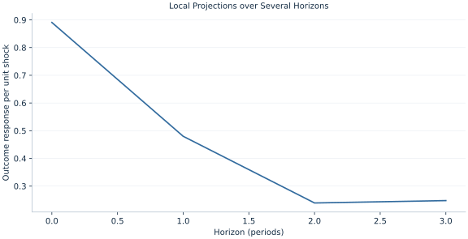

# Lab 19 · Local Projections over Several Horizons

> How can horizon-specific regressions trace the response to an exogenous shock?

## Start with the supplied observations

Download [local_projections.xlsx](local_projections.xlsx) and [the complete Python analysis](lab.py). Import the workbook into OpenEconometrics without renaming it. Open the complete Python file in an empty Python document and run the whole file. The first sheet, **Data**, contains the observations. **Dictionary** explains variables, coding, units and missing cells.

For ordinary Python, keep the workbook beside `lab.py`. For another location, use `from lab import run_lab`, then `run_lab(data_path="/path/to/local_projections.xlsx")`. Keep the supplied workbook intact and use a copy for transformations. The [LaTeX result table](table.tex) accompanies the chapter.

The workbook contains **260 original synthetic observations**. Its observational unit is: One synthetic time observation. These are teaching observations, not an empirical estimate about an actual business, population or policy. Every student starts from the same stored values and missing cells.

| Variable | Meaning | Unit or coding | Missing cells |
|---|---|---|---:|
| `row_id` | Stable record identifier | integer ID | 0 |
| `x` | Exposure or predictor X | centered units | 0 |
| `z` | Previous-period outcome; zero initializes the first period | outcome units | 0 |
| `y` | Outcome | outcome units | 0 |
| `time` | Regular time index | integer period | 0 |

## 1. Build the comparison

A local projection fits a separate future-outcome regression for each horizon. The exposure coefficient describes the response of Y at t+h to X at t, conditional on the chosen information set. It avoids requiring every horizon response to be generated by one fitted autoregressive model, though identification and control choices still matter.

The supplied mechanism makes X an independent shock and Y a stable AR(1) response. The lagged outcome is stored as Z and controls for prior state. Longer horizons lose more tail observations. Overlapping future outcomes can generate correlated projection errors, so every horizon uses the same explicitly stated HAC convention.

$$
y_{t+h}=a_h+\theta_hx_t+\gamma_hy_{t-1}+v_{t,h},\quad y_t=.5y_{t-1}+.8x_t+e_t,\quad \theta_h=.8(.5)^h.
$$

Lead the outcome by h within the single ordered series, align it with current shock and lagged outcome, and trim missing tail leads. Drop the first period consistently because its lag is an initialization. At horizon two the mechanism response is .8×.5²=.2.

## 2. State the assumptions and sample

X is exogenous, the AR coefficient is stable, time regular and no gaps occur. Four horizons use Bartlett HAC with four lags. The output provides pointwise coefficient intervals, not a simultaneous response band.

**Pause before running.** What is the mechanism response at h=2?

## 3. Follow the application

The complete file loads the supplied observations, applies the chapter's explicit sample rule, computes the procedure and displays the result, a chart and a compact numerical table. The following shortened call highlights the statistical operation. `load_data()` and the other chapter helpers are defined in the full file; run that file before using the snippet.

```python
import openecon as oe

raw = load_data()
horizon = 2
data = raw.assign(lead_y=raw.y.shift(-horizon)).iloc[1:]
data = data.dropna(subset=["lead_y"]).reset_index(drop=True)
model = fit(data, ["x", "z"], y="lead_y", covariance="hac", time="time", lags=4, kernel="bartlett")
display(model)
```

Read the output in this order: establish which observations were used, identify the quantity being compared, inspect the amount of variation or uncertainty, and then interpret the result in the units of the question. A large statistic without its denominator, sample and comparison cannot explain the result. The final numerical table puts the quantities used in the worked discussion together; the procedure output retains the fuller set of tables.

## 4. Interpret the executed example

| Quantity | Computed value |
|---|---:|
| H0 response | 0.890745 |
| H1 response | 0.479782 |
| H2 response | 0.239124 |
| H3 response | 0.247714 |
| H2 hac se | 0.109917 |
| H0 rows | 259 |
| H3 rows | 256 |
| Population h2 response | 0.2 |

Estimated responses are 0.890745, 0.479782, 0.239124 and 0.247714 for horizons 0–3. Horizon-two SE=0.109917; its population target is 0.2. Samples decline from 259 to 256 rows.



The plotted coordinates come from the same retained observations and calculations as the saved result. A visual pattern is a diagnostic to interpret under the chapter’s assumptions; it does not substitute for the covariance, sample definition or identification argument.

## 5. Decide what the evidence supports

An observed exposure is not automatically an exogenous shock. Pointwise significance across horizons does not provide simultaneous coverage, and horizon/sample conventions must be reported.

## 6. Try it yourself

**A.** What is the mechanism response at h=2?

**B.** Why do row counts decline?

**C.** Are the intervals a joint band?

**D.** Would this design identify responses to an endogenous policy variable?

## Further reading

[Bruce Hansen’s Econometrics](https://users.ssc.wisc.edu/~behansen/econometrics/) provides optional advanced reading. The examples, synthetic mechanisms and exercises here are original; no textbook datasets, figures or exercise solutions are reproduced.
