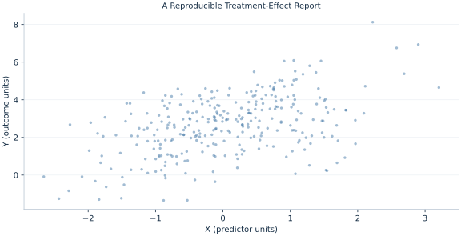

# Lab 20 · A Reproducible Treatment-Effect Report

> How should a report retain its estimand, sensitivity specifications and full evidence?

## Start with the supplied observations

Download [specification_report.xlsx](specification_report.xlsx) and [the complete Python analysis](lab.py). Import the workbook into OpenEconometrics without renaming it. Open the complete Python file in an empty Python document and run the whole file. The first sheet, **Data**, contains the observations. **Dictionary** explains variables, coding, units and missing cells.

For ordinary Python, keep the workbook beside `lab.py`. For another location, use `from lab import run_lab`, then `run_lab(data_path="/path/to/specification_report.xlsx")`. Keep the supplied workbook intact and use a copy for transformations. The [LaTeX result table](table.tex) accompanies the chapter.

The workbook contains **300 original synthetic observations**. Its observational unit is: One synthetic independent unit; dependence is stated explicitly where groups are supplied. These are teaching observations, not an empirical estimate about an actual business, population or policy. Every student starts from the same stored values and missing cells.

| Variable | Meaning | Unit or coding | Missing cells |
|---|---|---|---:|
| `row_id` | Stable record identifier | integer ID | 0 |
| `x` | Predetermined baseline covariate | baseline units | 0 |
| `z` | Second predetermined baseline covariate | baseline units | 0 |
| `y` | Outcome | outcome units | 0 |
| `treat` | Randomized treatment | 0 or 1 | 0 |
| `interaction` | Treatment times centered baseline | treat × baseline | 0 |

## 1. Build the comparison

A reproducible treatment report begins with a target comparison. The unadjusted model estimates a mean difference; a covariate-adjusted model assumes a constant treatment coefficient; an interaction model permits effects to vary with baseline X. Their coefficients need not have the same interpretation.

In the interaction model the treatment coefficient is the effect at X=0. Averaging fitted treatment contrasts over the supplied baseline distribution adds the interaction slope times mean X. Its SE uses the full covariance, including covariance between treatment and interaction coefficients. The reported interval conditions on the observed baseline design rather than adding uncertainty for a separate target population distribution.

$$
y=\beta_0+\tau D+\beta_xx+\beta_zz+\delta(Dx)+u,\quad \widehat{ATE}_{sample}=\hat\tau+\hat\delta\bar x.
$$

Compute each observation’s fitted treated-minus-untreated contrast as τ+δxi and average it. Linearity makes this equal τ+δ mean(X), so oe.lincom can calculate the contrast and its covariance-based interval directly.

## 2. State the assumptions and sample

Treatment is randomly generated independently of baseline covariates and disturbances. Outcomes are complete, units independent and HC3 covariance used throughout. Covariates precede treatment in the mechanism. All specifications use the same 300 units.

**Pause before running.** What does the treatment coefficient in the interaction model describe?

## 3. Follow the application

The complete file loads the supplied observations, applies the chapter's explicit sample rule, computes the procedure and displays the result, a chart and a compact numerical table. The following shortened call highlights the statistical operation. `load_data()` and the other chapter helpers are defined in the full file; run that file before using the snippet.

```python
import openecon as oe

raw = load_data()
model = fit(raw, ["treat", "x", "z", "interaction"])
average = oe.lincom(model, {"treat": 1., "interaction": float(raw.x.mean())})
display(model)
print("Sample-average fitted contrast:", average)
```

Read the output in this order: establish which observations were used, identify the quantity being compared, inspect the amount of variation or uncertainty, and then interpret the result in the units of the question. A large statistic without its denominator, sample and comparison cannot explain the result. The final numerical table puts the quantities used in the worked discussion together; the procedure output retains the fuller set of tables.

## 4. Interpret the executed example

| Quantity | Computed value |
|---|---:|
| Randomized units | 300 |
| Treated units | 156 |
| Unadjusted effect | 1.13925 |
| Adjusted constant effect | 1.17964 |
| Effect at baseline zero | 1.1486 |
| Effect modification slope | 0.648191 |
| Sample average effect | 1.17948 |
| Average effect se | 0.135705 |
| Average effect ci low | 0.91241 |
| Average effect ci high | 1.44656 |
| Baseline mean | 0.0476494 |

The unadjusted effect is 1.13925 and constant-effect adjusted coefficient 1.17964. With interaction, the effect at zero baseline is 1.1486 and modification slope 0.648191. The sample-average fitted effect is 1.17948 with SE 0.135705 and interval [0.91241, 1.44656].



The plotted coordinates come from the same retained observations and calculations as the saved result. A visual pattern is a diagnostic to interpret under the chapter’s assumptions; it does not substitute for the covariance, sample definition or identification argument.

## 5. Decide what the evidence supports

Specification choices should be stated before searching for significance. This original randomized simulation does not establish an empirical policy effect; population generalization requires a target population and sampling argument.

## 6. Try it yourself

**A.** What does the treatment coefficient in the interaction model describe?

**B.** Calculate the average contrast.

**C.** Which uncertainty is reported?

**D.** What belongs in a reproducible report?

## Further reading

[Bruce Hansen’s Econometrics](https://users.ssc.wisc.edu/~behansen/econometrics/) provides optional advanced reading. The examples, synthetic mechanisms and exercises here are original; no textbook datasets, figures or exercise solutions are reproduced.
