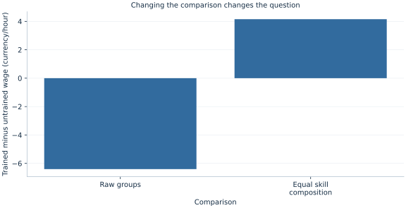

# Lab 01 · The Economic Question Comes First

**Research questions, observation units and study design**

## Start with the supplied workbook

1. Download [training_and_wages.xlsx](training_and_wages.xlsx) and the [Python lab](lab.py). The workbook contains the fixed observations used throughout this chapter.
2. Import `training_and_wages.xlsx` into OpenEconometrics, keeping that filename as the dataset name. The first sheet, `Data`, contains observations; `Dictionary` explains the columns and units.
3. Open the complete `lab.py` in a new Python document and run the whole file. It reads the imported dataset and displays the analysis.

For ordinary Python, keep `lab.py` and `training_and_wages.xlsx` in the same folder and run the script there. To choose another location, import the function with `from lab import run_lab`, then call `run_lab(data_path="/path/to/training_and_wages.xlsx")`. The lab reads the supplied observations each time; it does not create a new random sample. Keep blank cells as missing values rather than replacing them with zero. For exercise transformations, work on a copy of the loaded frame and keep the distributed workbook unchanged.

A city is considering a training program. Its director compares hourly wages and finds that participants earn less than nonparticipants. One reader concludes that training harms workers. Another says the program serves workers who already faced disadvantages. Both readers have noticed the same table, but they are asking different questions about it.

This lab develops that distinction using **600 original synthetic workers**. The numbers are generated for teaching; they are not records from a city or an evaluation of an actual program. The exercise begins with a concrete decision, builds an explicit comparison and shows why a different comparison can produce a different answer. A regression comes later in the course. Here, clear definitions and careful arithmetic do most of the work.

With `training_and_wages.xlsx` imported, run the complete [Python lab](lab.py). The program reads those workers, displays the four comparison cells and plots two wage contrasts. The worked discussion below uses that execution. A [LaTeX table](table.tex) is also available for writing about the cells.

## 1. Turn a decision into a research question

“Is training good?” is too broad to define an analysis. Good for whom? Compared with which alternative? Measured using what outcome? At what point after participation? A useful question names these choices rather than hiding them behind a model name.

For this worked example, define the population as the synthetic workers in a local labor market. Define participation as completing the training program. Define the outcome as hourly wages in hypothetical currency units at one common follow-up date. The initial descriptive question is: **How do average follow-up wages differ between participants and nonparticipants?** It asks about two observed groups.

The corresponding causal question would be: **How would a worker's follow-up wage change if that worker completed training rather than did not complete it?** This question compares two possible outcomes for the same worker. Changing a description into a causal question changes the evidence required. A calculator can produce an observed difference without resolving the causal comparison.

There are also legitimate forecasting questions. An employment office might ask which applicants are likely to have low wages next year. A predictor useful for targeting services need not identify the effect of changing that predictor. Write the intended use next to the question: description, prediction or an intervention decision. This choice guides the comparison and the interpretation.

## 2. Define the observation and its columns

One row represents **one worker**, observed once. There are 600 rows, with no repeated follow-ups. This is a cross section, not a time series or a panel. The distinction matters because three rows for the same worker at different dates would not be three independently selected workers.

| Column | Definition | Interpretation |
| --- | --- | --- |
| `worker_id` | Identifier from 1 to 600 | Labels a row; has no economic magnitude |
| `prior_skill` | Indicator: 0 for lower, 1 for higher prior skill | Measured before participation |
| `trained` | Indicator: 1 for a participant, 0 otherwise | Observed program status |
| `hourly_wage` | Follow-up hourly earnings | Hypothetical currency units per hour |

An indicator is a numerical coding of a category. Its average is a proportion: the average of `trained` is the share of workers trained. An identifier is different. Averaging `worker_id` produces a number, but changing row labels would change that number without changing any worker's economic situation. Being stored as a number is not sufficient reason to treat a column as a meaningful quantitative variable.

All outcomes are observed in this example. There are no survey weights, and every worker receives equal weight in a group mean. That defines a worker-average comparison. A firm-average or household-average question would require a different unit, and a population survey could require a deliberate weighting rule. These choices belong in the question and data definition before estimation.

## 3. Understand the design behind the supplied workers

The original teaching design gives 300 workers lower prior skill and 300 higher prior skill. Participation is more likely among the lower-skill group. Specifically, the training probability is 0.8 for a lower-skill worker and 0.2 for a higher-skill worker. Those participation decisions and wage disturbances have already been drawn and saved in `training_and_wages.xlsx`. Every student therefore analyzes the same realized workers.

Let $S_i$ denote prior skill and $D_i$ participation. The artificial wage equation is

$$
Y_i=12+18S_i+4D_i+\epsilon_i,
\qquad \epsilon_i\sim N(0,2^2).
$$

The disturbance is generated independently of skill and participation. Prior skill raises the conditional wage level by 18 currency units. Training raises it by 4 units in the generating mechanism. The observed outcome combines both differences with individual noise.

In a real study, these numbers and independence statements would be unknown assumptions rather than a visible recipe. The simulation lets us see exactly what selection does: participants are disproportionately drawn from the group with a lower baseline wage. A raw participant comparison mixes a training difference with a composition difference.

The teaching mechanism does not say that actual programs select workers in this way, that actual skill can be reduced to a binary variable, or that real wage effects are constant. Its purpose is to create a transparent example where the arithmetic and the underlying mechanism can be compared.

## 4. Calculate the first observed contrast

Write the raw contrast before using any software:

$$
\widehat\Delta_{raw}=\bar Y_{D=1}-\bar Y_{D=0}.
$$

It is the mean observed wage among participants minus the mean observed wage among nonparticipants. The sign convention matters. Reversing the subtraction reverses the sign while leaving the economic comparison unchanged.

The central calculation is short:

```python
data = load_data()  # Reader defined in the complete lab.py
group_means = data.groupby("trained").hourly_wage.mean()
raw_gap = float(group_means[1] - group_means[0])
print(group_means)
print(raw_gap)
```

The reference execution contains **306 participants** and **294 nonparticipants**. Participants earn **19.878** currency units per hour on average; nonparticipants earn **26.281**. Therefore,

$$
\widehat\Delta_{raw}=19.878-26.281=-6.403.
$$

This is a correct answer to the stated descriptive question. It would be misleading to call it the wage loss caused by training. Participation was not assigned independently of prior skill. The two observed groups began with a different composition, so the raw contrast does not compare otherwise similar workers.

Notice that the problem is not an arithmetic mistake or a small sample technicality. Even a very large dataset could preserve this composition difference. Precision around the wrong comparison would not convert that comparison into the effect of interest.

## 5. Look inside the groups

Divide the data by both participation and prior skill. The four resulting cells show the comparisons that a two-column average hides:

```python
cells = data.groupby(["prior_skill", "trained"]).hourly_wage.agg(
    ["count", "mean"]
)
print(cells)
```

Within the lower-skill stratum, the participant mean is **3.916** currency units higher. Within the higher-skill stratum, the participant mean is **4.392** units higher. Both differences are positive, although the overall participant difference is negative.

This reversal is often called Simpson's paradox. There is no contradiction. The overall means and the within-stratum means use different weights. Among participants, only **21.569%** have higher prior skill. Among nonparticipants, **79.592%** have higher prior skill. The nonparticipant mean places much more weight on the higher-wage stratum.

Let $p_d$ be the higher-skill share among workers with participation status $d$. Then the observed group mean is

$$
\bar Y_d=(1-p_d)\bar Y_{S=0,D=d}+p_d\bar Y_{S=1,D=d}.
$$

The within-stratum wage differences and the differences in $p_d$ both contribute to the raw contrast. A table that reports counts alongside means makes this visible. Counts reveal which comparisons have substantial support and how the overall averages were assembled.

## 6. Choose a common target composition

Suppose the descriptive target is a population with half lower-skill and half higher-skill workers. We can standardize both participation groups to that same composition. This does not change a worker's observed wage; it changes the averaging weights used to summarize the two groups.

For target weights $q_0=q_1=0.5$, define

$$
\widehat\Delta_{standardized}
=0.5(\bar Y_{0,1}-\bar Y_{0,0})
+0.5(\bar Y_{1,1}-\bar Y_{1,0}).
$$

The first subscript identifies skill and the second participation. Substituting the executed within-skill differences gives

$$
\widehat\Delta_{standardized}=0.5(3.916)+0.5(4.392)=4.154.
$$



The two plotted bars summarize different comparisons. The raw bar answers what happened in the realized participant and nonparticipant groups. The standardized bar answers what their observed cell means imply when both groups are represented with the same skill shares. Neither bar should be relabeled without explaining its weights.

Why use one half? Here it matches the full synthetic population's skill composition. Another target might be the participant population, applicants for a new program, or a particular policy district. Different targets can imply different averages when effects vary across groups. Always name the population whose distribution supplies the weights.

## 7. Distinguish adjustment from identification

Standardization removes the observed skill-composition difference from this particular descriptive comparison. A causal interpretation needs more: within a skill stratum, participation must provide a credible comparison for the unobserved alternative outcome. It also needs both participation statuses to occur in the relevant strata, a well-defined treatment and an interpretation that is not disrupted by spillovers between workers.

Potential outcomes make the missing comparison explicit. Let $Y_i(1)$ and $Y_i(0)$ denote the worker's follow-up wage with and without training. We observe

$$
Y_i=D_iY_i(1)+(1-D_i)Y_i(0).
$$

Only one outcome is observed for each worker. The average treatment effect is $E[Y(1)-Y(0)]$, not automatically $E[Y\mid D=1]-E[Y\mid D=0]$. Prior skill helps organize a comparison, but in an empirical application unobserved motivation, health, job networks or employer selection might still differ within each skill category.

The artificial mechanism has a constant training contribution of 4 and independently generated disturbances. Its standardized estimate of 4.154 is close to that contribution, with sampling noise accounting for the difference. This transparency explains the example. It does not establish that adjusting for one binary skill measure would identify a real program's effect.

## 8. Describe the data structure a new question would need

Imagine that the city instead asks whether earnings growth accelerated after training. A single follow-up cross section cannot directly show a worker's change. We would need a baseline outcome and a follow-up outcome, ideally measured consistently. Repeated observations on the same workers create panel data and permit a change-based question, but they do not automatically solve selection either.

If the city asks whether monthly unemployment moved after a national reform, the natural unit might be a month and the data a time series. If it compares multiple regions across months, the unit becomes a region-month and the structure a panel. Dependence across dates and regions then becomes part of the uncertainty calculation.

Aggregation can also change interpretation. A region with high average training participation and high average wages does not establish that trained individuals earn more within that region. Regional composition and individual comparisons are different objects. Match the observation unit to the question, and avoid moving between aggregate and individual claims without evidence.

In every structure, keep the timing straight. Prior skill is measured before participation in this example. A skill assessment taken after training could itself be affected by training. Controlling for a consequence of participation can change the estimand rather than merely make the original comparison fairer.

## 9. Write a result that matches the calculation

A useful short report names the population, outcome, contrast and limitation in connected sentences. For the worked analysis: “Among 600 original synthetic workers, participants have a mean follow-up wage 6.403 currency units lower than nonparticipants. Participants are much more concentrated in the lower prior-skill group. When both participation groups are standardized to equal skill shares, the descriptive wage difference is 4.154 units in the other direction.”

That wording retains the surprising raw result and explains the changed comparison. It does not discard an inconvenient number, conceal selection or imply that the artificial dataset evaluates a real program. A reader can identify what was averaged and why two answers differ.

Before adding a regression, ask whether each term in the planned model corresponds to an economic comparison you can describe. More elaborate estimation can help answer a well-defined question; it cannot choose that question for you. The discipline developed here carries into every later lab: name the outcome and unit, define the comparison, inspect support and composition, then match the conclusion to the evidence.

## Student exercises

1. Write separate descriptive, predictive and causal questions that a training agency could ask using follow-up wages. For each, identify the target population and the role of participation.
2. Calculate the standardized wage gap for a target with 75% lower-skill workers and 25% higher-skill workers. Explain what changed relative to the equal-composition comparison.
3. Use the four cell counts to reconstruct the higher-skill share in each participation group. Then reconstruct each raw mean from its cell means and shares.
4. Suppose a third skill stratum contains participants but no nonparticipants. Explain which standardized comparison becomes unsupported and why an empty cell cannot be repaired by arithmetic alone.
5. Propose one pre-participation variable and one post-participation variable that an agency might collect. Explain why their timing could matter for adjustment.
6. Replace the raw result with a headline appropriate for a report on these synthetic data. Include a sentence that prevents a reader from interpreting the estimate as evidence about an actual training program.
