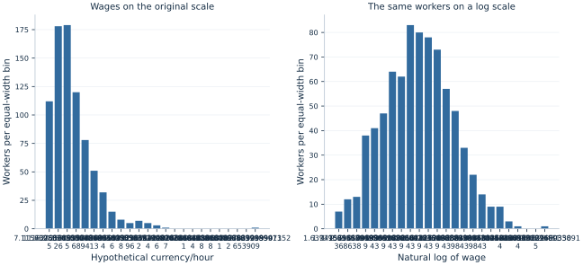

# Lab 02 · A First Look at Wages

**Descriptive statistics, distributions and exploratory plots**

## Start with the supplied workbook

1. Download [wage_distributions.xlsx](wage_distributions.xlsx) and the [Python lab](lab.py). The workbook contains the fixed observations used throughout this chapter.
2. Import `wage_distributions.xlsx` into OpenEconometrics, keeping that filename as the dataset name. The first sheet, `Data`, contains observations; `Dictionary` explains the columns and units.
3. Open the complete `lab.py` in a new Python document and run the whole file. It reads the imported dataset and displays the analysis.

For ordinary Python, keep `lab.py` and `wage_distributions.xlsx` in the same folder and run the script there. To choose another location, import the function with `from lab import run_lab`, then call `run_lab(data_path="/path/to/wage_distributions.xlsx")`. The lab reads the supplied observations each time; it does not create a new random sample. Keep blank cells as missing values rather than replacing them with zero. For exercise transformations, work on a copy of the loaded frame and keep the distributed workbook unchanged.

An analyst is asked to summarize hourly wages. One number seems attractive: the average wage. But that number alone cannot tell a reader whether most workers earn near the average, whether a small upper tail raises it, how widely wages vary, or which workers are missing from the calculation. Those questions are economic questions about a distribution, not decorations to add after fitting a regression.

This worked example uses **800 original synthetic workers**, of whom 795 have observed wages. Wages are measured in hypothetical currency units per hour. The data are designed to have a right tail and one unusually large recorded wage. They are not observations of actual workers and do not describe inequality in any country.

With `wage_distributions.xlsx` imported, run the complete [Python lab](lab.py). It reads the saved wages, displays a descriptive table and draws wage histograms on the original and logarithmic scales. The [LaTeX table](table.tex) presents the same distribution summaries for a written report.

## 1. Decide which feature of wages matters

“What is the wage level?” can mean several things. An employer budgeting total payroll may care about the arithmetic mean because total wages equal the number of workers multiplied by their mean wage, when each has the same hours. A reader asking what a worker near the middle earns may prefer the median. Someone studying low pay may focus on a lower percentile; someone studying dispersion may compare the interquartile range or the standard deviation.

These summaries answer different questions. Choosing one is not a contest to find a universally best statistic. A clear report connects the summary to the intended economic use and then shows enough of the distribution to prevent the summary from misleading the reader.

Our observation is a worker, and the measured variable is hourly pay. It is not annual income. Workers with the same hourly wage can have different annual earnings because their hours and employment spells differ. The code gives every observed worker equal weight. It therefore summarizes observed workers rather than hours worked, households or employers. Changing those weights would change the object being described.

## 2. Inspect the original data and missing values

| Column | Meaning | Unit |
| --- | --- | --- |
| `worker_id` | Identifier from 1 to 800 | Row label |
| `hourly_wage` | Positive hourly pay when observed | Hypothetical currency/hour |
| `log_wage` | Natural logarithm calculated from each observed hourly pay by the analysis | Log of the wage measured in the stated unit |

The teaching population behind this prepared dataset has independent standard-normal draws and wages defined by

$$
W_i=\exp(2.8+0.5Z_i),\qquad Z_i\sim N(0,1).
$$

The supplied workbook includes an unusual positive value for the final worker, whose initial wage was multiplied by 12 during preparation. Wage reports for IDs 1, 161, 321, 481 and 641 are blank. The missingness is deliberately mechanical, so its exact pattern is visible; this is not a model of actual wage nonresponse.

Missing is not zero. A missing wage says that the value is unavailable. A zero would say that the worker's wage is known to equal zero, which would be a substantively different observation and would also prevent an ordinary logarithm. The script explicitly selects the 795 observed wages before computing both scale summaries.

```python
raw = load_data()  # Reader defined in the complete lab.py
observed = raw.dropna(subset=["hourly_wage"]).copy()
print(len(raw), len(observed))
```

The first count is 800 and the second 795. Report both when describing the data. The analysis summarizes observed wages. Whether those observations represent the full population would depend on the real sampling and response process, not just the fraction missing.

## 3. Start with the arithmetic mean

For $n$ observed wages, the arithmetic mean is

$$
\bar W=\frac{1}{n}\sum_{i=1}^{n}W_i.
$$

The executed mean is **19.052 currency units per hour**. Multiplying it by 795 reconstructs total observed hourly pay across the workers, interpreted as one hour for each worker. This additivity is useful when the question concerns totals.

The mean responds to every observation. Raising one wage by 100 while holding the sample size fixed raises the mean by $100/n$. That sensitivity follows directly from the formula. It is neither automatically a defect nor a reason to discard an unusually high value. A genuine high wage belongs in a payroll total; a recording error should be investigated using evidence about how the value was collected.

The native calculation is:

```python
import openecon as oe

description = oe.describe(
    observed, ["hourly_wage"],
    stats=["n", "mean", "std_dev", "min", "p25", "p50", "p75", "max"],
)
display(description)
```

In ordinary Python, printing `description` shows the same table. The outcome name and units belong beside the number. Writing only “the average is 19.052” leaves a reader unable to distinguish an hourly wage, annual income or a logarithm.

## 4. Locate the middle and the middle half

Sort the observed wages from smallest to largest. The median divides the ordered observations into lower and upper halves. With 795 values, it is the 398th ordered wage. The reference median is **16.644**, below the mean of 19.052. That difference is consistent with an upper tail pulling the mean upward.

The 25th percentile is **11.681**, and the 75th percentile is **23.477**. Thus the middle half of observed workers lies between those two wage values, according to the stated empirical percentile rule. Their difference is the interquartile range:

$$
IQR=Q_{0.75}-Q_{0.25}=11.796.
$$

This is a measure of spread, expressed in the original wage units. It is not the fraction of workers who earn above a poverty threshold, and it does not describe the entire lower or upper tail.

Percentiles in finite samples require a convention. This lab uses the native default: take the ordered value at the ceiling of $np$ when $np$ is not an integer; when $np$ is an integer, average the adjacent ordered values at positions $np$ and $np+1$. Positions in this explanation start at one. Other interpolation rules can give slightly different quartiles in small samples without implying that one program has sorted the data incorrectly.

Do not infer that exactly 25% of every finite sample must be strictly below its reported 25th percentile. Ties and interpolation conventions affect that statement. Percentiles locate positions in an ordered distribution; precise counts should be calculated from the threshold when counts are the question.

## 5. Separate dispersion from the level

The sample variance and standard deviation are

$$
s_W^2=\frac{1}{n-1}\sum_i(W_i-\bar W)^2,
\qquad s_W=\sqrt{s_W^2}.
$$

The executed sample standard deviation is **10.774 currency units per hour**. Squaring it gives a variance measured in squared wage units. The standard deviation returns the measure to the original units, making it easier to compare with a wage level.

Each squared deviation contributes to the variance, so distant values receive substantial weight. The interquartile range focuses on the middle half and is less responsive to the exact magnitude of the most extreme observation. Neither summary describes all possible kinds of inequality. Two distributions can share a standard deviation or an IQR while differing markedly near the bottom or top.

The minimum is **4.823** and the maximum **114.862**. These endpoints describe the observed sample, not guaranteed population bounds. Another independently generated sample could contain a larger or smaller value. Treating a sample maximum as a legal wage cap or a population upper limit would confuse an observation with a rule.

A standard deviation also differs from a standard error. The first describes dispersion among workers. A standard error describes how an estimator, such as the sample mean, varies across possible samples. The next lab uses repeated sampling to make that distinction concrete.

## 6. Read a histogram as a count, not a fitted model

A histogram divides the wage axis into bins and counts observations in each bin. The lab uses 24 equal-width bins on each scale. Every observed wage contributes to one bin, and the final bin includes its upper endpoint. The heights shown are counts, not probabilities or density estimates.



On the original scale, a long right tail spreads some observations far above the central mass. Empty or short bars near the high end are part of that pattern. They are not evidence that the low-end observations should be removed, and the horizontal distances represent actual differences in currency per hour.

Changing the number of bins can change the visual texture. Very wide bins can hide structure; very narrow bins can make random gaps look like distinct groups. A sensible exploration tries a few bin widths while keeping the sample and units explicit. The underlying observations and descriptive statistics remain the same when only the plotting bins change.

The two panels use different horizontal scales and independently chosen equal-width bins. Do not compare their bar widths as if they represented the same intervals of pay. Compare the shapes while remembering what distance means on each axis. The original-scale panel describes absolute wage differences; the log-scale panel organizes proportional differences.

## 7. Investigate the large observation transparently

The largest observed wage is 114.862. With that worker included, the mean is 19.052. Removing only that observation produces a mean of **18.931**, a reduction of **0.121** currency units per hour. The median changes from **16.644** to **16.641**. In this realization, the mean is more responsive than the median, but the large observation does not dominate the entire sample.

This comparison is a sensitivity description, not a recommendation to delete the value. The original preparation deliberately included it, so we know it is part of the designed dataset. In an empirical analysis, one would check units, duplicate records, decimal placement and source documentation before deciding whether a value is erroneous.

An analyst should not define “outlier” as “an observation that makes the preferred result less convenient.” A clear rule is chosen for a substantive reason and reported alongside the main result. If both the complete sample and a restricted sample are shown, label them and state which workers were removed.

The highest **eight** wages, the ceiling of 1% of 795, account for **3.582%** of the sum of observed hourly wages. This is a sample upper-tail share under equal worker weights. It is not a national top-income share, and it refers to hourly wages rather than annual household income. The denominator is the wage sum over the same 795 observed workers.

## 8. Understand what taking logarithms changes

The natural logarithm compresses large positive values and gives proportional differences a convenient representation. A doubling adds the same amount, $\log 2$, whether a wage rises from 5 to 10 or from 50 to 100. On the original scale, those changes are 5 and 50 currency units respectively.

In this sample, the mean log wage is **2.813650**. Exponentiating that mean gives the geometric mean wage:

$$
G=\exp\left(\frac{1}{n}\sum_i\log W_i\right)=16.671.
$$

It is not the arithmetic mean of 19.052. Averaging and exponentiating do not commute. Because the exponential function is convex, the geometric mean cannot exceed the arithmetic mean for positive observations. Their difference is related to dispersion, but it is not itself a complete inequality index.

Taking logs does not remove the high-wage worker or change the ranking of positive wages. It changes the scale on which distances are measured. A value can look less extreme visually after the transformation while still being present and economically important on the original scale.

The logarithm is defined here because all observed wages are strictly positive. If actual data contained zero or negative earnings, silently adding an arbitrary constant would change the meaning of the variable and subsequent coefficients. That would require an explicit substantive and statistical decision, rather than a mechanical plotting fix.

## 9. Build a descriptive paragraph with a purpose

A useful description combines a level, spread, shape and sample statement. For this worked example: “Among 795 observed wages from 800 original synthetic workers, the mean hourly wage is 19.052 and the median is 16.644 hypothetical currency units. The middle half lies between 11.681 and 23.477. The distribution has a right tail, with a maximum of 114.862.”

If the purpose is payroll planning, explain why the arithmetic mean is relevant. If the purpose is the wage of a worker near the middle, emphasize the median and its limits. If the purpose is low pay, choose and report a substantively meaningful threshold rather than assuming that a lower quartile is a policy definition.

Every summary above describes the generated observed sample. Generalizing to a real population would require an appropriate sample design, response assumptions and units. The work done before regression is therefore substantive: it establishes what the data represent, which quantities are being summarized and what an eventual model must explain.

## Student exercises

1. Compute the coefficient of variation, $s_W/\bar W$, and interpret its scale. Explain one limitation of comparing this ratio across outcomes with different substantive meanings.
2. Compare histograms with 12, 24 and 48 bins using the same observed workers. Identify a feature that persists and a feature that depends on the bin choice.
3. Calculate the proportion earning below 12 currency units per hour. Distinguish that count-based statement from the reported 25th percentile.
4. Double the largest wage while holding all other observed values fixed. Calculate how the arithmetic mean changes before running code, then compare with the recomputed median.
5. Convert all wages into a currency unit worth ten original units. Determine how the mean, median, standard deviation, log wages and IQR change.
6. Write two descriptive paragraphs: one for payroll planning and one for a reader interested in workers near the middle. Use the same data but justify the summaries emphasized in each.
