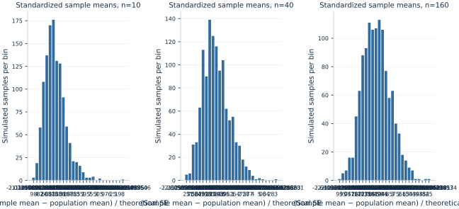

# Lab 03 · What Changes Across Random Samples?

**Sampling variation, standard errors and the central limit theorem**

Two analysts draw different samples from the same population and report different average expenditures. Neither has necessarily made a mistake. A sample mean is a function of the observations selected, so it changes when those observations change. Econometric uncertainty begins with that simple fact.

In this lab, the population is an **original artificial lognormal distribution** whose mean and variance are known. The computer repeatedly draws new independent samples, allowing us to observe the sampling distribution of the mean rather than merely talk about it. The outcomes are hypothetical expenditure units, not actual household records. Every sample comes from the same fixed population mechanism.

Run the complete [Python lab](lab.py) in OpenEconometrics. It displays a repeated-sampling table and three histograms. The [LaTeX table](table.tex) records the main numerical comparison. The discussion below follows that execution and separates variation among individual outcomes from variation among sample averages.

## 1. Name the population quantity and the estimator

The population mean is the expected value of one observation, denoted $\mu=E[X]$. It is fixed by the population mechanism. The sample mean is

$$
\bar X_n=\frac{1}{n}\sum_{i=1}^{n}X_i.
$$

Before drawing a sample, $\bar X_n$ is random because its inputs are random. After a sample is drawn, it takes a particular observed numerical value. Distinguishing the estimator from its realization helps explain why uncertainty can be discussed even though a reported number on a page is fixed.

The sampling distribution is the distribution of $\bar X_n$ across possible samples of the same size drawn using the same sampling design. It differs from the distribution of individual $X_i$ values. An individual expenditure can vary widely while the average of many independent expenditures varies much less.

A histogram of one sample's expenditures is therefore not a histogram of the estimator's sampling distribution. To construct the latter directly here, we draw many samples and calculate one mean from each. Each histogram bar counts **sample means**, not households within one sample.

## 2. Use a population with visible right skew

The artificial population is

$$
X=\exp(1+0.8Z),\qquad Z\sim N(0,1).
$$

Every outcome is positive. Large outcomes occur less frequently but extend farther to the right than small outcomes extend to the left. This gives the central limit theorem something meaningful to approximate: the individual observations themselves are not normally distributed.

For a lognormal variable generated as $\exp(a+bZ)$,

$$
E[X]=\exp(a+b^2/2),
$$

$$
\operatorname{Var}(X)=(\exp(b^2)-1)\exp(2a+b^2).
$$

With $a=1$ and $b=0.8$, the population mean is **3.743421**, and the population standard deviation is **3.544371**. These are analytic properties of the specified population, not averages estimated from a finite master dataset.

The distinction matters. If we first generated a finite file and then sampled from that file, we would be studying a different finite population, with its own realized mean. Here, each new draw comes directly from the stated random mechanism. The reference seed, **3032026**, makes the demonstration repeatable without changing what the population is.

## 3. Derive the standard error before simulating

Assume observations are independent and identically distributed, with population variance $\sigma^2$. Then

$$
\operatorname{Var}(\bar X_n)
=\operatorname{Var}\left(\frac{1}{n}\sum_iX_i\right)
=\frac{1}{n^2}\sum_i\operatorname{Var}(X_i)
=\frac{\sigma^2}{n}.
$$

The standard deviation of the estimator is its standard error:

$$
SE(\bar X_n)=\frac{\sigma}{\sqrt n}.
$$

Independence removes covariance terms from the variance of the sum. If observations share shocks, those terms may not be zero and the formula may not describe the sampling design. Increasing the number of correlated records does not necessarily provide the same information as increasing the number of independent observations.

For sample sizes 10, 40 and 160, the theoretical standard errors are **1.120829**, **0.560414** and **0.280207**. Multiplying the sample size by four halves the standard error. Multiplying it by sixteen reduces the standard error to one quarter. Precision improves at a square-root rate, which is why very large reductions in uncertainty can require substantial increases in sample size.

## 4. Draw genuinely new samples

The lab draws **1,200 independent samples at each sample size**. Each row in the generated array is one sample; each column is one observation within that sample. It computes the mean across the columns to obtain one estimator realization per row.

```python
generator = torch.Generator(device="cpu").manual_seed(3032026)
n = 40
draws = torch.exp(
    1.0 + 0.8 * torch.randn(
        1200, n, generator=generator, dtype=torch.float64
    )
)
sample_means = draws.mean(dim=1)
```

The full source repeats this calculation for all three sizes. It does not draw one sample and repeatedly recalculate the same mean. Nor does it bootstrap one observed dataset. Those are different operations with different interpretations.

The number of replications, 1,200, controls how smoothly we can observe the sampling distribution in the simulation. The sample size $n$ controls how much information enters each individual mean. Increasing replications gives a better Monte Carlo description of the same estimator; increasing $n$ changes the estimator's sampling variability. Confusing those two counts leads to incorrect claims about precision.

## 5. Compare the simulated spread with the formula

The executed comparison is:

| Observations per sample | Average of the 1,200 means | Empirical SD of means | Theoretical SE |
| --- | ---: | ---: | ---: |
| 10 | 3.756312 | 1.090333 | 1.120829 |
| 40 | 3.727744 | 0.555110 | 0.560414 |
| 160 | 3.743054 | 0.274921 | 0.280207 |

The average of the means is close to the population mean at each size. It is not identical because only finitely many simulated samples were drawn. For an unbiased estimator, equality holds in expectation over the sampling distribution, not as an arithmetic identity in every simulation.

The empirical standard deviation of the means is close to $\sigma/\sqrt n$. It is calculated across the 1,200 realized sample means. It is not the average standard deviation within the samples and not the standard deviation of all individual draws pooled together.

For example, at $n=40$, the observed spread of sample means is about 0.555, while an individual draw has population standard deviation about 3.544. Averaging independent observations reduces variation. It does not make the underlying population less dispersed: the same right-skewed population supplies all three experiments.

## 6. Standardize before comparing shapes

To compare distributions with different spreads, form the standardized statistic

$$
Z_n=\frac{\bar X_n-\mu}{\sigma/\sqrt n}.
$$

It measures the sample mean's departure from the population mean in units of its theoretical standard error. The central limit theorem states that, under its conditions, this statistic converges in distribution to a standard normal variable as $n$ grows.



The histograms put each sample size on this standardized scale. The standardized empirical means are **0.0115**, **−0.0280** and **−0.0013**; their empirical standard deviations are **0.9728**, **0.9905** and **0.9811**. Values near zero and one are consistent with centering and scaling, but those two moments alone do not prove that a distribution is normal.

Look at asymmetry and the tails as well as the center. A small-sample distribution can remain skewed even when its average and variance are close to the normal reference values. Convergence concerns the distribution, not merely a mean and a standard deviation.

There is no universal rule that every estimator is adequately normal once $n$ reaches 30. The population's tail behavior, the estimator and the accuracy needed for the question matter. This lognormal population has finite variance, so the usual independent-draw central limit theorem applies, but finite-sample approximation can still be imperfect.

## 7. Distinguish a known from an estimated standard error

In an empirical application, $\sigma$ is usually unknown. A common estimated standard error replaces it with the sample standard deviation:

$$
\widehat{SE}(\bar X_n)=\frac{s}{\sqrt n},
\qquad s^2=\frac{1}{n-1}\sum_i(X_i-\bar X_n)^2.
$$

This estimate varies from sample to sample. A small sample that misses the upper tail may have both an unusually low mean and an unusually low estimated standard deviation. Treating its estimated standard error as if it were known can make an interval too optimistic.

The average estimated standard errors in the experiment are **0.980750**, **0.523413** and **0.273616**. Compare them with the theoretical values of 1.120829, 0.560414 and 0.280207. The discrepancy is most visible at $n=10$ and becomes smaller as the sample size grows.

This does not contradict the unbiasedness of the usual sample *variance*. Taking a square root is nonlinear, so an unbiased variance estimate does not imply an unbiased standard deviation estimate. More importantly for interval coverage, the joint behavior of the mean and its estimated uncertainty matters, not only the average estimated standard error.

## 8. Observe coverage directly

For each simulated sample, the script forms a normal-reference interval with critical value 1.959964. First it uses the known population standard deviation:

$$
\bar X_n\pm1.959964\frac{\sigma}{\sqrt n}.
$$

Then it uses the sample standard deviation in place of $\sigma$. We can count the fraction of intervals containing the known population mean. This is empirical coverage in the repeated-sampling experiment.

| Sample size | Coverage using known $\sigma$ | Coverage using sample $s$ |
| --- | ---: | ---: |
| 10 | 95.333% | 85.083% |
| 40 | 95.750% | 90.667% |
| 160 | 95.750% | 94.167% |

The estimated-scale normal interval performs poorly at $n=10$ in this skewed population. Its coverage improves across these sizes. The known-scale interval happens to have coverage near 95% even at the smallest size, but this single coverage number does not show that the entire standardized distribution is normal or that errors in the two tails are balanced.

These intervals use a **normal critical value** deliberately. They are not exact Student $t$ intervals for normally distributed individual observations: the individual observations here are lognormal. Changing the critical value alone does not automatically supply an exact small-sample result for this population.

## 9. Allow for Monte Carlo uncertainty

The reported coverage is itself estimated from 1,200 simulated intervals. If a coverage probability were exactly 0.95, the standard error of its simulated proportion would be approximately

$$
\sqrt{\frac{0.95(1-0.95)}{1200}}=0.00629.
$$

That is about 0.629 percentage points. A simulated coverage of 95.75% rather than exactly 95% is therefore unsurprising. More replications would reduce this Monte Carlo noise without changing the underlying finite-sample coverage probability.

The Monte Carlo average of the means also has uncertainty. At $n=10$, its approximate standard error is $1.120829/\sqrt{1200}$, about 0.0324. The realized average of 3.756312 is only about 0.0129 above the population mean, well within that scale of simulation variation.

This distinction helps read simulation studies critically. A tiny numerical difference between two methods may reflect Monte Carlo noise. A persistent large coverage shortfall, such as the estimated-scale interval at $n=10$ here, is a different matter. Report the number of replications and consider the simulation precision when comparing methods.

## 10. Carry the idea into empirical work

An actual researcher usually observes one dataset rather than 1,200 independent versions of it. Statistical theory and an appropriate sampling design connect that one realization to the possible samples it represents. The simulation makes the logic visible because the population can be sampled repeatedly and its mean is known.

A small standard error does not guarantee that the population of interest was sampled correctly. Selection bias, measurement error and dependence can undermine the interpretation even if an independent-sampling formula produces a small number. Similarly, a large number of rows does not repair a wrong observation unit or identify a causal effect.

The central lesson is to attach uncertainty to a clearly defined estimator under a clearly defined design. Individual variation, sampling variation and Monte Carlo variation are three different sources of spread in this lab. Each has a different denominator and a different economic interpretation. The next step is to use these distinctions when reading a confidence interval or a hypothesis test from one fitted analysis.

## Student exercises

1. Predict the theoretical standard error at sample sizes 20, 80 and 640 before modifying the code. Explain which ratios can be obtained without recalculating the population variance.
2. Change only the number of replications to 4,800. Explain which quantities should become more precisely measured by the simulation and which theoretical standard errors should remain unchanged.
3. Compare the lower and upper tail errors of the known-scale interval at $n=10$. Does approximately correct total coverage imply balanced tail probabilities?
4. Increase the log standard deviation from 0.8 to 1.2. Recompute the analytic mean and variance, then examine whether a fixed sample size gives the same quality of normal approximation.
5. Generate positively correlated observations within each sample. Explain which step in the variance derivation fails and how the empirical spread compares with the independent-draw formula.
6. Write a short explanation distinguishing the standard deviation of individual outcomes, the standard error of one sample mean and the Monte Carlo standard error of the average of 1,200 sample means.
