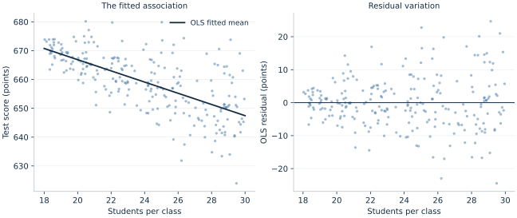

# Lab 04 · Does Class Size Predict Test Scores?

**Simple OLS**

## Start with the supplied workbook

1. Download [class_size.xlsx](class_size.xlsx) and the [Python lab](lab.py). The workbook contains the fixed observations used throughout this chapter.
2. Import `class_size.xlsx` into OpenEconometrics, keeping that filename as the dataset name. The first sheet, `Data`, contains observations; `Dictionary` explains the columns and units.
3. Open the complete `lab.py` in a new Python document and run the whole file. It reads the imported dataset and displays the analysis.

For ordinary Python, keep `lab.py` and `class_size.xlsx` in the same folder and run the script there. To choose another location, import the function with `from lab import run_lab`, then call `run_lab(data_path="/path/to/class_size.xlsx")`. The lab reads the supplied observations each time; it does not create a new random sample. Keep blank cells as missing values rather than replacing them with zero. For exercise transformations, work on a copy of the loaded frame and keep the distributed workbook unchanged.

Why might a smaller class help students learn? A teacher could give each student more attention. Yet schools with smaller classes may also differ in funding, family resources or admissions. A negative relationship in a scatterplot is therefore a starting point for investigation, not automatically a policy effect.

In this lab, you will build and interpret a simple regression using **240 original simulated schools**. The data-generating process is deliberately visible: you can distinguish the relationship we put into the simulation from the estimate one finite sample produces. These are not observed school records, and the results do not establish the effect of any actual education policy.

## Learning goals

This lab connects the fitted line, its uncertainty and its economic interpretation:

- Translate an economic question into an outcome, predictor and observation unit.
- Compute an OLS slope from centered data and connect it to the fitted line.
- Interpret a coefficient, confidence interval and $R^2$ in their correct units.
- Explain why changing the covariance estimator changes uncertainty rather than the fitted coefficients.
- Separate a sample association from the assumptions needed for a causal claim.

**Suggested reading:** Stock and Watson, *Introduction to Econometrics*, fourth edition, Chapters 4–5: simple regression and its inference. The [Pearson contents](https://www.pearson.com/en-gb/subject-catalog/p/introduction-to-econometrics-global-edition/P200000005500/9781292264523) provide the topic map. This lab contains original prose, questions and simulated data; it does not reproduce a textbook exercise.

**Files:** [class-size workbook](class_size.xlsx), [runnable lab](lab.py) and [regression table in LaTeX](table.tex).

## 1. State the question before opening the model

Our descriptive question is: **Do simulated schools with larger average classes tend to have lower average test scores?** The observation is a school. The outcome is its average score, measured in points on an artificial teaching scale. The predictor is its average number of students per class.

For a policy question, we would instead ask what would happen to the *same school's* score if its class size were reduced. We cannot observe both outcomes for a real school at once. In this simulation, the mechanism is known; in an empirical study, the design must justify the comparison.

Before running anything, write down the sign you expect for the slope. Then distinguish “one fewer student per class” from “one additional class in a school.” Those changes have different units and are not interchangeable.

## 2. Understand the original simulated data

| Variable | Meaning | Unit / role |
| --- | --- | --- |
| `school_id` | Identifier from 1 to 240 | School label; never a regressor |
| `class_size` | Average students per class | Students; fractional averages are possible |
| `test_score` | Average simulated test score | Points on an artificial score scale |

All rows are complete. Schools are independent draws; there are no student-level records, survey weights or repeated observations. We give each school equal weight, so this is a relationship across schools rather than a student-weighted average. `missing="raise"` stops execution if a required value is missing rather than silently changing the sample.

The supplied `class_size.xlsx` was prepared from the following original teaching mechanism:

$$
X_i \sim U(18,30), \qquad Z_i \sim N(0,1), \qquad X_i \perp Z_i,
$$

$$
Y_i=660-1.8(X_i-24)+[3+0.8(X_i-18)]Z_i.
$$

The conditional mean score at class size 24 is 660. The structural slope is $-1.8$ points per additional student. Conditional noise grows with class size, from a standard deviation near 3 points to one near 12.6 points. This is **heteroskedasticity**: the variance of the disturbance depends on the predictor. The disturbance still has conditional mean zero.

The realized sample has mean class size **23.933**, with range **18.036–29.957**, and mean score **659.228**. An average class size is not an integer count, which is why decimal values are appropriate here.

## 3. Fit the line and see what OLS chooses

We estimate the statistical model

$$
Y_i=\beta_0+\beta_1 X_i+u_i.
$$

OLS chooses the line that minimizes the sum of squared vertical residuals:

$$
(\hat\beta_0,\hat\beta_1)=\arg\min_{b_0,b_1}
\sum_{i=1}^{n}(Y_i-b_0-b_1X_i)^2.
$$

With an intercept, the centered-data solution is

$$
\hat\beta_1=\frac{\sum_i(X_i-\bar X)(Y_i-\bar Y)}{\sum_i(X_i-\bar X)^2},
\qquad \hat\beta_0=\bar Y-\hat\beta_1\bar X.
$$

After importing `class_size.xlsx`, open the complete [lab.py](lab.py) in a **new Python document** and run the whole file. It reads the prepared schools and prints the model. When the application supplies `display`, it also shows a publication table and two native charts. The default run writes no files.

The central estimation step is:

```python
import openecon as oe

# load_data() is defined in the complete paired lab.py.
schools = load_data()
model = oe.ols(
    data=schools,
    y="test_score",
    x=["class_size"],
    covariance="HC3",
    missing="raise",
    device="cpu",
)
print(model.summary())
```

The executed reference fit is

$$
\widehat{\mathrm{test\_score}}_i=705.723-1.943\,\mathrm{class\_size}_i.
$$

The slope means that schools differing by one student in average class size differ by approximately **1.943 fitted score points**, with the larger class predicted to score lower. The intercept predicts a score at zero students per class. Zero is far outside the simulated support, so **705.723 has no useful school-policy interpretation** here.



**Pause for discussion:** Is every school with a larger class predicted to have a lower *observed* score? No. The fitted conditional mean falls, while individual observations vary around it. The residual chart in the application makes that distinction visible.

## 4. Quantify uncertainty without changing the line

For this heteroskedastic simulation, the primary result uses HC3 standard errors. Let $\mathbf{x}_i=(1,X_i)'$, let $X$ denote the design matrix, and define $h_i=\mathbf{x}_i'(X'X)^{-1}\mathbf{x}_i$. The estimator is

$$
\widehat{\operatorname{Var}}_{HC3}(\hat\beta)
=(X'X)^{-1}\left[\sum_i
\mathbf{x}_i\mathbf{x}_i'\frac{\hat u_i^2}{(1-h_i)^2}\right](X'X)^{-1}.
$$

HC3 inflates residual contributions for leverage; it does not remove confounding, fix a wrong functional form, or make a small sample automatically reliable. For this fit, OpenEconometrics reports Student $t$ inference with **238 residual degrees of freedom**, using a 95% confidence level. The robust interval uses a finite-sample $t$ reference convention; it is not an exact finite-sample coverage guarantee under heteroskedasticity.

| Quantity | Executed value |
| --- | ---: |
| School observations | 240 |
| Class-size coefficient | −1.942695 |
| HC3 standard error | 0.144563 |
| Classical standard error | 0.141512 |
| 95% HC3 confidence interval | [−2.227481, −1.657909] |
| Two-sided $p$ value for zero slope | $5.16\times10^{-31}$ |
| $R^2$ | 0.441920 |

Both covariance choices give the **same coefficient and fitted line on the same 240 schools**. HC3 gives a slightly larger slope standard error in this draw. Robust standard errors are not necessarily larger in every dataset.

The interval gives plausible slope values under the model and repeated-sampling procedure. It does not assign a 95% probability to this fixed unknown parameter after the data have been observed. The small $p$ value means the observed statistic is unusual under a zero-slope null and the stated inference convention. It does not measure the probability that the null is true or establish a real-world causal mechanism.

Here $R^2=0.442$ says that the fitted line accounts for about 44.2% of the sample variation in school mean scores around their overall mean. It is neither a causal share nor a forecast-accuracy guarantee for another population.

## 5. Translate the coefficient into a useful comparison

Moving from 25 to 20 students per class is a change of $\Delta X=-5$:

$$
\Delta\widehat Y=(-5)\hat\beta_1=9.713\text{ score points}.
$$

The fitted score is **657.155** at 25 students and **666.869** at 20. Both predictor values lie inside the data range. Multiplying the slope interval by $-5$ reverses its endpoints, giving **[8.290, 11.137] score points** for this fitted mean contrast.

That interval concerns a difference between two points on the fitted mean line. It is not an interval for an individual school's realized score, which would also involve outcome noise. If you use it to discuss a causal reduction in the simulation, state why: class size was generated independently of the mean-zero disturbance, the relationship was linear, and schools were independent. Those properties were built into the teaching mechanism; observational school data would need their own justification.

### Read a fitted value and a residual separately

The fitted value is a point on the estimated line; the residual is the observed
score minus that fitted value. For example, imagine a school with 25 students
per class and an observed score of 670. Its fitted value would be 657.155 and its
residual would be about 12.845 points. This hypothetical school scores above
the line. That does not contradict a negative slope: the slope describes how
the fitted mean changes across class sizes, while the residual describes one
school's departure from that mean.

Squaring residuals makes positive and negative departures contribute positively
to the OLS objective. A departure of 10 points contributes 100, while a
departure of 2 contributes 4. Large departures therefore receive more influence
in choosing the line. Minimizing squared departures is a statistical rule;
whether the outcome or sample answers the economic question still requires
judgment. A perfectly calculated regression of the wrong outcome would answer
the wrong question precisely.

### Why the intercept can change without changing the relationship

Rewrite class size relative to 24 students, $C_i=X_i-24$. The fitted line becomes

$$
\widehat Y_i=659.098-1.943C_i.
$$

This is the same line expressed with a more useful reference point. The new
intercept is the fitted score at 24 students, a value inside the observed range;
the old intercept referred to zero students. Centering changes the intercept's
interpretation and uncertainty but leaves the slope, fitted values and residuals
unchanged. It does not create extra information or repair confounding. The
example shows why the name and reference point of a coefficient matter as much
as the number printed beside it.

### Three different kinds of variation

The spread of observed school scores, the uncertainty in the estimated slope,
and the uncertainty in a future school's score answer different questions.
Observed outcome variation includes differences along the fitted line and
residual variation around it. The slope standard error concerns how much the
estimated slope would vary across comparable samples. A prediction interval
for a new observed school would additionally account for its disturbance.

For a fitted mean at class size $x_0$, define $q_0=(1,x_0)'$. Its estimated
variance is $q_0'\widehat V q_0$, where $\widehat V$ is the covariance matrix of
the two estimated coefficients. Using only the slope's standard error would
omit intercept uncertainty and their covariance. For an individual outcome,
the disturbance variance at $x_0$ is an additional source of variation. Because
our disturbance variance changes with class size, using one constant residual
variance for every individual prediction would impose an assumption the
mechanism does not satisfy.

Increasing the number of independently sampled schools generally supplies more
information about the mean relationship. It does not imply that school scores
become identical or that the outcome noise disappears. Similarly, collecting
many students within a few schools would not automatically create the same
information as collecting many independent schools. The observation unit and
dependence structure must follow the question and sampling design.

## Student exercises

1. **Units and direction.** Interpret the slope for a reduction of two students per class. Give the fitted score difference and transform the reported 95% interval correctly.
2. **Where the line passes.** Use the sample means and the centered OLS formula to verify that the fitted line passes through $(\bar X,\bar Y)$. Explain why this is an algebraic property with an intercept.
3. **Precision versus fit.** Compare the HC3 and classical columns in [table.tex](table.tex). Name two entries that must remain the same and two that can change.
4. **Sample sensitivity.** Load the supplied workbook and fit the same HC3 model on schools with `class_size < 24`, then on schools with `class_size >= 24`. Report each sample size, slope and interval. Explain why these smaller conditional samples need not reproduce the full-sample slope or equal the structural value $-1.8$. Keep the original workbook unchanged.
5. **External validity.** A school administrator reads “five fewer students raises scores by 9.713 points.” Rewrite that sentence so it accurately describes what this lab establishes. List one possible confounder in real school data.

For an optional extension, add `class_size_centered = class_size - 24` to a copy of the loaded frame and fit the same model using that centered predictor. Compare the intercept, slope and their standard errors with the original fit. Explain which prediction changes numerically and which fitted relationships remain identical.
