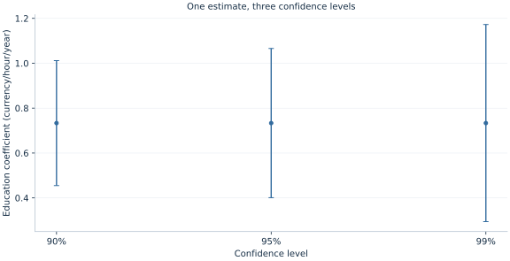

# Lab 05 · How Precise Is Our Estimate?

**Confidence intervals, hypothesis tests and economic importance**

## Start with the supplied workbook

1. Download [wage_inference.xlsx](wage_inference.xlsx) and the [Python lab](lab.py). The workbook contains the fixed observations used throughout this chapter.
2. Import `wage_inference.xlsx` into OpenEconometrics, keeping that filename as the dataset name. The first sheet, `Data`, contains observations; `Dictionary` explains the columns and units.
3. Open the complete `lab.py` in a new Python document and run the whole file. It reads the imported dataset and displays the analysis.

For ordinary Python, keep `lab.py` and `wage_inference.xlsx` in the same folder and run the script there. To choose another location, import the function with `from lab import run_lab`, then call `run_lab(data_path="/path/to/wage_inference.xlsx")`. The lab reads the supplied observations each time; it does not create a new random sample. Keep blank cells as missing values rather than replacing them with zero. For exercise transformations, work on a copy of the loaded frame and keep the distributed workbook unchanged.

A regression reports an education coefficient of 0.733. A reader asks whether the association is “significant.” Before answering, ask what uncertainty is being described, which null value is being tested and how large a change would matter economically. Those are related questions, but they are not the same question.

This lab uses **140 original synthetic workers** to follow one fitted coefficient through three confidence levels, two null hypotheses and a two-year education contrast. Hourly wages are measured in hypothetical currency units. The numbers illustrate statistical reasoning; they are not estimates of educational returns in an actual population.

With `wage_inference.xlsx` imported, run the complete [Python lab](lab.py). It reads the prepared workers, displays the primary model and interval table, and plots the three confidence intervals. The [LaTeX comparison table](table.tex) keeps the fitted coefficients and standard errors together with their stated confidence conventions.

## 1. Identify the uncertain quantity

The fitted model is

$$
W_i=\beta_0+\beta_1S_i+u_i,
$$

where $W_i$ is hourly wage and $S_i$ is completed education in years. The coefficient $\beta_1$ measures a wage difference per additional education year in the linear conditional mean. Its estimate changes across possible samples, which is why a standard error accompanies the estimate.

The original synthetic population has education uniformly between 10 and 18 years and wages defined by

$$
W_i=25+0.6(S_i-14)+[3+0.3(S_i-10)]Z_i,
\qquad Z_i\sim N(0,1).
$$

Education and the mean-zero disturbance are generated independently, with disturbance variance increasing with education. The generating slope is 0.6 currency units per hour per education year. The fixed sample in `wage_inference.xlsx` gives a slope of **0.733351** rather than exactly 0.6 because one finite sample contains sampling variation.

All 140 workers are observed. Each worker receives equal weight, and the two parameters are an intercept and education slope. The primary covariance estimate is HC3, which allows heteroskedasticity and adjusts residual contributions for leverage. The model reports Student $t$ reference inference with **138 residual degrees of freedom**.

## 2. Read an estimate and its standard error together

The executed slope is

$$
\hat\beta_1=0.733351,\qquad \widehat{SE}(\hat\beta_1)=0.168130.
$$

The estimate is the fitted association in the sample. The standard error estimates the spread of that estimator across repeated samples under the model and sampling assumptions. It is not the standard deviation of wages across workers and not an estimate of how much an individual's wage changes randomly from day to day.

Both quantities have the same units: currency per hour per education year. This makes their ratio dimensionless. A coefficient divided by its standard error measures the distance from zero in estimated standard-error units, but the relevant distance changes when the null hypothesis is not zero.

The estimation code is:

```python
data = load_data()  # Reader defined in the complete lab.py
model = oe.ols(
    data=data, y="hourly_wage", x=["education"],
    covariance="HC3", alpha=0.05,
    missing="raise", device="cpu",
)
display(model)
```

The explicit covariance and confidence level make the uncertainty convention visible. They do not establish that education is randomly assigned in a real wage study. Robust standard errors address a covariance calculation; they do not remove omitted confounders or repair an inappropriate sample design.

## 3. Construct a confidence interval

A two-sided confidence interval has the familiar form

$$
\hat\beta_1\pm c\,\widehat{SE}(\hat\beta_1),
$$

where $c$ is a reference-distribution critical value. For the 95% interval here, it is the 97.5th percentile of the Student $t$ distribution with 138 degrees of freedom. The resulting interval is

$$
[0.400906,\;1.065796].
$$

Read it in the coefficient's units. Under the stated procedure and assumptions, it gives an uncertainty range for the education slope, approximately 0.401 to 1.066 currency units per hour per education year. It is not an interval containing 95% of workers' wages.

The confidence statement refers to a procedure across repeated samples. If intervals were constructed using that procedure under conditions supporting its approximation, their long-run coverage would be near the stated level. For one realized interval, the fixed population coefficient either lies in it or does not. The usual frequentist interpretation does not assign a 95% posterior probability to the fixed parameter after observing this interval.

HC3 inference with a finite-sample $t$ reference is an approximation under heteroskedasticity, rather than an exact finite-sample theorem for this teaching population. A larger dataset and a suitable design can make the approximation more informative, but no covariance label guarantees exact coverage in every application.

## 4. Change confidence without changing the fitted relationship

The lab estimates the same specification on the same 140 workers at three confidence levels. The coefficients, fitted values and standard errors remain the same; only the critical value used for the intervals changes.

| Confidence level | Lower endpoint | Upper endpoint |
| --- | ---: | ---: |
| 90% | 0.454932 | 1.011770 |
| 95% | 0.400906 | 1.065796 |
| 99% | 0.294207 | 1.172495 |



Higher confidence requires a wider interval under the same procedure. The 99% interval is more cautious about excluding parameter values; it does not indicate that a different economic relationship has been fitted. Similarly, the narrowest interval is not automatically the best choice for every decision. A confidence level should be chosen with the inferential purpose in mind and reported consistently.

An analyst should not inspect the result and then select whichever confidence level produces a preferred claim. That changes the procedure behind the nominal coverage statement. The three intervals here are an explicit teaching comparison, not an invitation to search for a favorable cutoff.

The critical value is also affected by the reference distribution and degrees of freedom. Confusing a normal critical value, a residual-degrees-of-freedom $t$ critical value and a cluster-degrees-of-freedom critical value can change the reported uncertainty. State the convention used rather than assuming every interval is mechanically estimate plus or minus 1.96 standard errors.

## 5. Test a zero-slope null precisely

For the two-sided null $H_0:\beta_1=0$, the statistic is

$$
t_0=\frac{\hat\beta_1-0}{\widehat{SE}(\hat\beta_1)}=4.361800.
$$

The two-sided $p$ value is **0.00002507** under the reported reference distribution. At a prespecified 5% threshold, this rejects the zero-slope null. The 95% interval excludes zero, giving the corresponding interval view of the same two-sided test.

A $p$ value asks how unusual a statistic at least as extreme would be if the null and the inferential assumptions held. It is not the probability that the null hypothesis is true. It is not the probability that the result arose “by chance,” and it is not the fraction of workers whose wage is affected by education.

Statistical significance also does not identify a causal effect. An observational education-wage association can be precisely estimated yet confounded by ability, family resources, location or selection. This artificial design makes the mechanism transparent, but the test itself only evaluates a parameter restriction within the stated model.

Reporting the estimate and interval makes the substantive claim easier to assess than reporting only “significant at 5%.” The latter discards the scale of the association and much of the uncertainty information.

## 6. Test a substantively different null

Suppose a planning discussion uses **one currency unit per hour per education year** as a benchmark. The relevant null becomes $H_0:\beta_1=1$, not zero. The test statistic is now

$$
t_1=\frac{0.733351-1}{0.168130}=-1.585963.
$$

Its two-sided $p$ value is **0.115037**. At a 5% threshold, the data do not reject this benchmark. The 95% interval includes one, consistent with that result.

The same estimate can reject zero and fail to reject one without any inconsistency. The null hypotheses ask different questions. Rejecting zero provides evidence against a zero slope; it does not prove that the slope equals the observed point estimate. Failing to reject one does not establish that the slope is exactly one.

The native contrast calculation is:

```python
benchmark = model.lincom({"education": 1}, constant=-1.0)
print(benchmark)
```

It estimates $\beta_1-1$, whose point estimate is **−0.266649**. Its standard error is unchanged because subtracting a fixed constant introduces no sampling variance. The statistic tests whether this difference equals zero, which is exactly the benchmark hypothesis.

If the decision instead asks whether the slope is *at least* one, the direction and decision rule need to be defined explicitly. A two-sided test of equality should not be casually relabeled as a one-sided superiority or noninferiority test.

## 7. Translate uncertainty into an economic comparison

The slope is measured per one education year. A comparison of two additional years has fitted difference

$$
\widehat\Delta=2\hat\beta_1=1.466703
$$

currency units per hour. Because the multiplier is a fixed positive constant,

$$
\widehat{SE}(\widehat\Delta)=2\widehat{SE}(\hat\beta_1)=0.336261.
$$

The corresponding 95% interval is **[0.801813, 2.131593]** currency units per hour. The interval and estimate scale together. Changing the reporting unit does not create new information or change the two-sided test of a zero contrast.

This is an interval for a difference along the fitted mean line. Predicting an individual worker's realized wage requires accounting for outcome noise as well as parameter uncertainty, and potentially additional predictors. The coefficient interval should not be presented as an individual prediction interval.

The comparison also assumes the linear slope describes the relevant range. A two-year difference within the observed education range is supported differently from extrapolating the same line to education levels far outside 10–18 years. Units, support and functional form remain important even when the interval calculation is correct.

## 8. Separate precision from importance

Precision is about how tightly the data constrain the parameter under the chosen procedure. Economic importance concerns the consequences of plausible parameter values for a particular decision. A tiny but precisely estimated association may be statistically distinguishable from zero yet economically modest. A large point estimate with a wide interval may be economically consequential but uncertain.

Here the 95% interval ranges from roughly 0.401 to 1.066 currency units per hour per education year. Whether that range is important depends on the wage scale, costs of schooling, hours worked, alternative uses of resources and the causal relevance of the estimate. The coefficient alone does not supply those inputs.

The one-unit benchmark illustrates why a practical threshold should be named rather than implied. The data reject zero but do not sharply distinguish values just below one from one itself. A report claiming that the association “clearly exceeds the one-unit benchmark” would be unsupported by this interval.

Nor does the benchmark automatically define an equivalence test. Showing that a parameter is close enough to a target requires a stated equivalence margin and an appropriate procedure. Failure to reject a point null is not evidence that all economically different alternatives have been ruled out.

## 9. Write the inferential claim in full

A complete statement for the worked analysis is: “In 140 original synthetic workers, an additional education year is associated with 0.733 currency units higher hourly wages in the fitted linear mean. The HC3 standard error is 0.168, and the 95% Student-$t$ reference interval is 0.401–1.066. The zero-slope null is rejected, while a slope of one is not rejected at the 5% level.”

This gives the sample, scale, estimator and uncertainty convention before drawing a conclusion. It avoids treating the threshold as the entire result. It also preserves the synthetic label, so readers do not mistake the exercise for evidence about a country's education policy.

In applied work, repeated searches across outcomes, specifications or subgroups can alter the interpretation of nominal $p$ values and intervals. A prespecified primary question and transparent reporting help distinguish an intended test from a result found through searching. The present worked analysis fixes its data and primary specification before showing how the same coefficient supports different explicitly named inferential questions.

## Student exercises

1. Calculate the 95% interval width and its half-width. Explain how each relates to the standard error and critical value.
2. Test the null that the education slope is 0.5 using the native contrast method. Interpret the result alongside the 95% interval rather than reporting only a threshold decision.
3. Express hourly wages in cents rather than currency units. Predict how the coefficient, standard error, interval and zero-null $t$ statistic change before modifying the data.
4. Calculate the fitted wage contrast and 95% interval for one fewer education year. Pay attention to the order of the endpoints when multiplying by a negative value.
5. Propose a practical benchmark for a clearly specified economic decision. List the extra information needed to decide whether the association is economically useful.
6. Rewrite “education has a significant effect, so the policy works” into a statement that matches the synthetic analysis and distinguishes statistical evidence, economic importance and causal identification.
