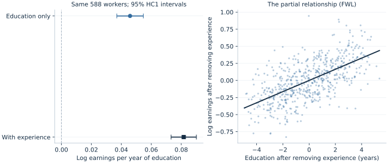

# Lab 06 · What Changes When We Add Controls?

**Education, experience and earnings · Multiple regression and omitted variables**

## Start with the supplied workbook

1. Download [wages_and_controls.xlsx](wages_and_controls.xlsx) and the [Python lab](lab.py). The workbook contains the fixed observations used throughout this chapter.
2. Import `wages_and_controls.xlsx` into OpenEconometrics, keeping that filename as the dataset name. The first sheet, `Data`, contains observations; `Dictionary` explains the columns and units.
3. Open the complete `lab.py` in a new Python document and run the whole file. It reads the imported dataset and displays the analysis.

For ordinary Python, keep the workbook beside `lab.py` and run the file. For another input location, use `from lab import run_lab`, then `run_lab(data_path="/path/to/wages_and_controls.xlsx")`. Keep the original workbook and its missing cells unchanged; use a copy for transformations.

**Files:** [the runnable lab](lab.py) and [the publication table in LaTeX](table.tex).

This lab uses **600 original, simulated workers**. They are not observations of actual people or evidence about returns to education in any country. The prepared `wages_and_controls.xlsx` and complete analysis give the entire class the same observations and reported results. The conceptual topics align with Stock and Watson, *Introduction to Econometrics*, fourth edition, Chapters 6–7 and 9: multiple regression, inference and internal validity. The questions and worked example here are original.

## The economic question

> Workers with more education often have different amounts of experience. What does a regression of earnings on education measure when it ignores that difference?

## Learning goals

- distinguish a simple association from an association conditional on a control;
- predict the direction of omitted-variable bias using two signs;
- keep the estimation sample fixed when comparing specifications;
- interpret a log-outcome coefficient and its confidence interval;
- explain why adding controls does not establish causality by itself.

## 1. A data-generating process we can inspect

Each worker is drawn independently. Education is an integer from 10 through 18 years. Experience tends to be lower for more educated workers in this artificial population; additional schooling can leave fewer years in the labor market. That pattern is a design choice, not a universal empirical fact.

The original teaching mechanism uses independent standard-normal disturbances $v_i$ and $\epsilon_i$ and sets

$$
E_i = \min\{40,\max\{2,20-1.3(S_i-14)+6v_i\}\},
$$

$$
\log W_i = 1.2 + 0.08S_i + 0.03E_i
             + (0.12+0.006E_i)\epsilon_i.
$$

Here $S_i$ is education and $E_i$ is experience. The disturbance has conditional mean zero by construction, but its conditional variance increases with experience. This motivates heteroskedasticity-robust standard errors. The supplied workbook stores one fixed realization of this mechanism.

| Variable | Meaning and units | Role |
| --- | --- | --- |
| `worker_id` | Integer identifier, 1–600 | Preserves the selected workers |
| `education` | Completed years, 10–18 | Predictor of interest |
| `experience` | Years of experience, 2–40 | Control; 12 reports deliberately missing |
| `log_earnings` | Natural log of hourly earnings measured in hypothetical currency units/hour | Regression outcome |
| `hourly_earnings` | `exp(log_earnings)`, hypothetical currency units/hour | Interpretation; not the fitted outcome |

The workbook leaves experience blank for worker IDs 1, 51, …, 551. Earnings remain observed for those workers. Both primary regressions use the same **588 complete cases**. In this run, mean education is **14.105 years**, mean experience is **19.633 years**, and their correlation is **−0.468**.

**Pause before running:** experience raises earnings in the generating equation, while education and experience are negatively related. Should the education-only slope be above or below the slope that holds experience fixed? Predict the sign before examining the fit.

## 2. Run the complete lab in OpenEconometrics

Import `wages_and_controls.xlsx`, open the complete [lab.py](lab.py) in a new Python document and run the whole file. The script reads the prepared workers and makes four compact native displays: two fitted models, their publication table, and a partial-regression scatterplot. A short printed summary reports the sample and the fitted education comparisons. It does not save files unless an output directory is explicitly provided.

The main estimation steps are:

```python
import openecon as oe

raw = load_data()  # Reader defined in the supplied lab.py
data = raw.dropna(
    subset=["education", "experience", "log_earnings"]
).reset_index(drop=True)

short = oe.ols(
    data=data, y="log_earnings", x=["education"],
    covariance="HC1", missing="raise", device="cpu",
)
adjusted = oe.ols(
    data=data, y="log_earnings", x=["education", "experience"],
    covariance="HC1", missing="raise", device="cpu",
)
display(short)
display(adjusted)
```

These snippets illustrate the complete file; `load_data()` is defined in that file. In a standard Python session, replace `display(model)` with `print(model.summary())`. Each full run reads the same workbook and fits both specifications. `missing="raise"` prevents either fit from silently discarding additional observations after the common sample has been selected.

## 3. Read the two models as different comparisons

The short specification is

$$
\log W_i = a_0+a_1S_i+e_i.
$$

Its education slope combines the association with education and the association transmitted through omitted experience. The adjusted specification is

$$
\log W_i = b_0+b_1S_i+b_2E_i+u_i.
$$

The coefficient $b_1$ compares the fitted log earnings of workers differing by one year of education **at the same experience level**, under this linear specification. This conditional comparison is the meaning of “holding experience fixed”; it does not imply the workers were randomly assigned schooling.

The actual run gives:

| Quantity | Education only | Education and experience |
| --- | ---: | ---: |
| Education coefficient | 0.045814 | 0.081664 |
| Education HC1 standard error | 0.004509 | 0.004295 |
| Education 95% confidence interval | [0.036958, 0.054669] | [0.073227, 0.090100] |
| Experience coefficient | — | 0.028985 |
| Experience HC1 standard error | — | 0.001527 |
| $R^2$ | 0.1408 | 0.4490 |
| Observations | 588 | 588 |



The adjusted education estimate is close to the generating value **0.08**, while the short slope is substantially lower. The observed change is **0.035850 log points per education year**. The increase in $R^2$ shows that experience improves in-sample fit; it does not itself validate causal assumptions.

Both columns use **HC1**, which multiplies the heteroskedasticity-robust HC0 covariance by $n/(n-k)$. Here $k$ includes the intercept: 2 in the short model and 3 in the adjusted model. OpenEconometrics reports Student-$t$ inference with 586 and 585 residual degrees of freedom respectively. These are the declared inference conventions for this lab; robust inference is an asymptotic justification, not an exact finite-sample guarantee under arbitrary heteroskedasticity.

### Log points, percentages and uncertainty

For an additional education year, the familiar approximation is $100\hat b_1=8.166\%$. The exact percentage change in the fitted **geometric mean** of earnings is

$$
100\{\exp(\hat b_1)-1\}=8.509\%.
$$

Transforming the education confidence limits in the same monotone way gives **[7.598%, 9.428%]**. This is a confidence interval for the fitted one-year conditional geometric-mean comparison. A log-outcome regression does not automatically estimate the arithmetic mean of earnings in levels; that requires attention to retransformation and the error distribution.

A 95% interval describes repeated-sampling coverage under the model and inference assumptions. It is not a 95% posterior probability that the fixed coefficient lies in this particular realized interval.

## 4. Account for the coefficient change

For a population linear model with an intercept and $\operatorname{Cov}(S,u)=0$, omitting experience changes the education slope by

$$
a_1-b_1
=b_2\frac{\operatorname{Cov}(S,E)}{\operatorname{Var}(S)}.
$$

The sign is negative here: experience has a positive earnings coefficient and covaries negatively with education. More educated workers' lower experience offsets some of their education-related earnings difference in the short regression.

There is also an **exact sample identity** for these nested OLS fits on identical rows. Regress experience on an intercept and education and call its education slope $\hat\delta$. Then

$$
\hat a_1-\hat b_1 = \hat b_2\hat\delta.
$$

The run reports $\hat\delta=-1.236866$ experience years per education year, so

$$
0.045814-0.081664
\approx 0.028985\times(-1.236866)
\approx -0.035850.
$$

The script checks this identity before rounding. Its algebraic equality does not require a causal interpretation; the population “bias” interpretation does require assumptions about the disturbance and the intended target. Do not substitute the known generating value 0.03 for $\hat b_2$ and expect an exact sample equality.

## 5. See “holding experience fixed” through residuals

The Frisch–Waugh–Lovell theorem provides a visual interpretation:

1. Regress education on an intercept and experience; retain residual education.
2. Regress log earnings on an intercept and experience; retain residual log earnings.
3. Regress the second residual on the first, through the origin.

The slope is **0.081664**, the same education coefficient as the full regression. Residual education measures how much schooling a worker has relative to the linear prediction from experience. The partial plot therefore displays the remaining education–earnings association after that linear adjustment.

This theorem establishes the coefficient identity. A naive regression of residuals can attach a different HC1 degrees-of-freedom factor and report a different standard error; use the original full model for the reported uncertainty.

### Why a control changes the comparison

Suppose two workers have the same experience but differ by one year of
education. The adjusted model compares their fitted log earnings through the
education term. Suppose instead that workers with more education also tend to
have less experience. A comparison that ignores experience combines both
differences: the positive education association and the negative contribution
from having fewer years of experience. That second comparison is what the
education-only slope summarizes in this simulation.

The adjusted coefficient is not obtained by finding an actual pair of workers
identical in every respect. It uses the linear projection across the whole
sample. Its interpretation is conditional on included experience within that
model. If the relationship were strongly nonlinear or lacked common support,
“holding experience fixed” could involve extrapolation rather than a well
supported comparison. Always examine what combinations of education and
experience the data contain before interpreting a model mechanically.

### Read the coefficient and its uncertainty together

The adjusted estimate of 0.081664 is a change in the logarithm of hourly
earnings per education year. Its HC1 standard error of 0.004295 is measured in
the same log-earnings units per year. Dividing the estimate by its standard
error gives a test statistic for a zero coefficient; multiplying the standard
error by the appropriate Student-$t$ critical value gives the interval's
half-width. These are distinct uses of the same uncertainty estimate.

With an intercept, education and experience, the adjusted fit estimates three
coefficients from 588 observations, so its residual degrees of freedom are
$588-3=585$. The short model estimates two coefficients and uses $588-2=586$.
The small change in degrees of freedom is one reason to report each model's
inference convention explicitly. The more important change here is the
conditional relationship being estimated; changing a critical value alone
would not explain the movement from 0.045814 to 0.081664.

An interval for the education coefficient can be transformed to an interval for
a fitted earnings ratio because the exponential function is increasing. First
exponentiate each endpoint and then subtract one and multiply by 100. Do not
apply that transformation to the standard error and call the result a
percentage standard error: nonlinear transformations require their own
uncertainty calculation. Likewise, a confidence interval for a coefficient is
not an interval containing 95% of workers' hourly earnings.

### The sample is part of the specification

Missing experience is unknown, not zero. Replacing it with zero asserts no experience. Selecting the same 588 complete cases before both regressions lets the coefficient change be attributed algebraically to adding experience on those workers.

A common sample does not establish that complete cases represent the target population. If low earners disproportionately omit experience, complete-case estimates may describe a selected group. Report how many observations were excluded, why, and how the selected sample differs from the intended population.

## Student exercises

1. **Predict before calculating.** If education and experience were positively correlated while the experience coefficient remained positive, which way would the short education slope move relative to the adjusted slope?

2. **Interpret the controlled comparison.** Report the adjusted one-year education association with its HC1 standard error, its confidence interval in log points, and its exact percentage interpretation. Include what is held fixed and what the simulated data cannot establish.

3. **Change the scale of the question.** At fixed experience, what is the exact fitted geometric-mean earnings difference for two additional education years? Why is simply doubling 8.509% incorrect?

4. **Audit the sample.** Fit an education-only model on all 600 rows returned by `load_data()`. Compare it with the 588-row short model. Explain why comparing that 600-row estimate directly with the adjusted model mixes two changes. Does the absence of missing education make the comparison automatically fair?

5. **Recover the decomposition.** Use the saved summary to verify $\hat b_2\hat\delta$. Then explain why adding experience to an actual wage regression need not resolve omitted ability, selection into employment, or education measurement error.

**Optional coding extension.** On the same 588 cases, center experience at 20 and refit the controlled model. Predict the coefficient changes; compare the education coefficient, fitted values and $R^2$ with the original fit. Keep the workbook unchanged.
