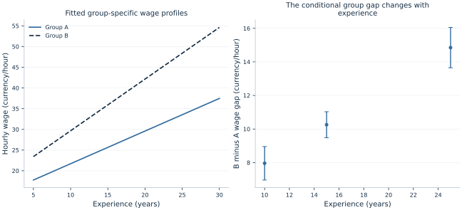

# Lab 07 · Do Groups Have Different Wage Profiles?

**Indicator variables, interactions and conditional comparisons**

## Start with the supplied workbook

1. Download [wage_interactions.xlsx](wage_interactions.xlsx) and the [Python lab](lab.py). The workbook contains the fixed observations used throughout this chapter.
2. Import `wage_interactions.xlsx` into OpenEconometrics, keeping that filename as the dataset name. The first sheet, `Data`, contains observations; `Dictionary` explains the columns and units.
3. Open the complete `lab.py` in a new Python document and run the whole file. It reads the imported dataset and displays the analysis.

For ordinary Python, keep `lab.py` and `wage_interactions.xlsx` in the same folder and run the script there. To choose another location, import the function with `from lab import run_lab`, then call `run_lab(data_path="/path/to/wage_interactions.xlsx")`. The lab reads the supplied observations each time; it does not create a new random sample. Keep blank cells as missing values rather than replacing them with zero. For exercise transformations, work on a copy of the loaded frame and keep the distributed workbook unchanged.

Two occupational groups can have different average wages for more than one reason. Their wages might differ at the same experience level, their returns to experience might differ, or their experience distributions might differ. A single group coefficient can conceal these distinct possibilities if the fitted specification forces the two wage profiles to be parallel.

This lab uses **480 original synthetic workers**, divided equally between fictional groups A and B. It fits an additive wage model, then allows the experience slope to differ by group. The exercise demonstrates what an interaction changes, why a main group coefficient depends on the reference experience level and how to calculate uncertainty for a conditional group gap.

With `wage_interactions.xlsx` imported, run the complete [Python lab](lab.py). It displays the interaction model, a table of group contrasts and a plot of the fitted wage gap. The [LaTeX comparison table](table.tex) places the additive and interaction specifications side by side. These are teaching data, not evidence about any real occupational, demographic or social group.

## 1. Define the question conditionally

Our central question is: **At a given experience level, how does the fitted mean wage differ between groups B and A?** That differs from asking whether group B's raw average wage is higher. A raw group average also depends on which experience levels occur in each group.

The observation is one worker. Hourly wages are measured in hypothetical currency units; experience is measured in years. The group column, called `sector` in the source, is coded zero for A and one for B. The prepared workbook contains 240 workers in each group, with experience between 5 and 30 years.

The original teaching mechanism sets

$$
W_i=14+0.8E_i+3B_i+0.45B_iE_i+u_i,
$$

where $B_i$ is the group-B indicator. The disturbance has mean zero and a standard deviation that grows with experience. In the artificial mechanism, the group-A slope is 0.8 and the group-B slope is $0.8+0.45=1.25$. The mean group difference therefore grows with experience.

These numerical patterns were chosen to make the model's comparisons visible. A conditional group difference in observed data would still require careful interpretation. It is not automatically the effect of moving a worker from one occupation or category into another, particularly when membership and experience are selected rather than assigned.

## 2. See what an additive model imposes

An additive specification is

$$
W_i=a_0+a_1E_i+a_2B_i+v_i.
$$

For group A, the fitted line is $a_0+a_1E$. For group B, it is $(a_0+a_2)+a_1E$. The two lines have the same slope, so their vertical separation is the constant $a_2$ at every experience level.

That restriction may be a useful simplification when the profiles are plausibly parallel. It is also a substantive assumption that can be wrong. A model cannot answer whether the group gap changes with experience if its equation rules out that possibility from the start.

The additive model in the reference execution gives a constant group gap of **11.560** currency units per hour. Under the artificial mechanism, however, the group gap is not constant. The additive coefficient is a projection summary of a relationship the specification compresses into parallel lines. It should not be described as the group difference at every experience level if that restriction is poorly supported.

Adding an interaction expands the question. It does not simply “control more carefully” while preserving the same meaning for every existing coefficient. The main group coefficient will now represent the gap at a particular reference experience level, while another coefficient tells us how that gap changes.

## 3. Center experience at a meaningful value

The lab defines centered experience as

$$
C_i=E_i-15.
$$

Fifteen years lies within the observed range for both groups. Centering makes the intercept and main group comparison refer to this value rather than to zero experience, which lies outside the simulated support.

The interaction model is

$$
W_i=\beta_0+\beta_1C_i+\beta_2B_i+\beta_3B_iC_i+u_i.
$$

The four terms have distinct roles. $\beta_0$ is group A's fitted mean wage at 15 years. $\beta_1$ is group A's experience slope. $\beta_2$ is the group-B-minus-A gap at 15 years. $\beta_3$ is the difference between the groups' experience slopes.

Centering changes the numerical reference for some coefficients, not the information in the data or the family of fitted lines. With all required main and interaction terms retained, the centered and uncentered versions describe the same fitted relationship. A shift of the experience origin is a reparameterization, not a different economic model.

This is why a main group coefficient cannot be interpreted without looking at the interaction and the reference point. Saying “group B earns 10.256 more” without naming experience would hide the fact that the fitted gap changes along the profile.

## 4. Build and fit the interaction explicitly

The workbook includes the centered and product columns so that every term is visible:

```python
data = load_data()  # Reader defined in the complete lab.py
interaction_model = oe.ols(
    data=data,
    y="hourly_wage",
    x=["experience_centered", "sector", "sector_experience"],
    covariance="HC3", missing="raise", device="cpu",
)
display(interaction_model)
```

Here `sector_experience` equals `sector * experience_centered`. The main group indicator and main experience term remain in the model. Omitting a main term would impose an additional restriction, such as a zero group gap at the reference point or a zero slope for group A; it would not be the same unrestricted two-line comparison.

The same structure can be written using a supported formula with a factorial interaction, but the explicit columns make the algebra easy to audit in a first worked example. The full file also fits the additive and uncentered specifications on exactly the same 480 workers.

All fits use HC3 standard errors. The interaction model estimates four coefficients, giving Student-$t$ reference inference with **476 residual degrees of freedom**. The covariance choice changes uncertainty calculations; the group comparison remains conditional on the specified linear profiles and the observed sample.

## 5. Read the two fitted profiles

The executed centered interaction model is

$$
\widehat W=25.649981+0.788458C+10.255555B+0.459389BC.
$$

For group A, substitute $B=0$:

$$
\widehat W_A(E)=25.649981+0.788458(E-15).
$$

For group B, substitute $B=1$ and collect terms:

$$
\widehat W_B(E)=35.905536+1.247847(E-15).
$$

The fitted slope is **0.788458** for A and **1.247847** for B, in currency units per hour per experience year. Their difference is **0.459389**. An additional experience year is associated with a larger fitted wage increase in group B under this model.

The interaction coefficient's HC3 standard error is **0.053086**, and its 95% interval is **[0.355078, 0.563701]**. This directly describes uncertainty about the slope difference. Comparing whether one group's slope is individually significant and the other's is not would be a different and generally inadequate way to test whether the slopes differ.



The first panel shows the fitted wage profiles over common experience support. The second shows several conditional gaps with uncertainty. A visual separation between the profiles is informative, but the estimated contrast and its covariance provide the formal uncertainty calculation.

## 6. Calculate the gap at a chosen experience level

Subtracting the two profiles gives

$$
\widehat\Delta(E)=\widehat W_B(E)-\widehat W_A(E)
=\hat\beta_2+\hat\beta_3(E-15).
$$

The fitted group gap is therefore an affine function of experience. The reference execution gives:

| Experience | B minus A fitted gap | HC3 SE | 95% interval |
| --- | ---: | ---: | ---: |
| 10 years | 7.958608 | 0.506971 | [6.962430, 8.954785] |
| 15 years | 10.255555 | 0.394130 | [9.481106, 11.030004] |
| 25 years | 14.849450 | 0.612121 | [13.646655, 16.052244] |

All comparisons lie inside the generated experience range. The gap at 15 years equals the main group coefficient because centered experience is zero there. At 10 or 25 years, both the main group and interaction coefficients contribute.

The native calculation at 25 years is:

```python
gap_25 = interaction_model.lincom(
    {"sector": 1, "sector_experience": 10}
)
print(gap_25)
```

The multiplier is ten because $25-15=10$. Using 25 instead would calculate a different comparison, corresponding to 40 years in this centered parameterization. Write the centering equation beside the contrast to avoid that common mistake.

## 7. Include covariance when combining coefficients

The variance of the gap is

$$
\operatorname{Var}(\hat\beta_2+c\hat\beta_3)
=\operatorname{Var}(\hat\beta_2)+c^2\operatorname{Var}(\hat\beta_3)
+2c\operatorname{Cov}(\hat\beta_2,\hat\beta_3),
$$

where $c=E-15$. The covariance term matters because both coefficients are estimated from the same data. Adding their standard errors, or taking a square root after adding only their variances, does not generally give the correct uncertainty for the contrast.

The compact matrix expression is $a'\widehat V a$, with contrast vector $a=(0,0,1,c)'$ in the reported coefficient order. `lincom` uses the fitted covariance matrix to calculate this quantity. Its confidence interval concerns a difference in fitted group means at fixed experience, not the range of wage differences between arbitrary individual workers.

The intervals are narrower near the information-rich reference region in this example and wider farther away. Centering itself does not create that information or make every contrast more precise. It only changes which contrast appears directly as a coefficient and can make the parameter interpretation easier to read.

## 8. Recenter without changing the comparison

The uncentered model uses experience $E$ and the product $BE$. Its main group coefficient is **3.364713**, representing the extrapolated group gap at zero experience. The centered main group coefficient is **10.255555**, representing the gap at 15 years.

These are connected by

$$
\hat\beta_{2,centered}=\hat\beta_{2,raw}+15\hat\beta_3.
$$

Substituting the executed coefficients gives the same 10.255555 value. The change in the main coefficient is not a change in the estimated profiles. The reference point has moved.

The uncentered zero-experience gap lies outside the simulated 5–30 year support. Its interpretation is algebraically clear but empirically less useful. A good reference value is substantively relevant and supported by observations from both groups. Choosing it should make the comparison more understandable, not serve as a way to select a favorable test.

Reversing the group coding would also change coefficient meanings. If A rather than B were coded one, the reference group and direction of the gap would reverse. Fitted wages for each worker would remain the same under the equivalent fully specified model. Always state which group is the baseline.

## 9. Check support and avoid a causal shortcut

Conditional comparisons require comparable experience values. If group A appeared only between 5 and 15 years and group B only between 20 and 30, a gap at 18 years would be an extrapolation for both groups. A flexible equation does not create overlap where none exists.

The supplied workbook gives both groups observations over the same experience range, making the worked profile comparisons directly supported by the design. Real occupational groups can differ in education, task, location, hours, tenure and selection. Conditioning only on experience would not necessarily isolate the effect of group membership.

Even the meaning of “changing group” may be ambiguous. Moving a worker to another occupation could change tasks, employers, training and hours simultaneously. A causal question needs a well-defined intervention and a credible comparison design; a group indicator plus an interaction does not supply those conditions by itself.

The fitted linear profiles are also approximations over a specified range. If the actual association bends with experience, a straight line within each group may omit important shape. Later functional-form choices can allow curvature, but the same interpretation discipline remains: identify the baseline, state the conditioning values and calculate the intended contrast explicitly.

## 10. Report the interaction as a comparison

A clear description is: “Among 480 original synthetic workers, the fitted experience slope is 0.788 for group A and 1.248 for group B. Their estimated slope difference is 0.459 currency units per hour per experience year, with a 95% HC3 interval of 0.355–0.564. The fitted B-minus-A wage gap is 10.256 at 15 years of experience and increases with experience.”

This explains both the interaction and the conditional main effect. It avoids calling the main group coefficient a universal wage gap and avoids inferring a causal occupational premium from the artificial example. The model's purpose is to make explicit which group comparison changes as experience changes.

## Student exercises

1. Calculate the fitted group gap at 20 years and obtain its HC3 standard error and 95% interval using `lincom`. Explain the contrast weights.
2. Recenter experience at 20 rather than 15. Predict which coefficients change, then verify that fitted wages and the gap at 20 remain the same.
3. Reverse the group coding. Derive the new baseline, group-gap direction and interaction sign before fitting the equivalent model.
4. Test whether group B's experience slope equals one. Explain why this is a restriction on two coefficients rather than a test of the interaction coefficient alone.
5. Compare the additive constant gap with the interaction gaps at 10, 15 and 25 years. Describe what information the additive restriction compresses.
6. From the supplied workers, retain group A only below 15 years of experience and group B only above 20 years. Plot the remaining support before refitting. Identify which group comparisons require extrapolation and write an interpretation that makes that limitation explicit. Keep the original workbook unchanged.
