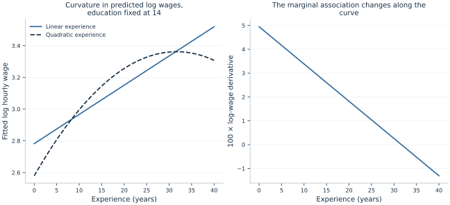

# Lab 08 · Modeling Percentage Changes and Curvature

**Log transformations, polynomial terms and interpretation**

## Start with the supplied workbook

1. Download [wage_profiles.xlsx](wage_profiles.xlsx) and the [Python lab](lab.py). The workbook contains the fixed observations used throughout this chapter.
2. Import `wage_profiles.xlsx` into OpenEconometrics, keeping that filename as the dataset name. The first sheet, `Data`, contains observations; `Dictionary` explains the columns and units.
3. Open the complete `lab.py` in a new Python document and run the whole file. It reads the imported dataset and displays the analysis.

For ordinary Python, keep `lab.py` and `wage_profiles.xlsx` in the same folder and run the script there. To choose another location, import the function with `from lab import run_lab`, then call `run_lab(data_path="/path/to/wage_profiles.xlsx")`. The lab reads the supplied observations each time; it does not create a new random sample. Keep blank cells as missing values rather than replacing them with zero. For exercise transformations, work on a copy of the loaded frame and keep the distributed workbook unchanged.

A constant wage increase per experience year is a strong assumption. Early experience might be associated with rapid wage growth, while later experience adds less. Likewise, an education difference may be easier to describe proportionally than as the same currency amount for every worker. Choosing a functional form determines which of those patterns the fitted model can represent.

This lab uses **500 original synthetic workers** to compare linear and quadratic experience terms in a log-wage equation. It derives local slopes, exact one-year changes and a fitted turning point. It also shows why exponentiating a fitted log outcome does not automatically recover a conditional arithmetic mean wage.

With `wage_profiles.xlsx` imported, run the complete [Python lab](lab.py). The source reads the prepared workers, displays the quadratic model and local-effect table, and plots its fitted log-wage profile. The [LaTeX comparison table](table.tex) shows both specifications on the same sample. Wages are in hypothetical currency units; none of the results describe a real labor market or establish a causal return to schooling or experience.

## 1. Inspect the original generating relationship

Education $S$ is drawn between 10 and 18 years, and experience $E$ between zero and 40 years. The two variables are generated independently. The log-wage mechanism is

$$
\log W_i=1.6+0.07S_i+0.05E_i-0.0008E_i^2+u_i,
$$

$$
u_i=[0.16+0.004E_i]Z_i,\qquad Z_i\sim N(0,1).
$$

The disturbance has conditional mean zero, and its variance grows with experience. The negative quadratic term bends the experience profile downward. Every wage in the prepared workbook is positive because the original preparation obtained wage levels by exponentiating log wages. All 500 rows are complete; both specifications retain every worker with equal weight.

| Column | Meaning | Units |
| --- | --- | --- |
| `education` | Completed schooling | Years |
| `experience` | Work experience | Years |
| `experience_squared` | Experience multiplied by itself | Years squared |
| `log_wage` | Natural log of hourly wage | Log of wage in the stated currency unit |
| `hourly_wage` | Exponentiated log wage | Hypothetical currency/hour |

The squared term is not a separate characteristic a worker can independently change. If experience rises, its square must change too. Treating the two columns as unrelated interventions would misinterpret the polynomial.

## 2. Fit two shapes to the same outcome

The linear log-wage model is

$$
\log W_i=a_0+a_SS_i+a_EE_i+v_i.
$$

It forces the log-wage association with experience to be constant. The quadratic model is

$$
\log W_i=\beta_0+\beta_SS_i+\beta_1E_i+\beta_2E_i^2+u_i.
$$

Its experience slope can vary with $E$. Both models use the same 500 workers, the same log outcome, an intercept and HC3 standard errors. The quadratic model has four fitted coefficients and Student-$t$ reference inference with **496 residual degrees of freedom**.

```python
data = load_data()  # Reader defined in the complete lab.py
linear = oe.ols(
    data=data, y="log_wage", x=["education", "experience"],
    covariance="HC3", missing="raise", device="cpu",
)
quadratic = oe.ols(
    data=data, y="log_wage",
    x=["education", "experience", "experience_squared"],
    covariance="HC3", missing="raise", device="cpu",
)
display(quadratic)
```

The linear model's $R^2$ is **0.509141**; the quadratic model's is **0.578037**. Adding a regressor to an OLS model on the same outcome and sample cannot reduce its unadjusted in-sample $R^2$. The increase is useful descriptive evidence about fit, but it is not by itself proof of better forecasts, a correct causal model or a universally optimal specification.

Comparing $R^2$ across a wage-level model and a log-wage model would require additional care because the outcome variation being explained differs. Here that particular problem is avoided: both columns fit log wages on the identical workers.

## 3. Read the fitted quadratic equation

The executed equation is

$$
\widehat{\log W}=1.741198+0.059901S+0.049452E-0.000781305E^2.
$$

The education coefficient holds both experience terms fixed. The experience coefficient 0.049452 is the derivative at **zero experience**, not a constant percentage association everywhere on the curve. The quadratic coefficient determines how that derivative changes with experience.

A common mistake is to interpret the squared-term coefficient alone as “the effect of one more experience year squared.” A meaningful one-year change moves both $E$ and $E^2$ together. The derivative or finite difference of the complete equation gives the intended comparison.

The intercept corresponds to zero education and zero experience. Zero education lies outside the generated 10–18 year support, so its direct economic interpretation is an extrapolation. The fitted equation can still provide useful comparisons at supported combinations of education and experience without treating every individual coefficient as an independently meaningful scenario.

The plot fixes education at 14 years to show the experience shape. Changing the fixed education value shifts the fitted log-wage curve vertically in this additive specification; it does not change its experience derivative because there is no education-by-experience interaction.



## 4. Interpret a log-outcome education coefficient

For one additional education year at fixed experience, the fitted log-wage difference is $\hat\beta_S=0.059901$. Multiplying by 100 gives the familiar approximation, **5.990%**. The exact proportional change obtained from exponentiating the fitted log difference is

$$
100\left[\exp(\hat\beta_S)-1\right]=6.173\%.
$$

This exact expression compares exponentiated fitted log means. It is a ratio of fitted geometric mean wages. Under additional distributional assumptions it may also describe a conditional median or an arithmetic-mean ratio, but those interpretations should not be assumed solely because the outcome was logged.

The 95% interval for the corresponding fitted geometric-mean percentage change is **[5.212%, 7.143%]**. It is obtained by exponentiating the endpoints of the coefficient interval and subtracting one. Because exponentiation is monotone, the endpoint order is preserved.

For several education years, first multiply the log coefficient by the number of years, then exponentiate. Three one-year percentage changes do not simply add exactly; proportional changes compound. The approximation $100k\hat\beta_S$ can be useful for small values, but the exact fitted ratio is $\exp(k\hat\beta_S)$.

Keep the conditioning statement visible. This model compares workers at the same experience level within a specified log-linear education relationship. A causal education claim would require a design addressing selection and confounding, not merely an exact percentage conversion.

## 5. Calculate the local experience derivative

Differentiating the fitted equation with respect to experience gives

$$
\frac{\partial\widehat{\log W}}{\partial E}
=\hat\beta_1+2\hat\beta_2E.
$$

The derivative is a local slope: the change in fitted log wage per infinitesimal change in experience at a specified point. Multiplying it by 100 gives an approximate percentage slope per experience year.

The executed derivatives are **0.041639** at five years, **0.018200** at twenty years and **−0.005240** at thirty-five years. Their approximate percentage interpretations are therefore **4.164%**, **1.820%** and **−0.524%** per additional year at those points.

The native calculation at twenty years is:

```python
local_slope_20 = quadratic.lincom(
    {"experience": 1, "experience_squared": 40}
)
print(local_slope_20)
```

The weight 40 is twice the evaluation point. The contrast uses the covariance between the linear and quadratic coefficients. Ignoring that covariance would generally give a wrong standard error for the derivative.

At twenty years, the derivative's HC3 standard error is **0.000893**, with a 95% interval **[0.016446, 0.019953]** in log-wage units per year. At thirty-five years, the corresponding interval is **[−0.011263, 0.000783]**. The latter contains zero, so the point estimate's negative sign should not be reported as a precisely established decline at that location.

## 6. Distinguish a derivative from an exact one-year change

A one-year change is finite, so its exact log difference is

$$
\widehat{\log W}(E+1)-\widehat{\log W}(E)
=\hat\beta_1+\hat\beta_2(2E+1).
$$

This differs from the derivative at $E$ by $\hat\beta_2$. The distinction is small when curvature over one year is modest, but it is conceptually important. The exact fitted percentage change is

$$
100\left\{\exp[\hat\beta_1+\hat\beta_2(2E+1)]-1\right\}.
$$

| Starting experience | Local derivative × 100 | Exact fitted change over one year |
| --- | ---: | ---: |
| 5 years | 4.163867% | 4.170352% |
| 20 years | 1.819952% | 1.757080% |
| 35 years | −0.523964% | −0.600285% |

Two approximations are easy to mix up here: replacing a finite difference with a derivative, and replacing an exponential percentage conversion with 100 times a log difference. The table separates them. Neither approximation should be described as exact just because the numerical values are close.

A ten-year change requires comparing the polynomial at $E+10$ and $E$, not multiplying the derivative at the starting point by ten. The slope changes along the path. The full fitted equation provides the finite comparison directly.

## 7. Interpret the turning point with care

Setting the derivative equal to zero gives the fitted turning point:

$$
E^*=-\frac{\hat\beta_1}{2\hat\beta_2}=31.647\text{ years}.
$$

Because the quadratic coefficient is negative, this is a maximum of the fitted log-wage curve, and also of its exponentiation. It lies within the generated zero-to-forty-year experience range. That makes it more directly supported than a turning point far outside the data range, but it remains an estimated feature of a chosen quadratic specification.

The turning point is a ratio of estimated coefficients, so it has uncertainty. If the quadratic coefficient were close to zero, the ratio could become very unstable. A precise point on a plotted curve should not be mistaken for a precisely known economic threshold.

The result also describes a cross-sectional conditional association. It does not show that an individual worker's wage necessarily rises until age or experience 31.647 and then declines. Cohort differences, selection and other changing circumstances can distinguish cross-sectional profiles from individual life-cycle paths.

Quadratic extrapolation deserves particular caution. Continuing the fitted downward curvature far beyond observed experience can generate unrealistic patterns. A polynomial is a functional approximation over a range, not a universal wage law.

## 8. Retransform a fitted log outcome correctly

In general,

$$
E[W\mid S,E]\ne\exp\{E[\log W\mid S,E]\}.
$$

Exponentiating the conditional mean of log wages gives a conditional geometric mean. The conditional arithmetic mean also depends on the distribution of the log disturbance. For the known normal log disturbance in this teaching population,

$$
E[W\mid S,E]=\exp\{\eta(S,E)+\sigma(E)^2/2\},
$$

where $\eta$ is the generating log mean and $\sigma(E)=0.16+0.004E$. The additional factor is greater than one and changes with experience because the conditional disturbance variance changes.

At education 14 and experience 20, the **known generating geometric mean** is **26.049537**, while the **known generating arithmetic mean** is **26.810672**. The factor connecting them is **1.029219**. These are analytic population quantities from the stated teaching mechanism, not fitted empirical forecasts.

In actual data the conditional disturbance distribution is unknown. A global smearing factor can be inappropriate if the retransformation factor varies with predictors. The right method depends on the desired forecast quantity and assumptions about heteroskedasticity. Simply labeling `exp(predicted_log_wage)` as the expected wage conceals this issue.

The education coefficient's percentage interpretation has a special simplification in this teaching mechanism: the log-variance factor depends on experience rather than education. At fixed experience it cancels from an arithmetic-mean wage ratio across education values. That is a property of this designed mechanism, not a general consequence of logging wages.

## 9. Use shape as part of the economic argument

The linear model reports a single experience coefficient of **0.018425**. The quadratic model shows that a similar central slope can coexist with a substantially larger slope early in the profile and a near-zero or negative slope later. A single average slope can therefore hide economically relevant curvature.

A more flexible shape should still be interpreted and evaluated rather than selected solely because it fits better in sample. Consider common support, residual patterns, uncertainty at the boundaries and the intended use. Prediction requires evaluation on observations not used to fit the model; a causal interpretation requires a credible design.

For this worked analysis, a defensible description is that the fitted synthetic log-wage profile is concave in experience, with a changing local association and a fitted maximum near 31.647 years. Education is associated with a 6.173% higher fitted geometric mean wage per additional year at fixed experience. These statements preserve the outcome scale, conditioning variables and limits of what the artificial example establishes.

## Student exercises

1. Calculate the exact fitted percentage change for three additional education years and transform the education coefficient's interval for that comparison.
2. Obtain the log-wage derivative and its HC3 interval at ten and thirty years. Explain the contrast vectors and why the covariance term matters.
3. Calculate the exact fitted percentage difference between ten and twenty years of experience. Compare it with ten times the derivative evaluated at ten years.
4. Recenter experience at twenty years before squaring it. Derive how the linear coefficient changes and verify that fitted log wages and the turning point in original experience units are preserved.
5. Obtain a delta-method uncertainty interval for the fitted turning point. Discuss when a ratio-based approximation could become unreliable.
6. Explain why an exponentiated fitted log wage and an expected wage need not coincide. Use the stated variance function to show how the correction changes between five and thirty-five experience years.
