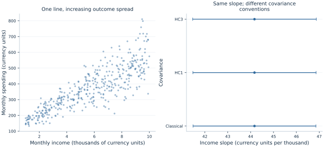

# Lab 09 · Same Coefficient, Different Standard Error?

**Household income and spending: heteroskedasticity, leverage and robust inference**

A regression can produce a plausible fitted line while attaching misleading uncertainty to it. The source of the problem need not be an incorrect slope calculation. The uncertainty formula may assume that outcomes are equally dispersed at every income level, even when the data show a much wider range of spending among richer households. This lab separates the point estimate from its estimated sampling variation. It asks what changes when we retain the same observations and regressors but replace the covariance estimator.

The example contains 420 original synthetic households. Income and spending are artificial monetary quantities, not survey measurements. The simulation deliberately increases spending variation with income, while keeping the conditional mean exactly linear. This makes it possible to study a particular uncertainty problem without simultaneously introducing omitted confounders, nonlinear conditional means or dependent households. Real household data could involve all those complications together.

## 1. Decide what the slope measures

Suppose the descriptive question is: how much more monthly spending is associated with an additional thousand currency units of monthly income? The observational unit is a household. `income_thousands` is monthly income divided by 1,000; `spending` is measured in currency units per month. The model is

$$
Y_i=\beta_0+\beta_1X_i+u_i.
$$

The units of $\beta_1$ are therefore **currency units of monthly spending per thousand currency units of monthly income**. A coefficient of 45 does not mean a 45% spending increase. It also does not mean that spending rises by 45 currency units when income rises by one currency unit. Rescaling the income variable would change the numerical coefficient, its standard error and interval endpoints together, while leaving the underlying comparison unchanged.

The fitted line is a conditional-mean description. An individual household can spend substantially more or less than its fitted value. A confidence interval for the slope concerns the precision of the fitted relationship; it is different from an interval predicting one household's realized spending. The latter must also account for residual outcome variation, which is precisely the quantity that varies with income here.

## 2. Inspect the supplied households and their generating equation

The supplied [household_spending.xlsx](household_spending.xlsx) contains the same fixed 420 synthetic households for every student. Its original generating equations are:

$$
X_i\sim U(1,10),\qquad Z_i\sim N(0,1),\qquad X_i\perp Z_i,
$$

$$
Y_i=120+45X_i+(12+10X_i)Z_i.
$$

The population conditional mean is $120+45X_i$. The conditional disturbance standard deviation is $12+10X_i$, increasing from about 22 to 112 currency units over the support. Consequently,

$$
E[u_i\mid X_i]=0,
\qquad \operatorname{Var}(u_i\mid X_i)=(12+10X_i)^2.
$$

The zero-conditional-mean assumption supports the intended slope interpretation within the simulation. Heteroskedasticity concerns the conditional **variance**, so it does not contradict that assumption. Distinguishing these two moments prevents a common misconception: unequal error variance does not by itself imply that OLS coefficients are biased.

| Variable | Meaning | Units and handling |
| --- | --- | --- |
| `household` | Synthetic household identifier | Label; excluded from regression |
| `income_thousands` | Monthly income divided by 1,000 | Continuous, generated between 1 and 10 |
| `spending` | Monthly household spending | Hypothetical currency units |

There are no missing values, weights or repeated household observations. All three fits use the identical 420 rows, and `missing="raise"` prevents silent exclusions. The observed income range is **1.007–9.997 thousand currency units**. Every household receives equal weight. This estimates a relationship across these generated households, without claiming survey representativeness or national expenditure totals.

## 3. Estimate the line once conceptually, three times explicitly

Download [household_spending.xlsx](household_spending.xlsx) and retain its filename. In OpenEconometrics, import this workbook before opening the complete [lab.py](lab.py) in a new empty Python document. Run the whole file to read the imported observations and display the native results. The first worksheet, `Data`, contains the analysis rows; `Dictionary` explains the columns and units. The data are original synthetic teaching observations, not real measurements. Every student uses the same supplied values, so the published results can be reproduced without generating another sample. Default execution writes no files.

For ordinary Python, keep `household_spending.xlsx` beside `lab.py`. If the workbook is stored elsewhere, import the function with `from lab import run_lab`, then call `run_lab(data_path="/path/to/household_spending.xlsx")`.

The substantive estimation calls are:

```python
data = load_data()  # Reads the supplied workbook; defined in the complete lab.py
models = {
    kind: oe.ols(
        data=data, y="spending", x=["income_thousands"],
        covariance=kind, missing="raise", device="cpu",
    )
    for kind in ["nonrobust", "HC1", "HC3"]
}
display(models["HC3"])
```

In ordinary Python, `print(models["HC3"].summary())` gives the same fitted result in text. The key comparison changes `covariance` while keeping the outcome, regressors, intercept, rows and numerical precision fixed. Calling three fits makes that restriction visible; the covariance choice is not a different economic specification.

All three income coefficients are **44.169160**. The population generating slope is 45, and a finite realization need not recover it exactly. Changing the covariance estimator does not move the coefficient toward 45. Any such movement would indicate that something else changed, such as the sample, weights, transformations or numerical specification.



The figure shows both the changing outcome spread and the interval comparison. An apparently stable line does not imply equally stable observations around it. Equally, a fan-shaped scatterplot is descriptive evidence rather than a complete test of the conditional variance specification.

## 4. Understand what the classical covariance assumes

Write $X$ for the design matrix including its intercept. Under conditional homoskedasticity and uncorrelated disturbances,

$$
\operatorname{Var}(\hat\beta\mid X)=\sigma^2(X'X)^{-1}.
$$

The classical estimator replaces the common variance with $\hat\sigma^2=\sum_i\hat u_i^2/(n-k)$, where $k=2$ counts the intercept and income slope. This pools the residual information into one common variance estimate. The formula works under its assumptions; it is not universally wrong. Its problem here is that the simulation explicitly gives each income level a different conditional variance.

With heteroskedasticity, the appropriate conditional covariance contains observation-specific variances:

$$
\operatorname{Var}(\hat\beta\mid X)
=(X'X)^{-1}\left[\sum_i\mathbf{x}_i\mathbf{x}_i'\sigma_i^2\right](X'X)^{-1}.
$$

This expression shows why the *location* of residual variation matters. A large disturbance at a high-leverage observation can affect slope precision differently from the same disturbance near the center of the regressor distribution. A single pooled residual variance cannot always reproduce that pattern.

## 5. Read HC1 and HC3 as different corrections

Heteroskedasticity-consistent covariance estimators substitute functions of the observed residuals for the unknown $\sigma_i^2$. The basic HC0 sandwich uses $\hat u_i^2$. HC1 applies a finite-sample multiplier:

$$
\widehat V_{HC1}
=\frac{n}{n-k}(X'X)^{-1}
\left[\sum_i\mathbf{x}_i\mathbf{x}_i'\hat u_i^2\right](X'X)^{-1}.
$$

HC3 additionally adjusts the contribution of each residual for leverage. With $h_i=\mathbf{x}_i'(X'X)^{-1}\mathbf{x}_i$,

$$
\widehat V_{HC3}
=(X'X)^{-1}\left[\sum_i
\mathbf{x}_i\mathbf{x}_i'\frac{\hat u_i^2}{(1-h_i)^2}\right](X'X)^{-1}.
$$

OLS residuals at high-leverage observations can be mechanically compressed because those observations help determine the fitted line. HC3 counteracts that compression more aggressively than HC0. It is a covariance convention, not a procedure that deletes unusual households or changes the estimated slope. Nor does it guarantee reliable inference with a tiny or highly influential sample.

The [publication table](table.tex) retains the actual method used in each column. OpenEconometrics uses Student-$t$ inference with **418 residual degrees of freedom** for these OLS fits. The robust intervals use that finite-sample reference convention, while their justification under arbitrary heteroskedasticity remains asymptotic. They are not exact finite-sample confidence statements for every possible disturbance distribution.

## 6. Read the actual uncertainty comparison

| Covariance | Income slope | Standard error | 95% interval |
| --- | ---: | ---: | ---: |
| Classical | 44.169160 | 1.366496 | [41.483100, 46.855221] |
| HC1 | 44.169160 | 1.369705 | [41.476793, 46.861528] |
| HC3 | 44.169160 | 1.375479 | [41.465442, 46.872879] |

The robust intervals happen to be only slightly wider in this realization. That is a useful result, not a failed demonstration. The presence of heteroskedasticity does not imply that every slope's robust standard error must differ dramatically from its classical counterpart. The regressors' distribution, the pattern of heteroskedasticity and realized residuals jointly determine the covariance calculation.

The residual root-mean-square is approximately **46.619 currency units** for households below the median income and **91.330** above it. Outcome spread therefore changes substantially even though the three reported slope standard errors are close. These are different quantities: residual dispersion describes variation around the line, while a coefficient standard error describes repeated-sample variability of the estimated line.

A defensible report can state that the income slope is about 44.17 spending units per additional thousand income units, with the declared HC3 95% interval of 41.47–46.87. It should identify the data as simulated and avoid interpreting the interval as a forecast range for households. The interval also does not place a 95% probability on the zero-conditional-mean assumption being correct.

## 7. Know what robust standard errors leave unresolved

Heteroskedasticity-robust covariance estimates address a particular form of uncertainty. They do not remove omitted household wealth, reverse causality between earnings and spending, measurement error in income, or an incorrectly specified nonlinear conditional mean. If these problems affect the coefficient's target, a more carefully estimated standard error can accompany a misleading coefficient.

HC1 and HC3 also treat distinct observations as uncorrelated. If the rows were repeated months from the same household, shared neighborhood shocks or members of the same family, the independent-household setup would no longer apply automatically. The appropriate dependence structure might call for clustered or time-series covariance rather than a different HC number. Identifying the uncertainty unit is an economic and sampling-design decision.

Likewise, a heteroskedasticity test is not a mandatory switch that must first reject before robust inference becomes permissible. Choosing a covariance convention after seeing which option gives the preferred p-value makes the reporting rule depend on the desired conclusion. A more transparent practice states the sampling and dependence assumptions, chooses a defensible convention and reports the relevant sensitivity comparison openly.

The known simulation gives a clean justification: independent households, a linear conditional mean, mean-zero errors and income-dependent variance. In real applications, evidence for those conditions comes from data collection and substantive knowledge, not from the software label alone.

## 8. Explore changes without mixing questions

After running the source, examine residuals using the stored models:

```python
model = models["HC3"]  # If models was created by the walkthrough above
residuals = model.predict(data=data, kind="residuals")
print(residuals.head())
```

If you ran only the complete file, create `data` and the `models` dictionary with the displayed walkthrough first; `run_lab()` keeps its fitted objects local. For a sensitivity comparison, form low-income and high-income subsets from the supplied observations, then fit the three covariance conventions within each subset. Keep the rows identical across covariance choices within a subset. Differences between subsets involve a changed sample and income support, while differences between covariance conventions within a subset concern uncertainty for the same fitted line.

## 9. Check units when changing the scale

Before changing units in an applied report, carry the uncertainty calculation through the same transformation as the coefficient. If income were recorded in individual currency units instead of thousands, the HC3 slope would be **0.044169 spending units per income unit** and its SE would be **0.001375**. The confidence limits would also be divided by 1,000. The corresponding t statistic would remain unchanged because both its numerator and denominator have the same scale factor. A larger printed coefficient produced by a different unit choice does not indicate a stronger statistical association.

For a specified 500-unit income difference, multiply the original slope and interval by 0.5. This gives a fitted spending difference of **22.084580**, with HC3 interval **[20.732721, 23.436440]**. The interval is about the fitted mean contrast under the model, using the same slope uncertainty. It is not a household prediction band. If the policy question instead concerns the spending of a newly observed high-income household, its outcome noise would be much larger than that of a low-income household in this synthetic design, even though both comparisons use the same estimated slope.

This scaling exercise shows why units belong in every coefficient table and figure. It also gives a practical audit: a unit conversion should preserve fitted values and test statistics when implemented consistently. A mismatch suggests that some part of the data, estimate or uncertainty label was transformed differently.

## Student exercises

1. Interpret 44.169160 with the exact income and spending units. Convert the fitted change for a 500-unit increase in monthly income without relabeling the coefficient as a percentage.
2. Explain why all three slopes coincide. List three implementation choices that would invalidate this controlled covariance comparison if changed between columns.
3. Use the equations to distinguish conditional mean zero from constant conditional variance. Which one fails in the generating process?
4. Compare the two residual RMS values with the three coefficient standard errors. Why can one comparison be large while the other is small?
5. Split the supplied observations at median income. Within each half, compare classical, HC1 and HC3 uncertainty using identical rows and regressors. Explain why differences across halves also reflect a changed sample and income support, and why one comparison cannot rank covariance estimators universally.
6. Suppose the households were observed repeatedly for twelve months. Explain which independence assumption would need reconsideration and why HC3 alone would not resolve it.
7. Write a short results paragraph using the HC3 estimate and interval. Include the simulation scope and distinguish a conditional-mean association from a causal income effect.
