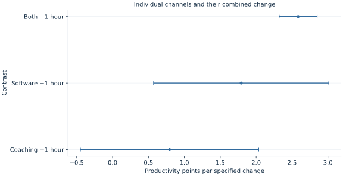

# Lab 10 · Testing Several Claims Together

**Workplace coaching, software use and the difference between individual and joint hypotheses**

A manager introduces coaching and software support together. Workers who receive more coaching also tend to spend more hours using the software. A regression can estimate whether this combined pattern is associated with productivity while remaining less certain about how much belongs to either channel separately. Looking at one coefficient's p-value cannot answer every question about the program.

This lab uses 380 original synthetic workers to distinguish three claims: both channel slopes are zero; the two slopes are equal; and the combined change from adding one hour of each activity is zero. Those claims involve the same fitted model but different restrictions. The purpose is to make the economic statement determine the statistical test, rather than let whichever coefficient looks most significant determine the economic story.

## 1. Write the economic model and the claims separately

Let productivity be an artificial index measured in points. Coaching and software use are measured in hours per reporting period, and tenure in years. The model is

$$
Y_i=\beta_0+\beta_C C_i+\beta_S S_i+\beta_T T_i+u_i.
$$

The coaching coefficient compares fitted productivity after an additional coaching hour, holding software use and tenure fixed. The software coefficient makes the corresponding comparison at fixed coaching and tenure. These conditional comparisons require variation in one activity while the other remains approximately unchanged. When the two activities nearly always move together, the data contain relatively little information about those separate changes.

The first economic claim is that neither activity contributes to the fitted relationship:

$$
H_0:\beta_C=0\ \text{and}\ \beta_S=0.
$$

It contains two restrictions. Rejecting it indicates that the vector of slopes is inconsistent with both being zero under the stated model and inference procedure. It does not establish that both slopes are individually nonzero, that both interventions are causal, or that either is profitable after costs.

The second claim is equality, $H_0:\beta_C-\beta_S=0$. The third concerns a coordinated change: adding one hour of each produces the fitted difference $\beta_C+\beta_S$. Equality and a zero sum each impose one restriction, but they ask different substantive questions. Always write the null in words and symbols before locating a software function.

## 2. Understand why the regressors move together

The supplied [productivity_joint_tests.xlsx](productivity_joint_tests.xlsx) contains a fixed set of 380 synthetic workers. In its original design, independent standard-normal draws determine a common support intensity $A_i$ and activity-specific noise:

$$
C_i=10+2A_i+0.3v_i,\qquad
S_i=8+2A_i+0.3w_i.
$$

Tenure is independently drawn between two and ten years. Productivity follows

$$
Y_i=50+1.2C_i+1.2S_i+0.5T_i+5\epsilon_i.
$$

All disturbances used in these equations are independent. The simulation therefore gives a well-defined linear conditional mean and equal generating slopes for the two channels. The realized correlation between coaching and software use is **0.977524**. That is intentional: most activity variation occurs along a shared direction rather than independently across the two channels.

| Variable | Definition | Units |
| --- | --- | --- |
| `worker` | Synthetic identifier | Label; not a regressor |
| `coaching` | Coaching exposure | Hours per reporting period |
| `software` | Software exposure | Hours per reporting period |
| `tenure` | Time with employer | Years |
| `productivity` | Synthetic output index | Index points |

All 380 observations are complete and equally weighted. There are no repeated workers or clusters in the generating design. Every test uses the same fitted covariance and the same estimation rows. `missing="raise"` makes incomplete input an error. If a later real-data analysis changes samples between models, a coefficient change cannot automatically be attributed to the changed restrictions alone.

## 3. Fit the model and read individual uncertainty

Download [productivity_joint_tests.xlsx](productivity_joint_tests.xlsx) and retain its filename. In OpenEconometrics, import this workbook before opening the complete [lab.py](lab.py) in a new empty Python document. Run the whole file to read the imported observations and display the native results. The first worksheet, `Data`, contains the analysis rows; `Dictionary` explains the columns and units. The data are original synthetic teaching observations, not real measurements. Every student uses the same supplied values, so the published results can be reproduced without generating another sample. Default execution writes no files.

For ordinary Python, keep `productivity_joint_tests.xlsx` beside `lab.py`. If the workbook is stored elsewhere, import the function with `from lab import run_lab`, then call `run_lab(data_path="/path/to/productivity_joint_tests.xlsx")`. The main fit is:

```python
data = load_data()  # Reads the supplied workbook; defined in the complete lab.py
model = oe.ols(
    data=data, y="productivity",
    x=["coaching", "software", "tenure"],
    covariance="HC1", missing="raise", device="cpu",
)
display(model)
```

The model includes an intercept. HC1 is the declared heteroskedasticity-robust covariance convention; it uses the multiplier $n/(n-k)$, here $380/376$. The software uses Student-$t$ coefficient inference and a robust Wald-$F$ reference for joint tests with **376 residual degrees of freedom**. Although the generating disturbance is homoskedastic, the robust convention keeps the emphasis on covariance-based hypothesis testing.

| Channel | Estimated slope | HC1 standard error | Two-sided individual p-value |
| --- | ---: | ---: | ---: |
| Coaching | 0.794033 | 0.631560 | 0.209441 |
| Software | 1.791224 | 0.620855 | 0.004138 |

The estimates fluctuate around their generating values of 1.2. The coaching coefficient does not reject zero at a conventional 5% threshold, while the software coefficient does. This does not establish that coaching has no association. The coaching estimate is imprecise conditional on a highly correlated software variable. Nor can one infer that the two effects differ merely because one p-value is below 0.05 and the other is above it. A difference in significance is not a test of the difference between coefficients.



The figure makes the coordinated change visible alongside its components. Each interval refers to its stated contrast and the declared fitted covariance. The contrast labeled “both +1 hour” is not another coefficient estimated by a separate regression; it is a linear combination of the same model's coefficients.

## 4. Build a joint Wald test from a restriction matrix

Arrange the coefficient vector as $\hat\beta=(\hat\beta_0,\hat\beta_C,\hat\beta_S,\hat\beta_T)'$. The null that both activity slopes are zero can be written

$$
R\beta=r,\qquad
R=\begin{pmatrix}0&1&0&0\\0&0&1&0\end{pmatrix},
\qquad r=\begin{pmatrix}0\\0\end{pmatrix}.
$$

The covariance of the restricted quantities is $R\widehat V R'$. The Wald statistic measures the squared distance of the estimated restriction vector from its null, scaled by that covariance:

$$
W=(R\hat\beta-r)'(R\widehat V R')^{-1}(R\hat\beta-r).
$$

For $q=2$ restrictions, the reported statistic is $F=W/q$. The actual computation is

```python
joint = model.test(["coaching", "software"])
print(joint)
```

It returns **F(2,376) = 187.582202**, with **p = 3.14 × 10⁻⁵⁷**. The very small p-value concerns the joint zero-slope null under this model and covariance convention. It is not a probability that both channels are ineffective, and it does not supply a mechanism linking workplace support to productivity.

Why is the joint evidence so strong when one individual coefficient is imprecise? Because the covariance includes the direction in which the coefficients tend to move together or offset one another across samples. Individual standard errors describe coordinate-by-coordinate uncertainty; a joint test uses the whole relevant covariance submatrix. Ignoring its off-diagonal entries discards information about combinations of coefficients.

## 5. Ask whether the two slopes differ

The direct equality test is:

```python
equal = model.test({"coaching": 1, "software": -1})
print(equal)
```

It gives **F(1,376) = 0.641304**, with **p = 0.423745**. This realization does not reject equal slopes at 5%. That is consistent with the generating equation's equal values, but the non-rejection does not prove equality. An equivalence claim would require a substantively meaningful tolerance and an appropriate procedure; a conventional difference test merely evaluates the zero-difference null.

The distinction is economically useful. A manager might care whether one activity is more productive per hour; a researcher might care whether either activity has any association; another analyst might care about adding both simultaneously. Those are three distinct questions. There is no reason for all three tests to yield the same p-value or decision, because their null sets are different.

Equality also depends on units. Comparing “one coaching hour” with “one software minute” would make equal numerical slopes an arbitrary unit statement. The two regressors here share the same hour unit. Comparing cost-effectiveness would require dividing effects by appropriate monetary costs and accounting for uncertainty in that comparison, rather than silently treating equal hours as equal costs.

## 6. Interpret a coordinated one-hour increase

For one extra coaching hour and one extra software hour at fixed tenure,

$$
\Delta\widehat Y=\hat\beta_C+\hat\beta_S=2.585257.
$$

The uncertainty of this sum is

$$
\operatorname{Var}(\hat\beta_C+\hat\beta_S)
=V_{CC}+V_{SS}+2V_{CS}.
$$

In this run, $V_{CS}=-0.383124$. The negative covariance means that a larger estimated contribution assigned to coaching tends to accompany a smaller estimated contribution assigned to software, and conversely. The sum can therefore be estimated more precisely than either component. This is a central consequence of strongly correlated regressors: the joint pattern may be well identified statistically while its decomposition is not.

```python
combined = model.lincom({"coaching": 1, "software": 1})
print(combined)
```

The combined estimate is **2.585257 productivity points**, HC1 SE **0.134464**, with a 95% interval of **[2.320861, 2.849654]**. Adding the two individual standard errors would be incorrect. Adding their variances while ignoring covariance would also be incorrect. The function uses the covariance of the saved fitted model, without fitting a new specification or selecting new observations.

## 7. Keep robust Wald tests distinct from an RSS shortcut

Under classical homoskedastic OLS assumptions, some nested-model tests can be written using the change in residual sum of squares between restricted and unrestricted models. That familiar formula is not a universal replacement for a robust covariance-based test. This lab's headline test explicitly uses HC1 and the Wald construction. Recomputing an ordinary RSS-based F statistic would impose a different uncertainty calculation.

A test also requires identified, independent restrictions. Repeating the same restriction twice does not create two independent claims. Including an omitted or perfectly collinear coefficient as though it were estimated can make the restriction covariance singular. Good interpretation begins with the actual fitted terms and their retained rank, rather than a wish list of variable names.

With a single restriction, the corresponding F statistic equals the square of its t statistic under matching covariance and degrees-of-freedom conventions. For multiple restrictions, there is no rule that says to square the largest individual t statistic or average the p-values. The matrix expression is the object that connects the economic null to the joint uncertainty.

## 8. Report a claim, its test and its limit

A coherent results paragraph could report strong evidence against both activity slopes being zero, while acknowledging that the conditional coaching coefficient is imprecise and that equality of the two slopes is not rejected. It can then report the combined fitted change with its confidence interval. These statements are compatible; presenting them together avoids the false choice between declaring the entire program ineffective and declaring every channel established.

The simulation builds conditional exogeneity into the generating process. An observational workplace study might not: supervisors could direct coaching toward struggling workers, productive firms might adopt software earlier, and measured hours might proxy for unobserved management quality. Joint significance cannot repair such design problems. Nor does a precise combined association establish a positive net benefit when program costs, displacement or implementation feasibility are unknown.

If many hypotheses are explored and only attractive results are reported, the nominal p-values no longer summarize the whole selection process. Define the principal claims before searching, distinguish planned from exploratory tests, and consider the relevant family of comparisons when making many decisions. A joint test addresses its stated vector of restrictions; it does not automatically correct every other test an analyst tried.

## Student exercises

1. Write the restriction matrices for both slopes zero, equal slopes, and a zero combined one-hour change. State the number of independent restrictions in each.
2. Explain why the individual coaching p-value and the joint p-value do not contradict one another. What does rejection of the joint null permit you to conclude about the two slopes?
3. Use the two SEs and the reported covariance to calculate the SE of their sum. Explain why simply adding SEs gives the wrong answer.
4. Test whether the coaching and software slopes differ. Explain why comparing their individual significance labels is insufficient.
5. From the supplied columns, create `average_exposure = (coaching + software) / 2` and `exposure_gap = coaching - software`. Refit with those two regressors and tenure. Derive how their slopes map to the original slopes and compare the precision of the shared-exposure and gap directions.
6. Re-express software exposure in units of ten hours. Explain how to reformulate the equality or coordinated-change claim so its economic meaning remains the same.
7. Draft a short report distinguishing joint association, channel decomposition, coordinated change and causal program effectiveness.
