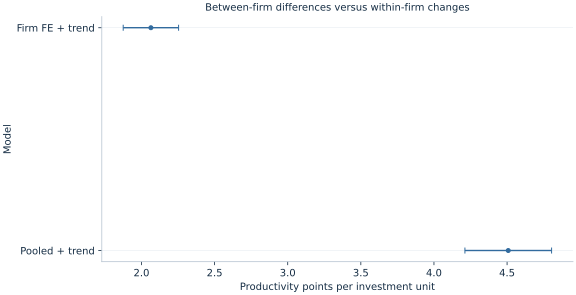

# Lab 11 · Comparing Firms to Themselves

**Investment, productivity and persistent differences between firms**

Firms that invest more may also have better management, stronger customer relationships or a more skilled workforce. A cross-sectional regression can attribute some of those persistent advantages to investment. Following firms over several years creates another comparison: when a given firm invests more than its own usual amount, does its productivity also move? Fixed effects use that within-firm variation to remove additive differences that remain constant over the observed years.

This lab follows 60 original synthetic firms for six years. The generating process deliberately gives productive firms higher investment, so pooled OLS mixes a within-firm investment relationship with between-firm advantages. A firm fixed-effects model removes the latter. The example also includes a common calendar trend and persistent errors, making it necessary to distinguish a control for changing means from an allowance for dependent uncertainty.

## 1. Define the observation and the competing comparisons

Each row is a firm-year, with productivity measured in artificial index points and investment measured in hypothetical thousand currency units per worker. The model is

$$
Y_{it}=\alpha_i+\beta I_{it}+\gamma t+u_{it},
$$

where $i$ indexes firms and $t$ is a numerical calendar trend taking values 0 through 5. The firm effect $\alpha_i$ collects persistent additive advantages. The investment slope compares changes within a firm after allowing for the common linear trend. Its units are productivity points per additional thousand investment units per worker.

A pooled model omits $\alpha_i$ and estimates one common intercept. It therefore uses both differences between firms and changes within firms. If persistent firm advantages are correlated with investment, those two sources of variation need not identify the same slope. Calling the pooled estimate “the investment effect” without discussing this correlation can conceal the economic source of its association.

Fixed effects do not make every firm identical. They absorb each firm's additive level over the sample. Firms can still have different shocks, trends, responses or measurement quality. Whether those remaining differences threaten interpretation depends on the design and specification; it is not settled by including an identifier in a software call.

## 2. Inspect the panel-generating process

The supplied [firm_panel.xlsx](firm_panel.xlsx) contains the fixed balanced panel. Its original design uses a persistent firm characteristic $A_i$, drawn with standard deviation 1.5. Investment follows

$$
I_{it}=6+1.2A_i+0.5t+v_{it},
$$

and productivity follows

$$
Y_{it}=40+2I_{it}+4A_i+0.8t+u_{it}.
$$

The idiosyncratic investment disturbance $v_{it}$ is independent of the productivity shocks. The latter are serially persistent:

$$
u_{i0}=\eta_{i0},\qquad
u_{it}=0.55u_{i,t-1}+\eta_{it},
$$

with independent innovations of standard deviation 2. Firms are independent of one another. The same $A_i$ raises both investment and productivity; omitting it creates the intended positive confounding in pooled OLS. Its constancy over years is what makes the within transformation useful.

| Variable | Meaning | Handling |
| --- | --- | --- |
| `firm` | Synthetic firm identifier, 0–59 | Panel and cluster unit |
| `year` | Calendar year, 2015–2020 | Orders observations within a firm |
| `trend` | Calendar year minus 2015 | Numerical common linear trend |
| `investment` | Investment per worker | Thousand hypothetical currency units |
| `productivity` | Firm productivity index | Artificial index points |

The panel is balanced: every firm has all six years, for **360 observations**. No rows are missing, there are no duplicate firm-year pairs, and every row receives equal weight. Both fits use `missing="raise"`. The workbook is ordered by firm and year, so its retained row positions can be compared directly. Preserve those identifiers and the recorded calendar years when importing it. Equal row weighting in this balanced panel also gives equal total observation weight to each firm; this equivalence need not hold in an unbalanced panel.

## 3. Estimate the pooled comparison first

Download [firm_panel.xlsx](firm_panel.xlsx) and retain its filename. In OpenEconometrics, import this workbook before opening the complete [lab.py](lab.py) in a new empty Python document. Run the whole file to read the imported observations and display the native results. The first worksheet, `Data`, contains the analysis rows; `Dictionary` explains the columns and units. The data are original synthetic teaching observations, not real measurements. Every student uses the same supplied values, so the published results can be reproduced without generating another sample. Default execution writes no files.

For ordinary Python, keep `firm_panel.xlsx` beside `lab.py`. If the workbook is stored elsewhere, import the function with `from lab import run_lab`, then call `run_lab(data_path="/path/to/firm_panel.xlsx")`. The pooled call is:

```python
data = load_data()  # Reads the supplied workbook; defined in the complete lab.py
pooled = oe.ols(
    data=data, y="productivity", x=["investment", "trend"],
    covariance="cluster", cluster="firm",
    missing="raise", device="cpu",
)
display(pooled)
```

Its investment slope is **4.508013**, with firm-clustered SE **0.148080** and 95% interval **[4.211705, 4.804321]**. The coefficient is estimated precisely for this pooled specification. It is nevertheless far from the generating slope of 2 because the model has not removed the persistent characteristic correlated with investment.

This illustrates why statistical precision and identification are different questions. A narrow interval estimates a particular statistical relationship precisely under its assumptions; it does not certify that the relationship isolates the desired economic mechanism. Clustering the pooled standard errors allows within-firm dependence but does not remove the omitted firm characteristic from the coefficient.

## 4. Remove persistent levels by taking within-firm deviations

For each firm, compute its sample means $\bar Y_i$ and $\bar I_i$. Subtracting the firm mean from every observation gives

$$
Y_{it}-\bar Y_i
=\beta(I_{it}-\bar I_i)+\gamma(t-\bar t_i)
+(u_{it}-\bar u_i).
$$

The additive $\alpha_i$ disappears because it is the same in every year for that firm. OLS on these transformed quantities identifies the within slopes. OpenEconometrics implements the fixed-effects estimator directly; you do not need to create 60 dummy columns manually.

```python
fe = oe.xtreg(
    data=data, y="productivity", x=["investment", "trend"],
    panel="firm", time="year", model="fe",
    covariance="cluster", cluster="firm", missing="raise",
)
display(fe)
```

The `time="year"` argument declares panel ordering and checks its structure. It does not automatically add a complete set of year fixed effects. This specification includes the explicit numerical regressor `trend`, matching the simulation's common linear calendar effect. In a real application with arbitrary common year shocks, a linear trend might be insufficient; year indicators or a different time specification would need substantive justification.

The difference between a panel declaration and an included regressor matters. A model can know the year attached to each row without controlling flexibly for calendar shocks. Likewise, knowing the panel identifier does not establish that all relevant confounding is constant within that identifier.

## 5. Read the executed within-firm result

| Quantity | Pooled with trend | Firm fixed effects with trend |
| --- | ---: | ---: |
| Investment slope | 4.508013 | 2.064449 |
| Firm-clustered SE | 0.148080 | 0.094610 |
| 95% interval | [4.211705, 4.804321] | [1.875135, 2.253762] |
| Firm-year observations | 360 | 360 |
| Independent firm clusters | 60 | 60 |



The fixed-effects estimate is close to the known generating value of **2.0 productivity points per investment unit**. Its confidence interval contains that value in this realization. Neither closeness nor coverage in one draw proves a universal superiority result. The reason to prefer the within specification for this simulation is that its assumptions match the generating equation and remove the deliberately correlated persistent firm characteristic.

The estimated common trend is **0.845845 productivity points per calendar step**, holding investment and firm levels fixed, close to the generating value of 0.8. The reported within $R^2$ is **0.824644**. It describes fit to within-firm variation, not the share of all between-firm productivity differences explained by the model. Comparing it directly with a pooled overall $R^2$ treats different denominators as though they were the same fit statistic.

The native within scatterplot displays productivity and investment after subtracting each firm's mean. Because the common trend is still present in those plotted coordinates, its raw visual slope is not by itself the fully trend-adjusted investment coefficient. The multiple regression performs the additional adjustment. This avoids turning a useful visualization into an incorrect substitute for the specified model.

## 6. Match uncertainty to the repeated observations

Six records from one firm do not supply six independent realizations of the persistent shock process. Clustering at the firm level permits arbitrary covariance among the six within-firm disturbances while relying on independence across firms. There are **60 clusters**, so OpenEconometrics uses Student-$t$ inference with **59 degrees of freedom** for the clustered coefficient intervals.

For the within-transformed slope design $X_w$, let $\hat u_{wi}$ be the residual vector for firm $i$. The cluster score is $s_i=X_{wi}'\hat u_{wi}$. The slope covariance takes the sandwich form

$$
\widehat V
=c(X_w'X_w)^{-1}
\left[\sum_{i=1}^{G}s_i s_i'\right]
(X_w'X_w)^{-1}.
$$

Here the declared finite-sample factor is $c=G/(G-1)\times(N-1)/(N-K)$, with $G=60$, $N=360$ and $K=3$ counting the two slopes and intercept. Firm effects are nested in firm clusters and are excluded from this correction's parameter count. This is the implementation's stated convention; it should not be silently replaced by the parameter count from a full dummy-variable regression.

Clustering handles dependence in uncertainty, while fixed effects remove additive firm levels from the point-estimation comparison. These are different operations. One can cluster a pooled model without removing firm confounding, and one can estimate fixed effects while using an inappropriate independence assumption for inference. Keeping the two decisions separate makes both the economic interpretation and the software specification easier to audit.

## 7. State the identifying assumption that survives demeaning

A useful sufficient assumption is strict exogeneity:

$$
E[u_{it}\mid I_{i1},\ldots,I_{iT},\alpha_i,t]=0.
$$

It concerns the idiosyncratic productivity shock relative to the firm's investment history, not merely the contemporaneous correlation between investment and a single year's error. The generating process satisfies the intended independence because investment shocks and productivity innovations are independently drawn. Correlation between investment and the persistent firm characteristic is allowed; fixed effects remove that characteristic additively.

An actual firm might increase next year's investment after an unexpectedly good or bad productivity shock. That feedback can violate strict exogeneity even if no persistent firm characteristic has been omitted. Time-varying management changes, demand shocks correlated with investment, investment measurement error or firm-specific trends can also remain after demeaning. Fixed effects are not a universal solution to endogeneity.

The common-slope assumption matters too. The simulation gives every firm the same investment slope. If effects differ across firms, the estimated coefficient aggregates within variation according to the design, and its interpretation requires more care. The transformation does not automatically turn the estimate into a simple arithmetic average of every firm's causal response.

## 8. Recognize what cannot be learned from within variation

A regressor that never changes within a firm disappears when its firm mean is subtracted. Industry, founding location or an unchanging ownership category cannot have a separate within-firm slope identified in a model with unrestricted firm fixed effects. Omitting such a coefficient is not a software defect; it reflects the absence of independent identifying variation.

This does not imply that time-invariant characteristics are economically irrelevant. Their additive associations are absorbed into firm effects. Questions about their effects require another design, additional assumptions or a model that uses between-firm information. A transparent analysis states which variation supports each coefficient and which substantive questions the selected design cannot answer.

Missing observations introduce another issue. A firm observed only in expansion years may have a different sample mean from the mean it would have over the intended full panel. Fixed effects use the observed estimation sample; they do not reconstruct missing years or automatically correct selective attrition. Inspect retained panels, dates and missingness before interpreting a within comparison.

## Student exercises

1. Derive the within equation by subtracting each firm's sample mean. Identify exactly which terms disappear and which remain.
2. Interpret the pooled and fixed-effects investment coefficients in their stated units. Explain why the pooled interval can be narrow while the coefficient remains confounded in this simulation.
3. Explain the separate roles of firm effects, the numerical trend, and firm clustering. Which would address a permanent management advantage, a common linear calendar change, and serially persistent uncertainty?
4. Why does `time="year"` not imply that arbitrary year fixed effects have been included? Propose a substantive situation in which the linear trend would be inadequate.
5. Add a firm-constant variable to a copy of the source and fit the fixed-effects specification. Explain the omitted-term behavior using identifying variation rather than a software error claim.
6. Describe an investment feedback rule that would violate strict exogeneity. Explain why clustering would not repair that violation.
7. Write a results paragraph reporting the within estimate, its interval, 60-cluster uncertainty and the original synthetic scope, without claiming that every real investment study is causally identified by fixed effects.
