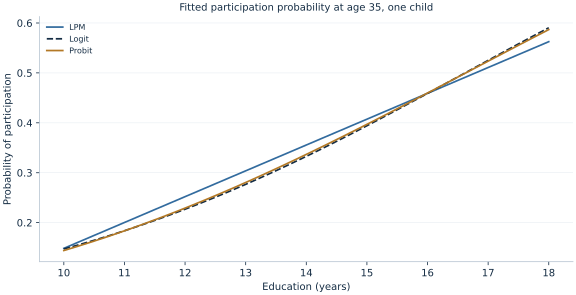

# Lab 12 · Explaining Labor-Force Participation

**Linear probability, logit, probit and interpretable marginal effects**

A participation outcome has only two values: a person either participates in the labor force or does not. The economic question concerns how the probability of participation varies with education, children and age. A coefficient from a nonlinear binary model does not automatically report that probability change. To interpret the result, distinguish the model's index, its link function, its predicted probabilities and the marginal comparison of interest.

This lab compares three models on 720 original synthetic adults: a linear probability model, logit and probit. The data are deliberately generated from a logistic probability, so the logit working model matches the known generating law. The other links provide useful descriptive comparisons. They do not become interchangeable causal models simply because their fitted curves look similar over the observed range.

## 1. Define a probability rather than a continuous outcome

Let $Y_i=1$ indicate participation and $Y_i=0$ otherwise. Its conditional mean is a probability:

$$
E[Y_i\mid X_i]=P(Y_i=1\mid X_i)=p_i.
$$

An individual outcome remains either zero or one even when the fitted probability is 0.33. The prediction 0.33 describes the model's expected participation frequency for repeated comparable observations, not a fractional participant and not a guarantee about a particular person. A model's probability prediction should also be distinguished from a decision rule that classifies people by a chosen threshold.

The predictors are education in years, number of children, and age in years. The main interpretation holds the other predictors fixed. Because these are simulated people, the estimates do not describe a real country's participation behavior, family choices or schooling policy. The example teaches the relationship between binary-model output and probability-scale questions.

## 2. Read the generating law and the data dictionary

The supplied [labor_force_participation.xlsx](labor_force_participation.xlsx) contains the fixed 720 synthetic adults. In the original design, education is an integer between 10 and 18; children is an integer from zero through three; age is continuously drawn between 20 and 60. The logistic index is

$$
\eta_i=-0.6+0.22(S_i-12)-0.45C_i+0.025(A_i-35),
$$

and

$$
p_i=\Lambda(\eta_i)=\frac{1}{1+\exp(-\eta_i)},
\qquad Y_i\mid X_i\sim\operatorname{Bernoulli}(p_i).
$$

Independent uniform draws determine whether each adult participates. The outcome is stochastic: two people with identical covariates can have different realized outcomes. The logistic link guarantees that the generating probabilities lie strictly between zero and one.

| Variable | Meaning | Units / coding |
| --- | --- | --- |
| `person` | Synthetic identifier | Label, excluded from the model |
| `education` | Completed schooling | Years, 10–18 |
| `children` | Number of children | Count, 0–3 |
| `age` | Adult age | Years, 20–60 |
| `participating` | Labor-force participation | Exactly 0 or 1 |

All **720 observations** are complete, independent and equally weighted. The observed participation fraction is **0.330556**, or **33.056%**. No household dependence, survey weights or nonresponse mechanism is simulated. Every model uses the same rows, with `missing="raise"`. If a real survey records missing participation as a special numeric code, that code must not be treated as another outcome category or silently interpreted as nonparticipation.

## 3. Start with the linear probability model

Download [labor_force_participation.xlsx](labor_force_participation.xlsx) and retain its filename. In OpenEconometrics, import this workbook before opening the complete [lab.py](lab.py) in a new empty Python document. Run the whole file to read the imported observations and display the native results. The first worksheet, `Data`, contains the analysis rows; `Dictionary` explains the columns and units. The data are original synthetic teaching observations, not real measurements. Every student uses the same supplied values, so the published results can be reproduced without generating another sample. Default execution writes no files.

For ordinary Python, keep `labor_force_participation.xlsx` beside `lab.py`. If the workbook is stored elsewhere, import the function with `from lab import run_lab`, then call `run_lab(data_path="/path/to/labor_force_participation.xlsx")`.

The linear probability model applies OLS directly to the binary outcome:

$$
p_i\approx\beta_0+\beta_S S_i+\beta_C C_i+\beta_A A_i.
$$

Its coefficients are immediately on the probability scale. A slope of 0.05 corresponds to five **percentage points**, not a 5% proportional increase. The fitted relationship is a linear approximation, however, and its predictions are not constrained to the unit interval. Extrapolating far enough can yield impossible values below zero or above one.

```python
data = load_data()  # Reads the supplied workbook; defined in the complete lab.py
predictors = ["education", "children", "age"]
lpm = oe.ols(
    data=data, y="participating", x=predictors,
    covariance="HC1", missing="raise", device="cpu",
)
display(lpm)
```

The education coefficient is **0.051758**, with HC1 SE **0.006027**: approximately **5.176 percentage points** per additional schooling year in the fitted linear comparison. Conditional Bernoulli variance is $p_i(1-p_i)$, so homoskedasticity is generally unsuitable. HC1 provides the declared independent-observation robust covariance for the linear projection.

The simplicity of this interpretation is valuable. It should not hide the model's functional-form restriction: the same education slope applies at every age and child count. The generating logistic model has probability effects that vary with the covariate index. A linear approximation can describe an average pattern without reproducing that whole structure exactly.

## 4. Translate logit from log odds to probabilities

Logit specifies

$$
\log\left(\frac{p_i}{1-p_i}\right)=X_i'\beta,
\qquad p_i=\Lambda(X_i'\beta).
$$

The coefficient changes **log odds** by one regressor unit. It is not itself a probability change. Exponentiating gives an odds ratio, which is also distinct from a risk ratio or percentage-point difference.

```python
logit = oe.logit(
    data=data, y="participating", x=predictors,
    covariance="nonrobust", missing="raise",
)
display(logit)
```

The executed education coefficient is **0.265383**, model-based SE **0.035121**. Its exponent is **1.303931**: the fitted odds of participation are about 30.393% higher per additional education year, holding age and children fixed. This does not mean that participation probability rises by 30.393 percentage points or by 30.393% for every person. The probability change depends on the starting index.

The fitted intercept refers to zero education, zero children and age zero because the estimation call uses the uncentered columns. That combination is outside the adult dataset. The centered generating equation and the fitted uncentered equation describe equivalent index parameterizations, but their intercepts have different numerical labels. Do not assign an economic adult interpretation to an unsupported intercept combination.

## 5. Compare probit without comparing incompatible scales

Probit uses a standard-normal cumulative distribution function:

$$
p_i=\Phi(X_i'\gamma).
$$

Its education coefficient is **0.160170**. The fact that it is numerically smaller than the logit coefficient does not establish a smaller education association. Logit and probit normalize their index scales differently. Compare probabilities or probability-scale marginal effects for the same covariate profiles instead of ranking raw coefficients across links.

```python
probit = oe.probit(
    data=data, y="participating", x=predictors,
    covariance="nonrobust", missing="raise",
)
display(probit)
```

The logit and probit fits here use **model-based observed-information covariance** and normal-reference coefficient inference. The logistic generating law supports that working-model calculation for logit. Probit is a deliberately different link, so its model-based uncertainty should not be presented as a misspecification-robust guarantee for the true logistic population. Its curve serves as a functional-form comparison. The LPM's HC1 convention is different again; a table should preserve those distinctions rather than label every standard error “robust.”

## 6. Read probabilities at an explicit profile

At 14 education years, one child and age 35, the logit fitted probability is **0.332806**, or **33.281%**. State the profile whenever reporting a nonlinear prediction:

```python
import pandas as pd

profile = pd.DataFrame({
    "education": [14.0], "children": [1.0], "age": [35.0]
})
probability = oe.predict(logit, data=profile)
print(probability["response"])
```

The generic prediction API labels binary response predictions `response`; an OLS linear prediction is labeled `xb`. This distinction keeps the scale visible. To calculate a one-year probability difference for this profile, make a second profile with education 15 and subtract the two response predictions. That finite change is not generally identical to the derivative evaluated at education 14.



The figure holds age at 35 and children at one while varying education over the observed 10–18-year support. It compares like-for-like probability predictions. Similar curves over this restricted range do not establish that the models agree in unsupported tails, fit every subgroup equally well or produce identical uncertainty.

## 7. Calculate an average marginal effect

For a continuous regressor in logit, the probability derivative is

$$
\frac{\partial p_i}{\partial S_i}
=\Lambda(\eta_i)[1-\Lambda(\eta_i)]\beta_S.
$$

The factor $p_i(1-p_i)$ is largest near probability one-half and smaller near zero or one. Thus a common log-odds slope implies different probability slopes at different covariates. The average marginal effect evaluates each person's derivative and averages over the specified evaluation rows:

$$
AME=\frac{1}{n}\sum_i\hat p_i(1-\hat p_i)\hat\beta_S.
$$

```python
education_ame = oe.margins(
    logit, variables=["education"], data=data, method="ame"
)
display(education_ame)
```

The result is **0.051300**, SE **0.005802**, with 95% interval **[0.039929, 0.062671]**. On a percentage-point scale, the average derivative is **5.130 points per education year**, interval **[3.993, 6.267]**. Because education is recorded in whole years but modeled as a numerical predictor, this is a smooth derivative interpretation. An exact one-year discrete change should be obtained from paired predictions instead of silently relabeling the derivative.

The AME averages over the dataset's observed age, education and child-count distribution. It is not necessarily the marginal effect at the mean covariate vector. Those are different summaries of a nonlinear function. It also need not apply to another population with a different covariate distribution.

## 8. Understand the uncertainty of a nonlinear summary

The marginal effect depends on several fitted coefficients through both the index and the education slope. Its standard error therefore uses the gradient of the **aggregate effect** with respect to the whole coefficient vector:

$$
\widehat{\operatorname{Var}}(\widehat{AME})
=g'\widehat V g,
\qquad g=\frac{\partial\widehat{AME}}{\partial\hat\beta}.
$$

Averaging individual standard errors is not this calculation. Nor is multiplying the education coefficient's standard error by the average $p(1-p)$ sufficient, because that ignores how the fitted probabilities themselves change with the parameters. The reported delta-method interval is for the selected AME summary under the fitted model and inference assumptions.

A normal-reference interval can sometimes extend outside a logically bounded response range in other datasets. That does not justify silently clipping interval endpoints and treating the result as an unchanged confidence procedure. Distinguish the bounded prediction, the estimated sampling uncertainty and any interval transformation used for reporting.

## 9. Keep participation prediction separate from identification

Education, age and children are independently generated predictors here, and the logistic probability is known. A real participation study could have omitted preferences, household resources, health constraints, selection or measurement error. An observed education association would not automatically be the effect of an education policy. Holding measured covariates fixed does not guarantee that otherwise comparable people differ only in schooling.

Classification accuracy is another separate question. A threshold of 0.5 can label many observations as nonparticipants when the outcome is uncommon. A high fraction of correct labels can coexist with poor probability calibration or weak usefulness for a policy decision. This lab estimates and interprets probability relationships; it does not choose a welfare-optimal classification threshold or assess out-of-sample predictive performance.

Run the complete [Python document](lab.py) after importing the supplied workbook for the actual models and native marginal-effects table. The [LaTeX publication table](table.tex) presents the same fitted coefficients and declared covariance conventions. Copying a coefficient table into a report is only the beginning: the report should translate the relevant model into a probability-scale comparison with units, evaluation population and assumptions intact.

## Student exercises

The appropriate marginal comparison also depends on the kind of predictor. Education is treated numerically here, so the smooth derivative is a useful summary, with the whole-year qualification already stated. For the child count, a question such as “one child versus two” is naturally answered by comparing two valid covariate profiles. For a categorical group, changing the category is a discrete comparison rather than a derivative with respect to an arbitrary numeric code. Choosing the comparison first prevents software defaults from deciding the economic question.

For example, duplicate the age-35, education-14 profile and change children from one to two; subtract the two fitted response probabilities. Keep both profiles within the observed support and state what remains fixed. A different age or schooling level can produce a different probability difference despite the same child-count index coefficient. This is a property of the nonlinear response function, not inconsistent model output.

1. Explain why a participation outcome of one, a predicted probability of 0.33 and a threshold-based classification are three different objects.
2. Interpret the LPM education coefficient in percentage points. Explain why it is not a 5.176% proportional increase for every person.
3. Convert the logit education coefficient to an odds ratio. Explain why that number cannot be read as a constant probability difference.
4. Use two explicit profiles to calculate the fitted probability change from 14 to 15 education years at age 35 and one child. Compare it with the AME and explain the difference.
5. Explain why the smaller raw probit coefficient does not demonstrate a weaker education relationship. Identify a common scale on which the two links can be compared.
6. Distinguish an average marginal effect from a marginal effect at the average covariates. Describe how changing the evaluation population could change the AME even if the fitted coefficients stayed fixed.
7. State which covariance conventions the three models actually use. Explain the qualification needed when discussing probit's uncertainty under a logistic generating law.
8. Write a results paragraph reporting the education AME, its interval, the evaluation sample and the synthetic, associational scope.
