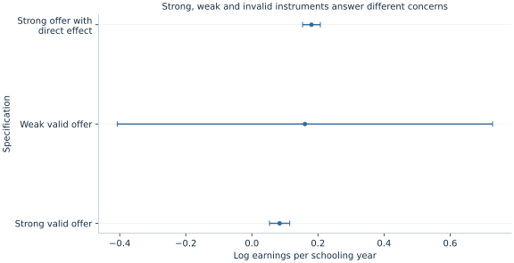

# Lab 13 · Estimating Effects with an Instrument

**Schooling, earnings and the difference between a relevant instrument and a valid one**

People with more schooling may earn more partly because of skills acquired in education and partly because of characteristics that also influence schooling choices. Controlling for one observed background measure does not necessarily remove unobserved ability, motivation or opportunities. Instrumental variables seek variation in schooling generated by another source, but the credibility of that source is an economic assumption, not a software output.

This lab uses an original simulation in which a fictional randomized scholarship offer shifts schooling. It compares ordinary least squares with two-stage least squares, then deliberately weakens the first stage and separately violates the exclusion restriction. The three instrument scenarios isolate different failures. A strong first stage cannot establish exclusion, and a conventional confidence interval cannot be trusted automatically when identifying variation is weak.

## 1. Identify the endogenous regressor and the target

The structural outcome equation is

$$
\log W_i=\beta_0+\beta_S S_i+\beta_B B_i+u_i,
$$

where $S_i$ is schooling in year-equivalent units, $B_i$ is a standardized background index, and earnings are measured in hypothetical hourly currency units. The coefficient of interest is the change in log earnings per additional schooling year, conditional on the background measure. A log-point coefficient can be translated into a fitted geometric-mean earnings ratio under the log specification; it is not automatically a change in arithmetic mean earnings.

Schooling is endogenous when it is correlated with the structural disturbance. OLS then combines the desired schooling relationship with an association arising from omitted determinants. An instrumental-variable design instead requires an excluded variable $Z_i$ that moves schooling while satisfying an appropriate structural orthogonality condition. Calling a variable an “instrument” in a function argument does not establish that condition.

In this simulation, the structural schooling slope is constant at **0.08** for everyone. That common-effect assumption simplifies interpretation. With heterogeneous effects, a randomized encouragement and noncompliance can identify a more specific local effect under additional assumptions; one should not automatically describe every IV estimate as the population average return to schooling.

## 2. Inspect the visible simulation

The supplied [schooling_instruments.xlsx](schooling_instruments.xlsx) contains 700 fixed independent synthetic people and three saved scenarios. The fictional offer $Z_i$ is a Bernoulli draw with probability one-half. Background $B_i$, unobserved ability $A_i$ and the remaining disturbances are independently drawn standard normals. The valid strong-instrument scenario is

$$
S_i=12+1.6Z_i+0.4B_i+0.8A_i+v_i,
$$

$$
\log W_i=1+0.08S_i+0.06B_i+0.25A_i+0.2\epsilon_i.
$$

Ability raises schooling and earnings. It is deliberately absent from the observed regression columns, so controlling for background alone leaves schooling correlated with the outcome disturbance. The offer is independent of ability and the other errors and has no direct outcome term in this valid scenario.

| Variable | Meaning | Units / role |
| --- | --- | --- |
| `person` | Synthetic person identifier | Label |
| `offer` | Randomized fictional scholarship offer | 0/1 excluded instrument |
| `background` | Observed background characteristic | Standardized index; exogenous control |
| `schooling` | Education exposure | Continuous year-equivalent units; endogenous |
| `log_earnings` | Natural log of hourly earnings | Log hypothetical currency units/hour |

The workbook also contains `schooling_weak`, `log_earnings_weak`, `schooling_invalid` and `log_earnings_invalid`. These are alternate scenario values for the same synthetic people, not additional observations. The complete source forms each scenario by copying the original five-column frame and replacing only its schooling and earnings columns. This preserves the common identifiers, offer and background values while comparing relevance and exclusion separately.

Schooling is continuous for this teaching design, rather than a claim that measured credentials always change fractionally. All observations are complete and equally weighted, and `missing="raise"` prevents hidden sample changes. The simulation contains no survey weights, household dependence, attrition or real scholarship recipients. It establishes the assumptions of an artificial design, not the validity of an existing education instrument.

## 3. Separate relevance from exclusion and independence

**Relevance** means the excluded offer shifts schooling after controlling for background. In the first stage,

$$
S_i=\pi_0+\pi_Z Z_i+\pi_B B_i+v_i^*.
$$

The intended strong design has $\pi_Z=1.6$. Without sufficiently informative instrument variation, IV has little basis for distinguishing schooling changes from structural disturbances.

**Exclusion** means the offer has no direct effect on earnings outside its schooling pathway in the specified structural model. A scholarship could conceivably change employment through income support, networks or job placement independently of completed schooling. In a real study, those channels need substantive investigation. Randomization of an offer supports independence from pre-existing characteristics; it does not by itself rule out these direct channels.

**Orthogonality** requires the instrument to be uncorrelated with the structural disturbance after the relevant controls. The valid simulation enforces this by independent draws and no direct offer term. With observational instruments, geographic, historical or institutional arguments must justify the corresponding moment condition. A first-stage p-value is not a test of that economic argument.

## 4. Compare OLS with native two-stage least squares

Download [schooling_instruments.xlsx](schooling_instruments.xlsx) and retain its filename. In OpenEconometrics, import this workbook before opening the complete [lab.py](lab.py) in a new empty Python document. Run the whole file to read the imported observations and display the native results. The first worksheet, `Data`, contains the analysis rows; `Dictionary` explains the columns and units. The data are original synthetic teaching observations, not real measurements. Every student uses the same supplied values, so the published results can be reproduced without generating another sample. Default execution writes no files.

For ordinary Python, keep `schooling_instruments.xlsx` beside `lab.py`. If the workbook is stored elsewhere, import the function with `from lab import run_lab`, then call `run_lab(data_path="/path/to/schooling_instruments.xlsx")`. Its principal calls are:

```python
supplied = load_data()  # Reads the supplied workbook; defined in the complete lab.py
data = supplied[["person", "offer", "background", "schooling", "log_earnings"]].copy()
ols = oe.ols(
    data=data, y="log_earnings", x=["background", "schooling"],
    covariance="HC1", missing="raise", device="cpu",
)
iv = oe.ivregress(
    data=data, y="log_earnings", x=["background"],
    endog=["schooling"], instruments=["offer"],
    covariance="robust", small=True, missing="raise",
)
display(iv)
```

The `instruments` list contains only the **excluded** offer. Exogenous background and the intercept instrument themselves; they must not be repeated as excluded instruments. All OLS, IV and first-stage comparisons in the principal scenario use the identical 700 rows.

The OLS schooling estimate is **0.171459**, HC1 SE **0.007176**. The strong valid IV estimate is **0.083863**, robust SE **0.015602**, with interval **[0.053230, 0.114497]**. The IV coefficient is close to the known structural 0.08, while OLS captures the positive ability-related confounding. The wider IV interval reflects the more limited identifying variation supplied by the instrument; it is not evidence that the precise OLS association is causally preferable.

For the valid IV fit, the exact fitted geometric-mean comparison is $100[\exp(0.083863)-1]$ = **8.748%** per schooling year. Transforming the reported coefficient interval gives **[5.467%, 12.131%]**. Keep the distinction between the fitted log-model comparison and an arithmetic-mean earnings effect explicit.

## 5. Understand the two stages without using the wrong second-stage SE

Let $X$ contain the intercept, background and observed schooling, and let $Z$ contain the intercept, background and offer. The projection of regressors onto instruments is $\widehat X=P_ZX$. Two-stage least squares computes

$$
\hat\beta_{2SLS}=(X'P_ZX)^{-1}X'P_ZY.
$$

Intuitively, the first stage extracts the portion of schooling associated with the instrument set. The second stage uses that instrument-predicted variation to estimate the structural relationship. Exogenous controls remain in both stages, preserving the conditional comparison.

Fitting ordinary OLS on predicted schooling can reproduce the coefficient algebra in this simple setup, but its default OLS standard errors are not the IV uncertainty calculation. Structural residuals must use **observed** schooling: $\hat u=Y-X\hat\beta$, rather than residuals from $Y-\widehat X\hat\beta$. The native IV estimator uses the appropriate structural residuals and covariance instead of treating the first-stage prediction as an ordinary observed regressor.

The declared `small=True` convention multiplies the robust 2SLS sandwich by $n/(n-k)$ and uses Student-$t$ inference with **697 degrees of freedom**, counting three structural coefficients. The [LaTeX table](table.tex) retains these model notes rather than silently mixing large-sample normal IV inference with small-sample t inference.

## 6. Inspect instrument strength on the right scale

The strong first stage estimates an offer effect of **1.554651 schooling years**, with a robust excluded-instrument **F = 244.110278** and partial $R^2$ **0.259113**. The partial $R^2$ concerns the additional schooling variation associated with the offer after background is accounted for; it is not the full first-stage fit statistic or a measure of exclusion validity.

```python
first_stage = iv.extra["first_stage"][0]
print(first_stage)
```

With one endogenous variable and one excluded instrument, the robust first-stage Wald statistic is informative about relevance, but no universal numerical threshold settles every weak-instrument problem. Critical values developed under particular iid, estimator and identification assumptions should not be attached indiscriminately to a robust statistic from another setting.

This design is exactly identified: one excluded instrument for one endogenous regressor. There are no overidentifying restrictions to test. A missing overidentification statistic is therefore expected, not an error to fill with another number. Even when extra instruments permit an overidentification test, failure to reject does not prove every instrument is valid.

## 7. Make the instrument weak while keeping it valid

The second saved scenario uses an offer coefficient of **0.12** instead of 1.6, with the same underlying synthetic draws. Its schooling and earnings values are already supplied as `schooling_weak` and `log_earnings_weak`; no new data need to be generated. The offer remains independent and excluded. Its realized first-stage F falls to **0.562852**.

The resulting IV schooling estimate is **0.160458**, with conventional robust SE **0.289288** and reported nominal interval **[−0.407523, 0.728438]**. The large uncertainty illustrates the weak first stage, but the issue goes beyond having a wide interval. Under weak identification, the usual t/normal approximation itself can be unreliable. Do not describe this conventional interval as an established 95% coverage guarantee or use non-significance to conclude that schooling has no effect.

Weak-identification-robust tests or confidence sets require a separate specified procedure. The present comparison deliberately shows the conventional output and its limitation rather than relabeling it as robust to weak instruments. “Heteroskedasticity-robust covariance” and “weak-identification-robust inference” address different problems.

## 8. Break exclusion while retaining a strong first stage

The third saved scenario restores the strong schooling equation but adds **0.15 × offer** directly to log earnings. Its values are supplied in `schooling_invalid` and `log_earnings_invalid`. The actual schooling effect remains 0.08. The offer now changes earnings through an additional route, violating exclusion:

$$
\log W_i=1+0.08S_i+0.06B_i+0.25A_i+0.2\epsilon_i+0.15Z_i.
$$

The fitted IV coefficient becomes **0.180348**, robust SE **0.013701**, with conventional interval **[0.153448, 0.207248]**. It is precisely estimated and badly displaced from the desired structural schooling coefficient. The point estimate shifts by approximately **0.096485**, corresponding here to the direct offer term divided by the realized conditional first-stage slope.



The intervals summarize each fitted procedure; the weak case's conventional approximation is explicitly qualified. The invalid-exclusion case shows why precision and relevance cannot rescue identification. A large first-stage F can accompany an instrument that answers the wrong structural question very precisely.

## 9. Form an economic conclusion that matches the design

The valid simulation supplies a clear source of exogenous schooling variation and a known homogeneous structural effect. That is why comparing IV with the generating value is meaningful here. A real scholarship study would need implementation details: who received offers, whether offers were random, how they affected schooling, what other services accompanied them, which outcomes were tracked and who remained in the sample.

Sample selection matters for both stages. If earnings were missing mainly among nonworkers, restricting to observed earnings could compromise the offer's independence in the selected sample. If missing instrument values removed a different group from the IV fit, comparing its coefficient with an OLS fit on more people would also mix specification and sample changes. The complete-case equality in this lab is visible and intentional; it is not a substitute for addressing real selection mechanisms.

The three scenarios support a focused lesson: use relevance diagnostics to assess identifying information, investigate exclusion and independence with design evidence, and select uncertainty procedures that match both sampling variation and identification strength. No single p-value can discharge all three tasks.

## Student exercises

1. Identify the endogenous variable, included exogenous control and excluded instrument. Explain why ability confounds OLS even after controlling for background.
2. State relevance, exclusion and orthogonality in economic language for the fictional scholarship offer. Give a plausible direct offer channel that would threaten exclusion in a real study.
3. Interpret the strong IV estimate in log points and as an exact fitted geometric-mean percentage comparison. State its declared covariance and inference degrees of freedom.
4. Explain why first-stage F=244.110 does not test exclusion. Why is no overidentification test available in this design?
5. Explain the distinction between a wide conventional interval and an inference method valid under weak identification. What should not be concluded from the weak scenario's nominal interval?
6. Calculate the shift between the valid and direct-effect IV coefficients. Relate it to the direct effect and the conditional first stage without treating that relation as a universal correction formula.
7. Explain why naive OLS standard errors from a regression on predicted schooling are not the appropriate 2SLS covariance calculation.
8. Write a short research-design paragraph describing what evidence a real scholarship study would need before treating the IV coefficient as a causal schooling effect.
