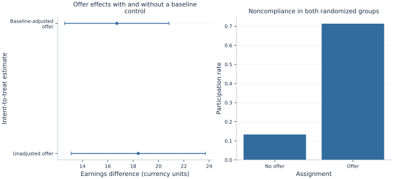

# Lab 14 · Evaluating a Randomized Training Program

**Assignment, participation and the intent-to-treat effect**

A training program can randomize invitations without making everyone attend. Some invited applicants decline, and some applicants without an invitation find training elsewhere. Comparing participants with nonparticipants then gives up the original randomized comparison. The policy question “what does offering this program change?” must be distinguished from “what does actually receiving training change?”

This lab follows 600 original synthetic applicants. Exactly 300 receive a randomized offer, all 600 are observed afterward, and participation responds imperfectly to the offer. The main analysis estimates the **intent-to-treat effect**, comparing outcomes by randomized assignment regardless of actual participation. A separate descriptive participation regression illustrates why conditioning on voluntary behavior can reintroduce selection.

## 1. Define assignment before examining compliance

Let $Z_i=1$ indicate that applicant $i$ receives the offer, and $D_i=1$ indicate actual participation. Let $Y_i$ be subsequent earnings in hypothetical currency units per reporting period. The intent-to-treat comparison is

$$
ITT=E[Y_i\mid Z_i=1]-E[Y_i\mid Z_i=0],
$$

when assignment is randomized under the stated design and outcomes are comparably observed. Its units are earnings currency units per applicant offered the program, averaged over the assignment groups. It is not a percentage change and not automatically the effect among those who participate.

Random assignment creates comparable groups in expectation. It does not force the observed groups to have identical baseline averages in a finite realization. Nor does randomizing the offer randomize the subsequent participation decision. The original assignment label is therefore the anchor for the primary comparison, including applicants who decline an offer or obtain training without one.

For policy evaluation, the offer effect can itself be the relevant quantity. A government choosing whether to make invitations available must account for uptake and existing alternatives. Estimating an effect of actual training receipt may answer another question, requiring additional assumptions and often an instrumental-variable design rather than a participants-versus-nonparticipants comparison.

## 2. Inspect the synthetic applicants and potential participation

The supplied [training_program.xlsx](training_program.xlsx) contains the same fixed 600 synthetic applicants for every student. Each applicant has an unobserved ability characteristic $A_i$, a baseline assessment score $B_i$, and a uniform draw $U_i$. Baseline scores are generated as

$$
B_i=30+5A_i+8v_i.
$$

The probabilities of taking training without and with an offer are

$$
p_{0i}=\Lambda(-2+0.5A_i),\qquad
p_{1i}=\Lambda(1+0.5A_i).
$$

Potential participation is $D_i(0)=1\{U_i<p_{0i}\}$ and $D_i(1)=1\{U_i<p_{1i}\}$. The same uniform draw makes participation monotone: no applicant is made less likely to participate by receiving the offer. Actual participation is $D_i=Z_iD_i(1)+(1-Z_i)D_i(0)$.

The original assignment procedure randomly selected exactly 300 applicant IDs for offers, independently of these characteristics; the workbook preserves that assignment. Earnings are

$$
Y_i=100+1.5B_i+10A_i+20\epsilon_i+30D_i.
$$

Training raises earnings by exactly 30 units for every applicant in the artificial structural equation. Ability influences both earnings and uptake, creating the selection problem in a participants-versus-nonparticipants comparison. The offer itself has no direct earnings term outside participation in this simulation.

| Variable | Meaning | Use in the analysis |
| --- | --- | --- |
| `applicant` | Synthetic ID | Label |
| `offer` | Random assignment | 0/1 primary treatment variable |
| `baseline_score` | Pre-assignment assessment | Points; optional precision control |
| `participated` | Actual training receipt | 0/1 behavior; not the randomized label |
| `earnings` | Follow-up earnings | Hypothetical currency units |
| `take_if_no_offer` | Potential participation without offer | Simulation oracle only |
| `take_if_offer` | Potential participation with offer | Simulation oracle only |

The two potential-participation columns are explicitly labeled **simulation oracle values**, supplied only to compare observed assignment effects with the known artificial design. They are never controls in the estimated models and would not ordinarily be jointly observable for real applicants. They are not empirical measurements or inferred compliance classifications. All 600 outcomes are observed; there are no survey weights, missing values or clustered assignment units. `missing="raise"` makes any unexpected incomplete input explicit.

## 3. Calculate the randomized group comparison

Download [training_program.xlsx](training_program.xlsx) and retain its filename. In OpenEconometrics, import this workbook before opening the complete [lab.py](lab.py) in a new empty Python document. Run the whole file to read the imported observations and display the native results. The first worksheet, `Data`, contains the analysis rows; `Dictionary` explains the columns and units. The data are original synthetic teaching observations, not real measurements. Every student uses the same supplied values, so the published results can be reproduced without generating another sample. Default execution writes no files.

For ordinary Python, keep `training_program.xlsx` beside `lab.py`. If the workbook is stored elsewhere, import the function with `from lab import run_lab`, then call `run_lab(data_path="/path/to/training_program.xlsx")`.

The realized group means are:

| Randomized assignment | Applicants | Mean earnings | Participation rate |
| --- | ---: | ---: | ---: |
| No offer | 300 | 149.961048 | 0.133333 |
| Offer | 300 | 168.363946 | 0.713333 |

The unadjusted offer estimate is

$$
\widehat{ITT}=168.363946-149.961048=18.402898.
$$

The earnings improvement is therefore about **18.40 currency units per applicant offered**, compared with not offering the program under this design. It is not the 30-unit structural training-receipt effect. Only some applicants change participation because of the offer, so the policy's average offer effect is diluted relative to the effect of actually receiving training.

The observed uptake gap is **0.580000**, or **58 percentage points**. This is an assignment-group comparison, with its own sampling variation. It is not the proportion of offered applicants who complied: offered uptake is 71.333%, while some nonoffered applicants also participated. Distinguishing those quantities avoids an incorrect “divide by attendance” correction.

## 4. Recover the same estimate through OLS

With an intercept and a binary offer indicator, the OLS coefficient is exactly the difference between group means:

$$
Y_i=\alpha+\tau Z_i+e_i.
$$

```python
data = load_data()  # Reads the supplied workbook; defined in the complete lab.py
unadjusted = oe.ols(
    data=data, y="earnings", x=["offer"],
    covariance="HC2", missing="raise", device="cpu",
)
display(unadjusted)
```

The fitted offer coefficient is **18.402898**, HC2 SE **2.696077**, with a 95% interval of **[13.107968, 23.697828]**. OpenEconometrics uses Student-$t$ inference with **598 residual degrees of freedom** for this specification. That is the declared regression inference convention, not an exact randomization test over all possible allocations.

In this two-group intercept model, HC2 reproduces the familiar unequal-variance difference-in-means variance estimator:

$$
\widehat{\operatorname{Var}}(\widehat{ITT})
=\frac{s_1^2}{n_1}+\frac{s_0^2}{n_0}.
$$

Here $s_1^2$ and $s_0^2$ are within-assignment sample variances with their usual $n_g-1$ denominators. HC2's leverage correction yields this identity for the binary intercept design. The source independently calculates both objects rather than assuming that any robust covariance name must have the same finite-sample result.

Under complete randomization with fixed potential outcomes, the familiar Neyman variance omits an unobservable nonnegative term involving treatment-effect heterogeneity. It is generally conservative for that finite-population variance. The numerical equality of HC2 and the two-sample expression does not establish exact finite-sample coverage of the reported t interval under every possible potential-outcome schedule.

## 5. Add a genuinely pre-assignment control

The baseline assessment predicts earnings and was measured before assignment. It can help separate chance baseline imbalance from the offer comparison:

```python
adjusted = oe.ols(
    data=data, y="earnings", x=["offer", "baseline_score"],
    covariance="HC2", missing="raise", device="cpu",
)
display(adjusted)
```

The adjusted offer coefficient is **16.714363**, HC2 SE **2.097627**, interval **[12.594739, 20.833987]**. The observed baseline means are **30.623305** in the offered group and **29.871182** in the nonoffered group. That modest favorable baseline difference helps explain why adjustment reduces the point estimate in this particular realization.

The adjusted estimate also has a smaller SE here. This is a realized precision comparison, not a guarantee that every covariate adjustment improves precision in every randomized sample. The specified additive regression uses a common baseline slope. More elaborate adjustment schemes, interactions or design-based estimators require their own specification and uncertainty conventions.

The unadjusted randomized difference remains the direct unbiased finite-population estimator under this complete-allocation design. Regression adjustment can be useful, but its finite-sample properties are not identical to the unadjusted difference merely because the baseline variable predates assignment. State which estimator is primary and preserve the randomized comparison when interpreting either result.



The figure juxtaposes the two offer-effect estimates with actual participation rates. It does not put the participation-based association on the same causal footing as the assignment effects. Each plotted quantity answers the question named on its axis.

## 6. Contrast assignment with voluntary participation

The source also estimates

$$
Y_i=a+bD_i+v_i.
$$

Its participation coefficient is **37.767047**, HC2 SE **2.365498**. The actual structural participation effect in the original synthetic design is only **30.0**. The discrepancy reflects the way ability and baseline characteristics influence both taking training and earnings. Randomizing the offer did not randomize who ultimately participated.

A per-protocol analysis that excludes offered applicants who decline creates an additional selection problem, distinct from the all-600-person participation regression above. Dropping those applicants conditions on post-assignment behavior and destroys the original equal-probability allocation comparison. Calling the retained group “compliers” does not restore randomization; actual compliance type involves both potential participation choices, only one of which is observed for a real person.

The distinction between intent-to-treat and treatment-on-the-treated is therefore substantive. The former evaluates the offer policy as implemented. The latter concerns training receipt and requires a defined population and assumptions. An instrumental-variable analysis can use randomized offer as an instrument for participation under exclusion, relevance, independence and an appropriate monotonicity argument. That is another estimand and procedure, not a relabeling of the raw participation coefficient.

## 7. Use the oracle to understand sampling variation

Because both potential participation states are stored in the simulation, we can compute the exact finite-sample fraction whose participation would change with an offer. It is **0.543333**, or 326 of the 600 applicants. Under the common 30-unit participation effect and no direct offer pathway, their finite-sample average offer effect is

$$
\frac{1}{600}\sum_i30[D_i(1)-D_i(0)]
=30\times0.543333=16.3.
$$

The unadjusted realized estimate of 18.402898 differs from 16.3 because assignment groups contain different realizations of baseline outcomes and compliance types. The adjusted estimate is closer in this draw, but that closeness should not be used to choose the preferred estimator after seeing the oracle. In real applications, the oracle is unavailable.

The observed 58-point uptake gap also differs from the oracle's 54.333-point complier fraction through assignment variation. The offered and nonoffered groups are different people, not paired observations of each person's two participation states. This makes the distinction between a population or finite-sample causal quantity and its randomized estimate concrete.

## 8. State what randomization does not automatically protect

Randomization supports the initial comparison, but outcome follow-up, interference and implementation still matter. If employment or earnings are observed only for participants, the analyzed groups are selected after assignment. If nonoffered applicants benefit from peers who were offered training, the no-interference interpretation must be reconsidered. If different versions of the program are delivered, “the treatment” may not be a single well-defined exposure.

The present simulation avoids these complications: every applicant has a measured outcome, applicants are independent, assignment is recorded correctly, and training adds the same amount whenever received. These are design choices documented by the synthetic setup and supplied workbook. A real report should document which analogues hold rather than imply that the phrase “randomized program” settles them all.

Baseline balance tests also require care. A chance difference can occur under valid randomization; identical observed means do not prove that assignment was executed correctly. Assignment records, allocation rules and outcome collection provide the primary design evidence. Covariate summaries help describe the realized sample but should not be used mechanically to discard an otherwise documented experiment or certify an undocumented one.

The [LaTeX table](table.tex) includes both assignment estimates and the participation association with their actual inference notes. A written report should retain their labels, explain noncompliance, and distinguish the offer effect from the selected participation comparison. Reporting only the largest coefficient would lose the experiment's central advantage.

## Student exercises

1. Define assignment, participation and the intent-to-treat estimand. Explain why the randomized comparison retains offered applicants who do not participate.
2. Calculate the earnings difference and participation-rate gap from the two group summaries. State the correct units for both.
3. Show why an intercept-plus-binary-offer OLS coefficient equals the difference in group means. Explain what the HC2 standard error estimates here.
4. Compare unadjusted and baseline-adjusted results. Explain the role of the observed baseline imbalance without claiming that adjustment must always improve accuracy or precision.
5. Explain why the 37.767 participation coefficient is not the randomized training effect. Identify the selection mechanism described in the synthetic design.
6. Use the oracle complier fraction to calculate the finite-sample offer effect. Explain why it differs from the realized randomized estimate and from the observed uptake gap.
7. Describe two follow-up or implementation problems that could undermine the interpretation of a real randomized offer comparison.
8. Draft a policy paragraph reporting the offer estimate, its interval, noncompliance and the original synthetic scope, while distinguishing it from the effect of actually receiving training.
