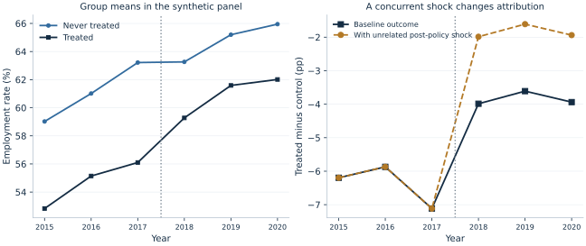

# Lab 15 · Before and After a Policy Reform

**Difference-in-Differences**

Can an employment program work even when the regions receiving it still have
lower employment afterward? This lab evaluates a fictional regional training
subsidy introduced in 2018. Its purpose is to separate the policy comparison
from the assumptions that make that comparison causal.

All observations are **original synthetic data** supplied in
[policy_panel.xlsx](policy_panel.xlsx).
No people, regions, or policy outcomes are represented. The reported numbers
are actual OpenEconometrics estimates from that simulated dataset, not evidence
about an actual subsidy. A pre-treatment diagnostic raises a warning that we will interpret alongside the policy estimate.

## Learning goals

By the end, you should be able to compute DiD from four means, connect it to a
regression interaction and a model with region and year effects, interpret a
clustered confidence interval, and explain why a promising coefficient or a
pre-trends test cannot establish policy identification alone.

Topic alignment:
Stock and Watson, *Introduction to Econometrics*, fourth edition, Chapters 10
(panel data) and 13 (experiments and quasi-experiments). This is an original
teaching exercise; it reproduces no textbook problem or dataset.

## 1. Ask the right policy question

Thirty regions receive the subsidy and thirty never receive it during the
sample. We observe every region annually from 2015 through 2020; all treated
regions begin treatment in 2018 and remain treated. Each observation is one
region-year, not an individual worker.

The target is the average policy effect in the treated regions over 2018–2020,
measured in **employment percentage points**. The comparison is with employment
in those same regions, in those same years, had the subsidy not existed. That
counterfactual is normally unobserved. The never-treated regions supply a
candidate comparison for the change that would otherwise have occurred.

The fictional administrative rule targets regions with lower underlying
employment levels. Therefore a lower post-policy employment level in treated
regions does not, on its own, show that the policy reduced employment. A rise
within treated regions does not isolate the effect either: national employment
conditions may improve at the same time.

## 2. Understand the data before fitting

The balanced panel has **360 observations, 60 regions, three pre-policy years,
and three post-policy years**. No observations are missing and no weights are
used. Each region receives equal weight; this is not a population-weighted
national employment estimate.

| Variable | Definition | Unit / coding |
| --- | --- | --- |
| `region` | Independent policy and uncertainty unit | Integer 0–59 |
| `year` | Observation year | 2015–2020 |
| `treated` | Region ever receives the subsidy | 1 for regions 0–29; otherwise 0 |
| `post` | Policy is available during this year | 1 from 2018 onward |
| `treated_post` | Actual treatment exposure | `treated * post` |
| `employment_rate` | Observed synthetic employment rate | Percent of working-age population |
| `employment_no_policy` | Simulated untreated potential outcome | Teaching oracle only; excluded from estimation |

The prepared observations follow this synthetic design: untreated employment
contains a region intercept, a six-point lower
level for the treated group, a common 1.2-point annual trend, common year shocks,
and region-specific errors with AR(1) persistence 0.65. Errors are independent
across regions. Treatment adds exactly **3.0 percentage points** to every
treated post-policy observation. Thus expected untreated trends are parallel by
construction; realized sample paths still fluctuate.

The known simulated counterfactual helps us learn what the estimator does. Do
not include `employment_no_policy` as a control or assume that it exists in an
empirical dataset.



Read the figure in two stages: compare pre-policy changes first, then examine
the change in the gap after 2018. Identical starting levels are not required for
DiD. Similar-looking pre-period paths are useful descriptive evidence but do
not identify the missing post-period counterfactual.

## 3. Compute the four-cell comparison

Let $\bar Y_{T,pre}$ and $\bar Y_{T,post}$ denote the treated group's means over
the three pre- and three post-policy years. Define the control means similarly.
The estimator is

$$
\widehat{\tau}_{DiD}
= (\bar Y_{T,post}-\bar Y_{T,pre})
- (\bar Y_{C,post}-\bar Y_{C,pre}).
$$

Download [policy_panel.xlsx](policy_panel.xlsx) and [lab.py](lab.py). In OpenEconometrics,
import the workbook without changing its filename, then open `lab.py` in a
Python document and run the complete file. The workbook's first sheet,
`Data`, contains the observations; `Dictionary` explains the variables and units.

The script reads the prepared panel, fits the models, performs the checks,
and displays the four-cell table, the main model, the gap chart, and the
concurrent-shock model. Everyone using the supplied workbook starts
from the same observations and obtains the same reported results.

In ordinary Python, keep the workbook beside `lab.py` and run `python lab.py`
from an environment where OpenEconometrics is installed. To read a workbook
from another folder, use `from lab import run_lab`, then call
`run_lab(data_path="/path/to/policy_panel.xlsx")`. The script writes no exports
unless an output directory is explicitly supplied.

After running the complete file, explore the same data interactively:

```python
data = load_data()
means = data.groupby(["treated", "post"]).employment_rate.mean()
did_by_hand = (
    means[1, 1] - means[1, 0]
    - (means[0, 1] - means[0, 0])
)
print(did_by_hand)
```

| Group | Pre-policy mean | Post-policy mean | Change |
| --- | ---: | ---: | ---: |
| Never treated | 61.084 | 64.803 | 3.719 |
| Treated | 54.691 | 60.959 | 6.268 |

Thus $6.268-3.719=2.549$ percentage points, using the unrounded values in code.
The treated-only before–after change is 6.268 points and the post-only
treated-minus-control gap is −3.844 points. These comparisons answer different
questions. DiD subtracts the control change to estimate the policy contrast
under its identifying assumptions.

## 4. Connect the arithmetic to regression

The two-way fixed-effects specification is

$$
Y_{gt}=a_g+\lambda_t+\tau D_{gt}+u_{gt},
\qquad D_{gt}=T_g\,1\{t\geq2018\}.
$$

Region effects $a_g$ absorb permanent differences in levels; year effects
$\lambda_t$ absorb shocks common to all regions in a year. The coefficient on
$D_{gt}$ is the DiD contrast in this balanced common-adoption design. We have
one adoption date and a constant simulated treatment effect. This lab makes no
claim about interpreting ordinary two-way fixed effects under staggered
adoption with heterogeneous effects.

```python
did = oe.didregress(
    data=data,
    y="employment_rate",
    treatment="treated_post",
    group="region",
    time="year",
    covariance="cluster",
    cluster="region",
    missing="raise",
    alpha=0.05,
)
print(did.summary())
```

Pass actual exposure `treated_post` to `treatment`, not the time-invariant
`treated` indicator. Region effects would absorb the latter. The lab also fits
the saturated regression `employment_rate ~ treated + post + treated_post` on
the identical observations. Its interaction coefficient, the native DiD
coefficient, and the four-cell calculation agree to numerical precision here.
Their equality relies on this balanced, equally weighted design; do not
generalize the shortcut to every panel or adjusted specification.

## 5. Interpret the estimate and uncertainty

| Quantity | Executed result |
| --- | ---: |
| DiD estimate | 2.549 percentage points |
| Region-clustered standard error | 0.438 |
| 95% confidence interval | [1.673, 3.426] percentage points |
| Two-sided p-value | 0.000000257 |
| Inference distribution | Student $t$, 59 degrees of freedom |
| Known simulated policy effect | 3.000 percentage points |

The estimated treated-region improvement exceeds the comparison-region
improvement by 2.549 points. This is not a 2.549% proportional increase. Under
the maintained design and uncertainty assumptions, the interval quantifies
sampling uncertainty about that contrast. It includes the true simulated
three-point effect. A confidence interval does not assign a probability to the
identifying assumptions being correct.

Clustering is at the **region**, where policy varies and errors persist across
years. The six observations from one region are not six independent policy
experiments. Serial correlation can materially distort DiD inference when
ignored; see [Bertrand, Duflo, and Mullainathan](https://www.nber.org/papers/w8841).
There are 60 independent clusters in this illustration, rather than only two
clusters labeled “treated” and “control.”

The native estimator uses the small-sample multiplier

$$
\frac{G}{G-1}\frac{N-1}{N-K},
\qquad G=60,\quad N=360,\quad K=7,
$$

and $t_{59}$ inference. Here $K$ counts one treatment slope and six time effects;
region effects nested in region clusters are excluded from that correction.
The script independently demeans the balanced panel and calculates the scalar
cluster sandwich. Its coefficient and standard error match the native result.
The saturated two-by-two regression uses a different finite-sample parameter
count; equality of coefficients is not a claim that every reported standard
error must be identical.

## 6. Identification: make the assumptions explicit

Parallel trends concerns **untreated potential outcomes**, not observed
post-treatment outcomes:

$$
E[Y_{post}(0)-Y_{pre}(0)\mid T=1]
=E[Y_{post}(0)-Y_{pre}(0)\mid T=0].
$$

For a causal interpretation, also argue that treatment was not anticipated,
comparison regions were not affected through spillovers, outcome measurement
and sample composition remain comparable, and no other treated-specific change
coincided with the subsidy. In this synthetic panel, stable composition and
independent regions are explicit design choices. In an empirical project they
would require substantive evidence.

The native linear pre-trend test returns **p = 0.0712**, while the joint
pre-treatment-leads test returns **p = 0.0098**. At a 5% threshold the first does
not reject and the second does reject. The tests ask different questions. The
joint result is a warning that deserves inspection; it cannot be discarded
because the headline estimate is attractive. Even a correctly specified
population model can produce an unusually large sample diagnostic. Conversely,
non-rejection would not establish parallel counterfactual trends or rule out a
post-treatment shock. The supplied sample is retained even when its diagnostics
are not reassuring. See [Roth's discussion of pre-testing](https://www.aeaweb.org/articles?id=10.1257/aeri.20210236).

Now add an unrelated two-point employment boost that occurs only in treated
regions, beginning in 2018:

```python
contaminated = data.copy()
contaminated["employment_rate"] += 2.0 * contaminated.treated_post
```

The full script refits the model on this outcome. The coefficient becomes
**4.549**, with the same **0.438** standard error and interval **[3.673, 5.426]**.
The pre-treatment data and diagnostic p-values are unchanged. The known policy
effect remains three points; the added shock is not part of the subsidy. DiD
cannot distinguish the two perfectly coincident changes. Better precision
about the combined change cannot repair this identification failure.

### Follow the counterfactual through the arithmetic

Start with the treated regions' pre-policy mean. Under parallel untreated
trends, add the control regions' average change. The resulting level is the
treated regions' predicted post-policy mean *without* the subsidy. Subtract
that counterfactual from their observed post-policy mean. This produces the
same DiD as subtracting the two changes, but makes the missing comparison more
visible:

$$
\widehat Y_{T,post}(0)=\overline Y_{T,pre}
 +\left(\overline Y_{C,post}-\overline Y_{C,pre}\right),
\qquad
\widehat\tau=\overline Y_{T,post}-\widehat Y_{T,post}(0).
$$

The first expression is a constructed counterfactual, not an observed group
mean. It is credible only if the comparison group's change is informative
about the treated regions' untreated change. A permanent difference in levels
need not violate that condition. A different underlying trend, spillover or
treated-only concurrent reform can violate it even when the pre-policy levels
look similar.

### Understand what one cluster contributes

The sample contains six annual observations from each region. A local shock
can persist across those years, so six observations from one region are not
equivalent to six independent regions. Region clustering forms a score
contribution for each region and allows dependence among that region's yearly
disturbances. The information supporting inference comes from 60 clusters,
including 30 treated clusters, rather than 360 unrelated treatment assignments.

This explains why the reported interval uses 59 inference degrees of freedom.
It does not make 60 a universal threshold for reliable inference. An uneven
design with very few treated regions, a dominant region, or shocks correlated
across regions could still demand additional care. Matching the clustering
unit to the policy and disturbance structure is a design decision, not a
search for the covariance method that gives the smallest standard error.

### A precise estimate can still answer the wrong causal question

The concurrent-shock example has a clear statistical comparison: the treated
outcome rises by an additional two points exactly when treatment starts. The
estimator correctly incorporates that additional change. The identification
problem is that the observed outcome does not label which part was produced
by the subsidy and which part by the other event.

A narrow interval around the combined change would describe statistical
precision conditional on the maintained model. It would not distinguish the
two mechanisms. More observations of the same confounded pattern can make the
combined effect more precise while leaving the attribution problem intact.
Policy documents, implementation dates, alternative outcomes and credible
comparison groups can therefore matter as much as a larger sample. The
regression organizes a comparison; the research design explains why that
comparison should identify the effect of interest.

## Student exercises

1. Calculate the DiD from the four displayed means. Explain why using rounded
   values can differ slightly from the script.
2. Write one sentence interpreting the 2.549 coefficient and one explaining
   why the −3.844 post-policy gap is not the same estimand.
3. Fit the saturated interaction model and locate `treated_post`. Why can
   `treated` and `post` appear there, while they are absorbed by region and time
   effects in the native model?
4. Replace clustered covariance with `covariance="HC1"` in `oe.didregress`.
   Does the coefficient change? Which dependence assumption changes? Do not
   choose an uncertainty method because its p-value is smaller.
5. Explain what the two pre-treatment diagnostics can and cannot tell us.
   Would both p-values above 0.05 eliminate concern about the concurrent shock?
6. Read the concurrent-shock estimate as a hypothetical policy memo. Identify
   the additional evidence you would need before attributing it to the subsidy.
