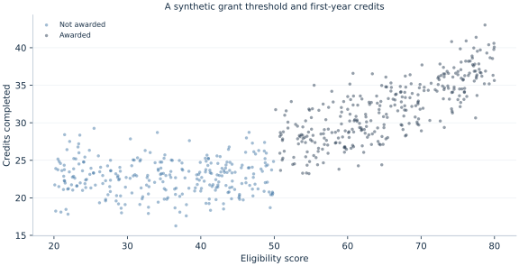

# Lab 16 · What Happens Around an Eligibility Cutoff?

An academic grant is awarded when a student's eligibility score reaches 50.
Students scoring 49.9 and 50.1 receive different treatment even though their
scores are almost identical. Could that policy rule help us estimate the
grant's effect on first-year credits completed?

This question is narrower than asking whether grant recipients outperform
everyone else. Students far above the cutoff may differ substantially from
students far below it. Regression discontinuity, or RD, focuses on the change
at the threshold while allowing outcomes to vary smoothly with the score on
either side. The policy rule supplies the comparison; the regression helps
estimate the limits of those smooth relationships.

The dataset is **original and entirely synthetic**. Its 600 independent
observations do not describe actual students, a real grant, or a university.
The observations are supplied in [scholarship_cutoff.xlsx](scholarship_cutoff.xlsx).
The estimates below come from executing [lab.py](lab.py) with OpenEconometrics.
They illustrate how a design works and how its uncertainty is reported.

## 1. Distinguish a local comparison from a group comparison

Let $X_i$ be a student's eligibility score and let the cutoff be $c=50$.
Treatment is assigned by the sharp rule

$$D_i=1\{X_i\geq50\}.$$

“Sharp” means that the rule determines treatment perfectly in this example:
every student at or above the threshold receives the grant, and every student
below it does not. An application with imperfect take-up would be a fuzzy RD,
with a different estimand and a first-stage discontinuity in actual receipt.
We do not silently interpret this sharp example as such a design.

The outcome $Y_i$ is credits completed in the first year. Scores and credits
have different units: a one-point increase in the eligibility score is not a
one-credit increase in academic progress. The RD estimand is

$$
\tau_{RD}=\lim_{x\downarrow50}E[Y_i\mid X_i=x]
-\lim_{x\uparrow50}E[Y_i\mid X_i=x].
$$

The first term approaches the threshold from the treated side; the second
approaches from the untreated side. We are estimating a jump at score 50, not
an average difference across the entire score distribution. If the effect
varies with academic preparation, this local effect need not equal the effect
for students with scores of 25 or 75.

Imagine that outcomes increase with preparation even without a grant. A raw
recipient-versus-nonrecipient mean comparison combines that smooth preparation
gradient with the policy effect. Comparing fitted limits at the same score
removes this particular difference if the underlying untreated relationship
continues smoothly through the cutoff.

## 2. Read the data-generating process as a research design

The supplied synthetic scores were drawn independently over 20–80. Define
$z_i=X_i-50$. The synthetic outcome
is generated as

$$
Y_i=24+0.2z_i+0.006z_i^2+3D_i+\varepsilon_i,
\qquad \varepsilon_i\sim N(0,2.5^2).
$$

The untreated response is curved but continuous at the threshold. Treatment
adds exactly three credits everywhere in this particular simulation, so the
true jump at the cutoff is **3.000 credits**. The analyst's estimator does not
receive that value as an input.

| Variable | Meaning | Unit / coding |
| --- | --- | --- |
| `student` | Independent observation identifier | 0–599 |
| `score` | Running variable determining assignment | Eligibility points, 20–80 |
| `awarded` | Actual grant receipt | 1 if score is at least 50 |
| `credits` | First-year academic progress | Credits completed |

No records are missing, and no sampling weights are applied. The grant is the
only discontinuous component in the generator. There is no manipulation of
scores and no other policy beginning at score 50. Those are facts about this
synthetic construction, not conclusions that a fitted RD model could establish
about an empirical program.



Use the figure to distinguish the continuous slope from the discontinuity.
The cloud contains individual noise, so the distance between the two nearest
observations is not itself the estimated policy effect. A regression uses
several nearby observations to estimate the conditional mean on each side.
Likewise, a jump that looks plausible in a graph does not demonstrate that
potential outcomes would have been continuous without treatment.

## 3. Run the complete example, then examine its pieces

Download [scholarship_cutoff.xlsx](scholarship_cutoff.xlsx) and [lab.py](lab.py). In OpenEconometrics,
import the workbook without changing its filename, then open `lab.py` in a
Python document and run the complete file. The workbook's first sheet,
`Data`, contains the observations; `Dictionary` explains the variables and units.

The script reads the prepared student observations and shows the scatterplot,
the native RD result, and a bandwidth comparison table. Everyone using the supplied workbook
starts
from the same observations and obtains the same reported results.

In ordinary Python, keep the workbook beside `lab.py` and run `python lab.py`
from an environment where OpenEconometrics is installed. To read a workbook
from another folder, use `from lab import run_lab`, then call
`run_lab(data_path="/path/to/scholarship_cutoff.xlsx")`. The script writes no exports
unless an output directory is explicitly supplied.

After the complete script has defined its functions, reload the supplied
observations and verify assignment:

```python
data = load_data()
print(data.groupby("awarded").size())
print((data.awarded == (data.score >= 50).astype(int)).all())
```

There are **280 observations below** and **320 at or above** the cutoff. These
are full-sample counts, not the number effectively used by the local fit.
Keeping that distinction prevents a common reporting error: presenting all 600
students as though they all had positive weight in the point estimator.

The main model is explicit about its choices:

```python
rd = oe.rdrobust(
    data=data,
    y="credits",
    running="score",
    cutoff=50.0,
    h=12.0,
    b=18.0,
    p=1,
    q=2,
    kernel="triangular",
    vce="hc0",
    missing="raise",
    alpha=0.05,
)
print(rd.summary())
```

The point-estimation bandwidth is 12 score points on each side: scores within
38–62 receive positive triangular weight, apart from zero weight at an exact
boundary. Here that includes **122 left-side and 127 right-side observations**.
The separate bias bandwidth is 18 points, which uses a wider neighborhood for
estimating curvature. These bandwidths are declared before examining the
outcomes; this is not a claim that 12 and 18 are universally optimal choices.

## 4. Understand local fitting and bias correction

The conventional estimator fits a separate local line on each side. With
$z_i=X_i-c$, the weighted least-squares problem on a side is

$$
\min_{a,b}\sum_i K(z_i/h)\{Y_i-a-bz_i\}^2,
\qquad K(u)=(1-|u|)1\{|u|<1\}.
$$

Observations closer to the threshold receive more weight. The fitted intercept
$a$ estimates the side's limit at $z=0$; the difference between the two
intercepts estimates the jump. Separate slopes allow the relationship between
score and credits to differ across the cutoff.

A local line is an approximation to a potentially curved conditional mean.
Using more distant observations can reduce variance while increasing
approximation bias. In the generator, the quadratic term makes that issue
visible. The bias-correction stage fits a quadratic, `q=2`, using bandwidth
`b=18`, estimates the leading bias of the local linear fit, and subtracts it.

Bias correction is itself estimated from noisy outcomes. Its uncertainty must
be included when constructing the robust bias-corrected interval. Treating the
corrected point estimate as though the bias adjustment were known can produce
an interval that is too optimistic. This distinction motivates the three rows
returned by OpenEconometrics:

| Row | Estimate, credits | Standard error | 95% interval |
| --- | ---: | ---: | --- |
| Conventional | 4.198 | 0.734 | [2.760, 5.637] |
| Bias-corrected | 4.579 | 0.734 | [3.141, 6.017] |
| Robust | 4.579 | 0.894 | [2.826, 6.331] |

The last row combines the corrected point estimate with uncertainty that
accounts for estimating the correction. It is the main reported interval in
this lab. The middle row retains the conventional standard error, so it should
not be substituted for the robust interval merely because it is shorter.
These are alternative estimates or inference calculations for one local
discontinuity, not three distinct treatment effects.

The `Robust` row uses normal reference inference. Its two-sided p-value is
approximately **0.000000304**. The estimate is about 4.58 credits at the cutoff,
with a robust bias-corrected interval from 2.83 to 6.33. The true simulated
three-credit effect lies inside this particular interval. Correction does not
guarantee that the corrected point estimate is closer to the truth in each
finite sample; here it moves farther from three than the conventional estimate.

## 5. Investigate bandwidth sensitivity without choosing a favorite answer

The complete script estimates three declared specifications on the same input
data. It changes the neighborhood rather than searching for a preferred
p-value:

| Main bandwidth $h$ | Bias bandwidth $b$ | Local point-fit observations | Robust estimate | Robust 95% interval |
| ---: | ---: | ---: | ---: | --- |
| 8 | 12 | 159 | 5.394 | [3.224, 7.564] |
| 12 | 18 | 249 | 4.579 | [2.826, 6.331] |
| 16 | 24 | 334 | 4.234 | [2.710, 5.757] |

A smaller neighborhood uses fewer observations and a more local approximation.
A wider one uses more information but relies on smooth approximation over a
larger score range. In this sample, the narrow estimate is less precise, and
its interval misses the known true value. That is possible even for a sensible
inferential procedure. Coverage describes repeated samples, not a guarantee
about every displayed interval.

Do not interpret the table as a competition whose winner is the smallest
standard error, the largest effect, or the interval that happens to contain
three. In an empirical setting the true value is not available. A defensible
analysis states how bandwidths were chosen, shows reasonable sensitivity, and
reports when conclusions depend strongly on those choices.

## 6. Separate statistical calculation from causal identification

For a causal interpretation, untreated potential outcomes must be continuous
at the threshold, along with the relevant treatment comparison. Students must
not be able to sort precisely around the cutoff in a way that changes those
potential outcomes discontinuously. Other policies must not change at the same
score. There must also be adequate observations and distinct score values on
both sides to estimate local limits.

These conditions suggest substantive checks: understand how the score was
recorded, inspect unusual bunching or heaping, examine predetermined
characteristics around the threshold, and document other eligibility rules.
A smooth observed covariate or an unremarkable density plot is informative but
does not prove all unobserved determinants are continuous. A large estimated
jump cannot compensate for a broken assignment story.

The synthetic design assumes independent students. If real outcomes shared
school-level shocks or assignment operated at a school level, uncertainty
would need to reflect that dependence rather than copying this HC0 choice.
The local estimate also does not tell us the grant's cost effectiveness, its
effect on students far from the cutoff, or whether benefits persist beyond
the first year. Those are additional questions requiring additional data or
designs.

Robust bias-corrected inference addresses local approximation bias and the
uncertainty of estimating that bias. It does not correct score manipulation,
simultaneous policies, selective outcome observation, or a discontinuous
change in the type of student at the threshold. See the original methodological
paper by [Calonico, Cattaneo, and Titiunik](https://rdpackages.github.io/references/Calonico-Cattaneo-Titiunik_2014_ECMA.pdf)
for the inferential distinction developed here.

## 7. Communicate the local result

The publication [LaTeX table](table.tex) keeps the conventional and robust
rows together so their different roles remain visible. A report should
identify the robust row as its primary inference rather than treating every
row as a separate finding.

A useful written interpretation includes the eligibility threshold, the
outcome unit, the local population, the bandwidths, and the reported interval.
Keep the causal qualification close to the coefficient. “The model reports a
4.58-credit local discontinuity at score 50” is a description of the estimate;
attributing that discontinuity to the grant additionally relies on the
continuity and assignment arguments above.

Also state whose outcome is being compared. The local comparison concerns
students close to the eligibility threshold under the assignment mechanism
observed in the data. Extending eligibility to much lower scores would change
the population receiving treatment and might also change program capacity,
peer effects, or take-up. A precise local discontinuity therefore informs a
specific policy margin without answering every expansion question.

## 8. Questions for your analysis

1. Explain why a comparison of all awarded and non-awarded students answers a
   different question from the RD limit comparison. Use the generator's smooth
   score terms to make the distinction concrete.
2. Derive the conventional estimator as the difference between two local
   intercepts. Explain why separate slopes are allowed.
3. State which observations have positive point-fit weight under `h=12` and
   distinguish their count from the full sample and the bias-fit sample.
4. Explain why the bias-corrected and robust rows have the same point estimate
   but different standard errors. Which interval would you report, and why?
5. Interpret the three bandwidth specifications without choosing a model by
   its significance. What uncertainty is suggested by their differences?
6. Suppose score 50 also triggers priority course registration. Can this RD
   separate the grant from that change? State the additional evidence needed.
7. Write a short result paragraph that reports the numerical estimate while
   making its local scope and identifying assumptions explicit.
