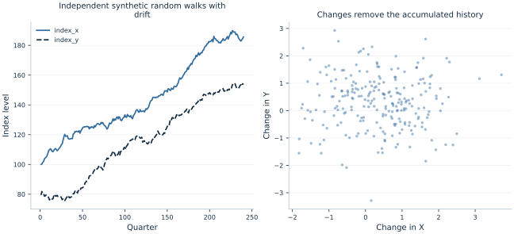

# Lab 17 · The Trap of Trending Series

Two economic indices rise over several decades. A regression of one on the
other gives an $R^2$ above 0.92 and an enormous t statistic. Is that strong
evidence of an economic relationship, or can the shared appearance of upward
movement produce a misleading result?

This lab examines two **independent synthetic random walks with drift**.
Their innovations have no relationship and neither series causes the other.
Nevertheless, their levels produce a striking regression. We then examine
changes and use two native time-series tests whose null hypotheses point in
opposite directions. The exercise connects the algebra of accumulated shocks
to the practical question of what a regression's reported significance means.

All 240 quarters are supplied in [trending_series.xlsx](trending_series.xlsx).
No index is measured from an actual economy. The numerical results are real
executions of
OpenEconometrics on the simulated data, not an empirical claim about any pair
of macroeconomic variables.

## 1. Start with what a shock does over time

Consider a stationary autoregression around a fixed mean:

$$Z_t-\mu=\rho(Z_{t-1}-\mu)+e_t,\qquad |\rho|<1.$$

A shock affects today's value and then decays. Its contribution $h$ periods
later is proportional to $\rho^h$. Under appropriate initialization and finite
innovation variance, the series has a stable mean and variance, and its
autocovariance depends on the lag rather than the calendar date. These are
features of covariance stationarity.

A random walk behaves differently:

$$X_t=X_{t-1}+d_x+\varepsilon_t.$$

The coefficient on the lagged level is exactly one. Expanding the recursion
shows why the distinction matters:

$$X_t=X_0+d_xt+\sum_{j=1}^{t}\varepsilon_j.$$

Every past innovation remains in the current level. A shock does not fade
away. With independent innovations of variance $\sigma_x^2$, the random
component has variance $t\sigma_x^2$. Thus subtracting a deterministic linear
trend does not make the accumulated stochastic component stationary.

This is the difference between a deterministic trend and a stochastic trend.
A series can trend upward because its expected value follows a calendar
pattern, because it accumulates permanent shocks, or because both mechanisms
operate. A line on a plot cannot by itself distinguish those possibilities.

## 2. Understand the synthetic indices

The prepared indices were constructed from independent standard-normal
innovations according to

$$
X_t=100+\sum_{j=1}^{t}(0.35+\varepsilon_{xj}),
\qquad
Y_t=80+\sum_{j=1}^{t}(0.25+\varepsilon_{yj}).
$$

The two innovation sequences are independent. Both indices have positive
drift, but there is no behavioral equation linking them. The units are
arbitrary index points; these are not percentages or currency amounts.

| Variable | Meaning | Sample |
| --- | --- | --- |
| `quarter` | Consecutive integer calendar index | 1–240 |
| `index_x` | First independent random walk with drift | 240 levels |
| `index_y` | Second independent random walk with drift | 240 levels |
| `change_x` | $X_t-X_{t-1}$ | Quarters 2–240 |
| `change_y` | $Y_t-Y_{t-1}$ | Quarters 2–240 |

The first difference needs two observed levels, so it loses the first row.
The resulting regression has 239 observations. The script retains the
original quarter labels rather than silently pretending that the first
change belongs to quarter 1. There are no missing interior periods, and all
models use explicit `missing="raise"` where that argument is supported.



The levels panel shows long movements generated by drift and accumulated
innovations. The changes panel asks a different question: when X has an
unusually large increment in a quarter, does Y also have an unusually large
increment? Independence of the innovations implies no population relationship
between those increments, even though the levels appear to move together.

## 3. Fit the tempting level regression

Download [trending_series.xlsx](trending_series.xlsx) and [lab.py](lab.py). In OpenEconometrics,
import the workbook without changing its filename, then open `lab.py` in a
Python document and run the complete file. The workbook's first sheet,
`Data`, contains the observations; `Dictionary` explains the variables and units.

The script reads the prepared indices, fits the level and change models,
displays the native tests, and plots quarterly changes. Everyone using the
supplied workbook starts
from the same observations and obtains the same reported results.

In ordinary Python, keep the workbook beside `lab.py` and run `python lab.py`
from an environment where OpenEconometrics is installed. To read a workbook
from another folder, use `from lab import run_lab`, then call
`run_lab(data_path="/path/to/trending_series.xlsx")`. The script writes no exports
unless an output directory is explicitly supplied.

After the file has been run, inspect the level specification:

```python
data = load_data()
levels = oe.ols(
    data=data,
    y="index_y",
    x=["index_x"],
    covariance="nonrobust",
    missing="raise",
    device="cpu",
)
print(levels.summary())
```

The executed regression reports

$$\widehat Y_t=-22.359+0.954429X_t.$$

| Reported level-regression quantity | Value |
| --- | ---: |
| Slope | 0.954429 |
| Conventional standard error | 0.017044 |
| Reported t statistic | 55.998 |
| Reported two-sided p-value | Approximately $4.97\times10^{-139}$ |
| $R^2$ | 0.929455 |

The software has correctly calculated this least-squares line and its
requested conventional formula. The problem is interpreting that formula
under a data-generating process for which the usual stationary-regression
reference argument does not apply. A tiny reported p-value cannot turn two
independent accumulated processes into an economic mechanism.

High $R^2$ measures how much level variation the fitted line explains in this
sample. It is not a test of causality, stationarity, or theoretical relevance.
Likewise, adding significance stars to this table would decorate an invalid
inferential interpretation rather than resolve it. The classic issue is
discussed by [Granger and Newbold](https://www.sciencedirect.com/science/article/pii/0304407674900347).

## 4. Change the question from levels to increments

First differencing removes the accumulation:

$$\Delta X_t=0.35+\varepsilon_{xt},\qquad
\Delta Y_t=0.25+\varepsilon_{yt}.$$

The independent shocks remain independent. Create the change sample explicitly
before fitting:

```python
changes = data.assign(
    change_x=data.index_x.diff(),
    change_y=data.index_y.diff(),
).iloc[1:].copy().reset_index(drop=True)

model_changes = oe.ols(
    data=changes,
    y="change_y",
    x=["change_x"],
    covariance="HC3",
    missing="raise",
    device="cpu",
)
print(model_changes.summary())
```

The change slope is **−0.015484**, with HC3 standard error **0.067413**,
95% interval **[−0.148289, 0.117321]**, and p-value **0.8185**. The change
regression's $R^2$ is approximately **0.000268**. These results are consistent
with the independent increments that we deliberately generated.

The two slopes are not alternative estimates of an unchanged target. The
level regression describes a relationship among accumulated index values;
the difference regression describes the association between quarter-to-quarter
increments. Its unit is “Y index-point change per X index-point change.”
Differencing can be appropriate for an integrated process, but it can also
discard economically important long-run information. Choosing a transformation
must follow a model of the series and the research question.

## 5. Ask a unit-root question with ADF

The augmented Dickey–Fuller regression used for the level series is

$$
\Delta Y_t=a+dt+\gamma Y_{t-1}
+\psi\Delta Y_{t-1}+v_t.
$$

The null hypothesis is a unit root, $\gamma=0$. The alternative has a
negative coefficient on the lagged level, corresponding to mean reversion
after accounting for the declared deterministic terms. The statistic is a
t-like ratio for $\gamma$, but its null reference distribution is
Dickey–Fuller, not the ordinary Student t distribution.

```python
adf_level = oe.dfuller(
    data, "index_y", time="quarter", lags=1, trend="trend"
)
print(adf_level)
print(adf_level.attrs["critical_values"])
```

We include a constant and linear trend because the level process has drift
and a trend-stationary alternative is relevant to the comparison. This
choice changes the test specification and reference values; deterministic
terms are not interchangeable formatting preferences.

For the level series, the statistic is **−2.749939** and the approximate
p-value is **0.21594**. The 5% critical value is **−3.429100**. Rejection is
in the more negative tail, so this result does not reject the unit-root null
at 5%. Non-rejection does not prove a unit root; tests can have limited power
against persistent alternatives.

For changes, the script uses one lagged change and a constant, without a
linear trend. The statistic is **−10.792592**, with an approximate p-value
of **$2.11\times10^{-19}$** and a 5% critical value of **−2.873814**. This
strongly rejects a unit root in the difference series under that specification.
The level ADF regression uses 238 observations; the difference-series ADF
regression uses 237, because constructing lags consumes additional rows.

The augmentation lag also has a purpose: it allows short-run dependence in
changes to be represented before testing the lagged level. Too few lags can
leave serially dependent auxiliary-regression errors; too many can consume
observations and reduce power. This lab declares one lag as a transparent
example rather than selecting it to produce a desired rejection. An actual
analysis should explain lag selection and examine whether the resulting
auxiliary regression has an adequate error specification.

Time ordering is equally substantive. The native test sorts by the declared
quarter column and requires a consecutive calendar. An interior missing
quarter cannot simply be dropped and treated as if its neighbors were adjacent:
that would redefine the lagged variables. A time-series transformation must
preserve the period it measures, just as a cross-sectional merge must preserve
the observation it describes. Keeping sample counts alongside test statistics
helps expose accidental changes in those definitions.

## 6. Reverse the null with KPSS

The KPSS test starts from stationarity as the null. With `trend=True`, the
null permits a deterministic linear trend; with `trend=False`, it concerns
stationarity around a level. A large statistic indicates that partial sums of
detrended residuals are too persistent relative to the estimated long-run
variance.

```python
kpss_level = oe.kpss(data, "index_y", time="quarter", lags=4, trend=True)
kpss_change = oe.kpss(changes, "change_y", time="quarter", lags=4, trend=False)
print(kpss_level)
print(kpss_change)
```

The level statistic is **0.243405**, above the trend-stationarity 1% critical
value **0.216**. The result rejects that stationary-trend null. The change
statistic is **0.121466**, below the level-stationarity 10% critical value
**0.347**, so it does not reject that null at conventional levels.

OpenEconometrics reports KPSS p-values using a bounded table interpolation.
For these results, the notes state **p < 0.01** for levels and **p > 0.10**
for changes. The stored boundary numbers 0.01 and 0.10 must not be described
as exact tail probabilities. Reading the accompanying notes avoids overstating
numerical precision.

Here ADF and KPSS tell a compatible story: persistent nonstationary levels
and stationary increments. That agreement is useful evidence, not an automatic
model-selection rule. Structural breaks, nonlinear dynamics, limited samples,
and inappropriate deterministic terms can complicate both tests. When results
conflict, examine the series and the specification rather than deciding that
one test is always authoritative.

## 7. Understand what differencing does not solve

Replacing levels with changes does not create exogeneity, eliminate
measurement error, or establish causal direction. Differencing a variable
measured with noise may even make that noise relatively more important. It
also changes interpretation from a level relationship to a short-run change
relationship.

Some nonstationary series share a genuine long-run equilibrium: a particular
linear combination can be stationary even when each individual series has a
unit root. That possibility is cointegration. Independent random walks in this
lab do not have a constructed common equilibrium. An empirical project with
an economic long-run theory would need to investigate that theory rather than
mechanically difference every variable and declare the problem solved.

Adding a time trend to a level regression can address a deterministic common
trend but does not generally remove accumulated stochastic trends. Changing
only the covariance estimator also does not repair the entire nonstationary
regression problem. The model, transformations, sampling behavior, and
reference distribution must fit together.

The level example is a substantive inferential failure even though its
least-squares calculation is correct. Understanding that distinction is
essential when a striking software output conflicts with the process that
generated the observations.

## 8. Report a defensible comparison

The publication [LaTeX table](table.tex) places the level and change models
side by side, with their different outcomes and sample counts clearly labeled.
That labeling matters because similar-looking columns can otherwise imply
that a transformation merely changes precision around an unchanged target.

When communicating the lesson, report the level fit as a misleading example,
the change estimate with its correct unit and sample, and the null hypotheses
of the tests. Do not present non-rejection of a unit root as proof or claim
that an insignificant change coefficient establishes that all economic
connections are absent in every setting.

## 9. Questions for your analysis

1. Expand a random-walk recursion and show why the variance of its accumulated
   innovation component grows with time. Contrast it with a stationary AR(1).
2. Explain why the level regression's high $R^2$ and large t statistic are
   misleading in this constructed example. What does the software correctly
   calculate, and what interpretation fails?
3. Derive the first differences of both generated indices. State the
   population slope expected in the change regression.
4. Interpret the change coefficient and its confidence interval, including
   its units and the number of observations used.
5. State the null and alternative of each test. Explain why ADF's statistic
   should not be compared with an ordinary t critical value.
6. Explain the level and change KPSS results while respecting the bounds of
   the reported p-values.
7. Describe a substantive situation in which differencing two nonstationary
   series could remove useful long-run information. What additional research
   question would need to be investigated?
