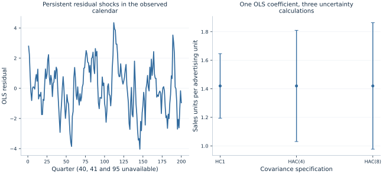

# Lab 18 · Accounting for Persistent Shocks

A firm increases advertising in one quarter and keeps much of that spending
level in the next. Demand shocks also persist: a favorable quarter is often
followed by another favorable quarter. A regression can still estimate the
advertising–sales relationship, but observations close together in time do not
provide the same uncertainty information as independent draws.

This lab separates two tasks that are often conflated: fitting an OLS
coefficient and estimating its sampling uncertainty. We fit exactly the same
model on exactly the same observations using HC1 and two declared HAC
specifications. The coefficient does not change. Its standard error and
confidence interval do change because the covariance calculations allow
different dependence patterns.

The advertising and sales series are **original synthetic data**, not company
records. They are supplied in [advertising_and_sales.xlsx](advertising_and_sales.xlsx).
[lab.py](lab.py) reads these observations, performs the native OpenEconometrics
fits, and presents the calendar-aware HAC comparison.
The results illustrate inference under a specified process rather than an
empirical estimate of advertising returns.

## 1. Explain why nearby quarters can contain overlapping information

Write the regression as

$$Y_t=\beta_0+\beta_1X_t+u_t.$$

If errors are independent across periods, the variance of a sum of regression
scores depends on each period's variance. If errors and regressors are
persistent, cross-period covariance terms also matter. A favorable demand
shock lasting several quarters should not be counted as several independent
surprises about the slope.

HC1 allows the variance of $u_t$ to differ across observations, but it does not
include nonzero cross-period covariance terms. HAC stands for
heteroskedasticity and autocorrelation consistent. It estimates a covariance
matrix that can accommodate both changing variance and short-range serial
dependence under appropriate regularity conditions.

The relevant object is the regression score $x_tu_t$, with $x_t$ including the
intercept, not simply the error series in isolation. Persistence in both the
regressor and errors can make the score covariance important for the slope.
Correcting only for heteroskedasticity may therefore leave substantial
uncertainty unaccounted for.

Serial correlation does not automatically bias the OLS coefficient. Under a
suitable exogeneity condition, the point estimator can remain consistent while
its conventional covariance formula fails. If the regressor is correlated
with the error, however, changing the covariance estimator does not solve that
endogeneity problem.

For an AR(1) error with persistence $\rho$ and innovation variance
$\sigma_\varepsilon^2$, the stationary error variance is
$\sigma_\varepsilon^2/(1-\rho^2)$ and its lag-$\ell$ covariance is that
variance multiplied by $\rho^\ell$. Positive persistence therefore creates
many positive covariance terms. The uncertainty of an average can be much
larger than a calculation that counts only each quarter's individual
variance. For a regression slope, the same intuition applies through the
score products, although their signs and magnitudes also depend on the
regressor path. This is why examining only the number of rows can give a
misleading impression of how much independent information a time series
contains.

## 2. Inspect the original synthetic process and calendar

The prepared series follow independent innovation sequences and persistent
processes:

$$
X_t-5=0.85(X_{t-1}-5)+\eta_t,
\qquad u_t=0.75u_{t-1}+\varepsilon_t,
$$

where the innovation standard deviations are 0.5 and 1.0 respectively. The
outcome is

$$Y_t=10+1.4X_t+u_t.$$

One hundred initial simulated periods are discarded before the 200-period
teaching series is retained. This reduces the influence of initializing both
deviations at zero. The two innovation streams are independent, so the
generator does not deliberately create endogeneity between advertising and
demand shocks.

| Variable | Definition | Unit |
| --- | --- | --- |
| `quarter` | Original integer calendar position | 1–200 |
| `advertising` | Synthetic quarterly advertising expenditure | Ten thousand currency units |
| `sales` | Synthetic quarterly quantity sold | Thousand units |

Three known unavailable quarters—**40, 41, and 95**—are excluded explicitly.
The resulting sample contains **197 observations**, and all fits use those
same observations. The original quarter labels are preserved. The script does
not silently compress the series into a gap-free calendar of length 197.

This distinction affects HAC. Observed quarters 39 and 42 are three calendar
periods apart even though their rows become adjacent after exclusions. A
procedure that treated them as lag one would estimate a different covariance
matrix. Missing-data handling is therefore part of the statistical
specification, not just file preparation.



The residual panel shows runs of positive and negative disturbances. The
interval panel compares the same slope under three covariance choices. Read
the calendar axis literally: a line joining observed values does not mean
outcomes were observed or imputed in the excluded quarters.

## 3. Run one model with three covariance choices

Download [advertising_and_sales.xlsx](advertising_and_sales.xlsx) and [lab.py](lab.py). In OpenEconometrics,
import the workbook without changing its filename, then open `lab.py` in a
Python document and run the complete file. The workbook's first sheet,
`Data`, contains the observations; `Dictionary` explains the variables and units.

The script reads the observed calendar without renumbering its gaps.
The application displays the main HAC model, a comparison table, and the
residual chart. Everyone using the supplied workbook starts
from the same observations and obtains the same reported results.

In ordinary Python, keep the workbook beside `lab.py` and run `python lab.py`
from an environment where OpenEconometrics is installed. To read a workbook
from another folder, use `from lab import run_lab`, then call
`run_lab(data_path="/path/to/advertising_and_sales.xlsx")`. The script writes no exports
unless an output directory is explicitly supplied.

The HC1 fit establishes the point model and one uncertainty comparison:

```python
data = load_data()
hc1 = oe.ols(
    data=data, y="sales", x=["advertising"],
    covariance="HC1", missing="raise", device="cpu",
)
```

The main HAC fit makes the calendar and lag choice explicit:

```python
hac4 = oe.ols(
    data=data, y="sales", x=["advertising"],
    covariance="hac",
    time="quarter",
    lags=4,
    kernel="bartlett",
    missing="raise",
    device="cpu",
)
print(hac4.summary())
```

The complete script also fits the same model with `lags=8`. No outcome,
regressor, weight, or sample changes across these specifications. Hence each
model reports the same fitted line:

$$\widehat Y_t=9.91594+1.420132X_t.$$

In the declared units, an additional ten thousand currency units of quarterly
advertising is associated with about **1.420 thousand additional sales units**.
That is a quantity association, not a monetary profit calculation. Revenue,
production costs, campaign pricing, and a causal design would be needed for a
return-on-investment claim.

## 4. Read the uncertainty comparison accurately

| Covariance calculation | Slope | Standard error | 95% interval |
| --- | ---: | ---: | --- |
| HC1 | 1.420132 | 0.114609 | [1.194100, 1.646164] |
| Bartlett HAC, 4 lags | 1.420132 | 0.197559 | [1.030506, 1.809759] |
| Bartlett HAC, 8 lags | 1.420132 | 0.224602 | [0.977171, 1.863093] |

The main HAC standard error is substantially larger than HC1's in this
sample. Including eight lags produces a wider interval still. The known
synthetic slope, **1.4**, lies inside all three intervals; that single fact does
not establish which covariance estimator would have appropriate repeated-sample
coverage.

HAC standard errors are not guaranteed to exceed HC1 standard errors, nor must
they grow monotonically when the lag choice changes. Cross-covariance terms
can be positive or negative, and the kernel weights change with the lag
bandwidth. The ordering here follows this realized persistent process, not a
universal rule about “robustness.”

OpenEconometrics reports Student t reference inference with **195 degrees of
freedom**, equal to 197 observations minus two fitted coefficients. For HAC,
this is a reporting convention and finite-sample approximation; it does not
make HAC intervals exact finite-sample intervals for every serially dependent
process. HAC consistency relies on large-sample arguments and suitable
dependence and bandwidth behavior.

## 5. Build intuition for the Bartlett sandwich

Let $x_t=(1,X_t)'$, let $\hat u_t$ be the OLS residual, and define the estimated
score $s_t=x_t\hat u_t$. The HAC meat includes contemporaneous and lagged score
products:

$$
\widehat S_L=\sum_t s_ts_t'
+\sum_{\ell=1}^{L}w_\ell
\sum_{t:\,t+\ell\ \mathrm{observed}}
(s_ts_{t+\ell}'+s_{t+\ell}s_t'),
\qquad w_\ell=1-\frac{\ell}{L+1}.
$$

For $L=4$, the lag weights are 0.8, 0.6, 0.4, and 0.2. Dependence closer in
time receives more weight. Products beyond lag four are not included in this
declared Bartlett calculation. Setting four lags does not assert that the true
error correlation becomes exactly zero after four quarters.

The reported covariance matrix is

$$
\widehat{\mathrm{Var}}(\hat\beta)
=\frac{N}{N-K}(X'X)^{-1}\widehat S_L(X'X)^{-1},
\qquad N=197,\quad K=2.
$$

The outer matrices translate variation in the scores into variation in fitted
coefficients. The multiplier is the finite-sample correction used here.
The same fitted residuals enter every covariance comparison, so the change in
uncertainty comes from which score products are included and how they are
weighted. Including serial products changes the sampling-variance estimate
without changing the least-squares objective or its minimizing coefficients.

An important implementation detail is the inner sum. It uses pairs whose
**actual calendar distance** is $\ell$. For lag one, quarter 39 is not paired
with quarter 42. For lag three, it is. Dropping a row and relabeling the
remaining rows would change that set of pairs and therefore change the
question asked by the covariance calculation.

## 6. Choose a dependence specification from the problem

The lag bandwidth balances two considerations. Including more covariance
terms can represent longer-lived dependence, while estimating many noisy
terms can make the covariance estimate unstable. The correct choice depends
on sampling frequency, process persistence, sample length, and the inferential
goal. There is no single lag count that works for every quarterly series.

Here four and eight lags are declared examples. A substantive application
might motivate a lag range from business cycles, contract renewal periods,
or known reporting patterns, and examine sensitivity over a justified set.
An automatic bandwidth rule is another possibility, but it too embodies
assumptions and should be recorded. Selecting the lag count because it creates
the preferred significance result is not a defensible selection strategy.

Inspecting residual plots helps reveal persistence and unusual episodes. It
does not replace reasoning about how regressors, errors, and calendar units
are generated. A residual correlation that appears small in one sample may
still matter for a particular contrast, and an isolated plot cannot diagnose
every failure of the model.

The excluded quarters are a deliberately transparent teaching choice. In real
data, missing sales could reflect a reporting failure correlated with unusually
bad outcomes. Preserving calendar gaps would then be necessary but insufficient:
the selection mechanism itself could threaten the analysis. Accurate time
indexing does not make the observed sample representative.

## 7. Know the limits of changing the covariance estimator

HAC does not change the fitted conditional mean. If the slope is biased
because advertising responds to an unobserved demand forecast, HAC leaves that
problem in place. If the true mean has a neglected seasonal pattern or a
structural break, a different covariance matrix may not provide the most
useful model. If the level series contain unit roots and produce a spurious
regression, simply requesting HAC is not a complete treatment of that
nonstationary setting.

There is also a difference between correcting inference and modeling dynamics.
A dynamic model might include lagged outcomes or specify an autoregressive
error process for forecasting or efficiency. HAC allows a broader class of
dependence when estimating uncertainty for a chosen regression, without
requiring us to fit the exact AR(1) generator. The choice between these goals
should follow the research question.

Finally, remember the unit of independence. This example is one time series,
with dependence organized by temporal distance. A multi-region panel with
common shocks may call for a different covariance design, such as appropriate
clustering or a panel-specific dependence method. Copying a single-series HAC
call onto a panel with repeated quarter labels would not preserve this
specification.

## 8. Communicate the result

The publication [LaTeX table](table.tex) presents the three covariance
specifications together. Keep the identical point model and sample visible
so that a reader can attribute the changing intervals to the uncertainty
calculation rather than an undisclosed change in regressors or observations.

A clear result paragraph states the regression, units, 197-observation sample,
excluded calendar periods, Bartlett kernel, four-lag choice, and interval.
It also distinguishes the estimated association from a causal or commercial
return claim. Report the eight-lag comparison as sensitivity rather than
silently choosing whichever interval is most convenient.

## 9. Questions for your analysis

1. Explain why serial correlation can affect uncertainty without necessarily
   changing the consistency of OLS under exogeneity. What additional problem
   arises if advertising is correlated with demand shocks?
2. Explain the different dependence assumptions behind HC1 and HAC. Why is the
   score covariance relevant to the slope, not just the residual variance?
3. Reconstruct the Bartlett weights for four and eight lags. Explain the role
   of the finite-sample multiplier in the displayed sandwich.
4. Identify which lag pairs would be incorrectly created if quarters 40, 41,
   and 95 were dropped and the remaining observations were renumbered.
5. Interpret the main slope and confidence interval using the declared
   advertising and sales units. Explain why the estimate is not a profit rate.
6. Discuss the bandwidth comparison without assuming HAC standard errors must
   always be larger or monotone in the lag count.
7. Describe two model or design failures that HAC cannot repair, and propose
   evidence or analysis that would address each one.
