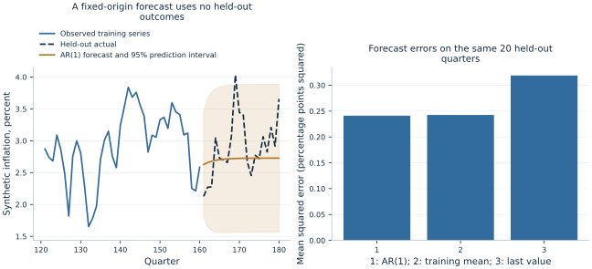

# Lab 19 · Forecasting Inflation Without Looking Ahead

Suppose the latest available inflation observation is quarter 160 and a
planning team wants a forecast path for the next twenty quarters. We can fit
an autoregression using the history available at that date. We cannot use
quarter 170's realized inflation to improve a forecast supposedly made ten
quarters earlier.

This lab makes that information boundary explicit. It estimates a native
OpenEconometrics AR(1) model on quarters 1–160, forecasts quarters 161–180
from a single fixed origin, and evaluates the predictions on the untouched
future observations. Two simple benchmarks use the identical origin and
evaluation window. The geometric forecast formula explains how a persistent
shock fades and how new innovations create future uncertainty.

The inflation series is **original synthetic data**. It is not a country's
inflation history and is not an economic forecast for a real economy.
All 180 observations are supplied in [forecast_series.xlsx](forecast_series.xlsx).
They follow a declared stationary process. All reported estimates and losses
come from executing [lab.py](lab.py) on that workbook.

## 1. Define the forecast before choosing the model

Our target is a path of future inflation values, measured in percent, over
horizons $h=1,\ldots,20$ from origin $T=160$. The information set contains
only observations through $T$. The desired conditional-mean forecast is

$$\widehat\pi_{T+h\mid T}=E[\pi_{T+h}\mid\mathcal I_T]$$

under the fitted forecasting model. The notation after the vertical bar is
essential: every point in this path uses the same information set.

This is **one twenty-step dynamic forecast**, not twenty forecasts repeatedly
updated with newly observed outcomes. In a rolling one-step exercise, the
forecast for quarter 162 could use quarter 161's actual value. In this fixed
origin exercise it cannot. The tasks have different information and error
structures, so their loss statistics should not be compared as though they
were interchangeable.

The model is chosen as a transparent teaching specification before examining
held-out loss. We do not select among dozens of lag orders using the same
twenty observations that we later describe as an untouched test set. If model
selection were required, it would need a separate training/validation design
or an explicitly nested time-ordered procedure.

## 2. Understand the supplied series and split

The supplied synthetic series follows

$$
\pi_t=2.5+u_t,\qquad
u_t=0.75u_{t-1}+\varepsilon_t,\qquad
\varepsilon_t\sim N(0,0.45^2).
$$

The first 200 simulated periods are discarded. We then retain 180 consecutive
observations. The known long-run mean is 2.5%, the persistence parameter is
0.75, and the innovation standard deviation is 0.45 percentage points. The
analyst fits the model without supplying those true parameters.

| Data component | Calendar range | Observations | Role |
| --- | --- | ---: | --- |
| Training history | 1–160 | 160 | Estimate every model parameter |
| Forecast origin | 160 | Latest available observation | Initialize the prediction path |
| Held-out outcomes | 161–180 | 20 | Evaluate previously fixed forecasts |

The variables are `quarter`, a consecutive integer time index, and
`inflation`, a synthetic quarterly rate expressed in percent. A change from
2.5 to 3.0 is half a percentage point. No external predictors, revisions,
seasonal adjustment, or survey expectations enter this example.



The observed training path stops at the origin. The forecast path approaches
the estimated long-run mean; the held-out actual path continues to receive
new shocks. Forecasting does not predict the realized future innovations.
The shaded interval describes model-based outcome uncertainty, not a range
chosen after seeing where the future observations happened to fall.

## 3. Fit a native AR(1) using training data only

Download [forecast_series.xlsx](forecast_series.xlsx) and [lab.py](lab.py). In OpenEconometrics,
import the workbook without changing its filename, then open `lab.py` in a
Python document and run the complete file. The workbook's first sheet,
`Data`, contains the observations; `Dictionary` explains the variables and units.

The script preserves the workbook order, fits only quarters 1–160, and
reserves quarters 161–180 for evaluation. It displays the fitted model,
the twenty-row evaluation table, a native forecast chart, and the benchmark
loss table. Everyone using the supplied workbook starts
from the same observations and obtains the same reported results.

In ordinary Python, keep the workbook beside `lab.py` and run `python lab.py`
from an environment where OpenEconometrics is installed. To read a workbook
from another folder, use `from lab import run_lab`, then call
`run_lab(data_path="/path/to/forecast_series.xlsx")`. The script writes no exports
unless an output directory is explicitly supplied.

The important split occurs before estimation:

```python
data = load_data()
train = data.iloc[:160].copy()
test = data.iloc[160:].copy()

model = oe.arima(
    data=train,
    y="inflation",
    order=(1, 0, 0),
    time="quarter",
    method="ml",
    covariance="nonrobust",
    missing="raise",
    alpha=0.05,
    ljung_lags=8,
)
print(model.summary())
```

The order `(1, 0, 0)` specifies one autoregressive lag, no differencing, and
no moving-average term. Exact Gaussian maximum likelihood estimates the
stationary AR model; the requested covariance uses observed-information
inference. This is not the same estimation objective as simply running a
conditional regression and dropping the first observation.

OpenEconometrics parameterizes this model as

$$\pi_t=\mu+u_t,\qquad u_t=\phi u_{t-1}+\varepsilon_t.$$

Its reported `Intercept` is **the long-run mean $\mu$**, not the recursion
constant $c$ in $\pi_t=c+\phi\pi_{t-1}+\varepsilon_t$. Those parameters satisfy
$c=(1-\phi)\mu$. Confusing them would give the wrong forecast even if the
estimated AR coefficient were read correctly.

| Fitted parameter | Estimate | Standard error |
| --- | ---: | ---: |
| Long-run mean, `Intercept` | 2.728028 | 0.110624 |
| Persistence, `ARMA:L1.ar` | 0.704108 | 0.056795 |
| Innovation SD, `/sigma` | 0.419674 | 0.023461 |

These estimates differ from the generator's true values because only one
finite training history is available. Knowing the simulation parameters is
useful for interpretation, but replacing estimated parameters with them would
turn this into a different forecasting exercise.

## 4. Forecast without feeding future actual values back into the model

The native call starts from the fitted result's saved final state:

```python
forecasts = oe.forecast(model, steps=20, alpha=0.05)
print(forecasts)
```

The output calendar begins at 161 and ends at 180. No held-out outcome is
passed to the forecast call. For a stationary AR(1), the point path can also
be written directly as

$$
\widehat\pi_{T+h\mid T}
=\hat\mu+\hat\phi^h(\pi_T-\hat\mu).
$$

At the origin, actual inflation is **2.585473%**, below the estimated mean
**2.728028%**. The one-step forecast is **2.627654%**; the twenty-step forecast
is **2.727900%**. The initial deviation decays geometrically because
$|\hat\phi|<1$. The forecast can move toward the mean while actual future
inflation moves elsewhere, because new shocks occur after the origin.

This mean-reverting path is not a forecast of central-bank actions or a
structural account of inflation. It is the model's statistical conditional
mean, based only on the past inflation series. An autoregressive coefficient
does not identify a causal policy response.

## 5. Distinguish a prediction interval from parameter uncertainty

For the fitted AR(1), the future innovation contribution is

$$
\pi_{T+h}-\widehat\pi_{T+h\mid T}
=\sum_{j=0}^{h-1}\hat\phi^j\varepsilon_{T+h-j}
$$

when fitted parameters are treated as fixed. Its variance is

$$
V_h=\hat\sigma^2\sum_{j=0}^{h-1}\hat\phi^{2j}.
$$

The native forecast standard error is $\sqrt{V_h}$. It is **0.419674** at
horizon one and **0.591012** at horizon twenty. For a stationary AR(1), the
variance approaches $\hat\sigma^2/(1-\hat\phi^2)$ rather than increasing
without bound.

The normal 95% prediction interval is the point forecast plus or minus
approximately $1.96\sqrt{V_h}$. At horizon one the interval is
**[1.805109%, 3.450199%]**; at horizon twenty it is
**[1.569537%, 3.886263%]**. These intervals concern future inflation outcomes,
which receive new innovations. They are not confidence intervals for the
long-run mean or the AR coefficient.

The native interval here includes **innovation uncertainty only**. It excludes
uncertainty about the estimated parameters, model selection, structural
change, and a potentially incorrect innovation distribution. The relatively
short training history means those omitted sources can matter. Labeling the
interval “95%” does not guarantee 95% empirical coverage under a different
process or in a single held-out episode.

The geometric formulas also explain a practical limit: distant conditional
means approach the same estimated level even while the uncertainty remains
positive. Reporting a smooth distant forecast without its interval can
therefore give a misleading impression of confidence about actual outcomes.

## 6. Evaluate against honest benchmarks

Only after fitting and forecasting do we align the twenty actual held-out
values with the predictions. The two benchmarks are defined from training
information alone:

* **Training mean:** forecast 2.747946% at every horizon.
* **Last observed value:** forecast the origin's 2.585473% at every horizon.

Neither benchmark uses the held-out sample mean or an updated actual value.
The mean benchmark represents a stable-level prediction; the last-value
benchmark represents persistent continuation of the most recent observation.

The evaluation loss is

$$
MSE=\frac{1}{20}\sum_{h=1}^{20}
(\pi_{160+h}-\widehat\pi_{160+h\mid160})^2.
$$

| Forecast method | Held-out MSE |
| --- | ---: |
| Native AR(1) | 0.241122 |
| Training mean | 0.242553 |
| Last observed value | 0.318858 |

MSE is measured in **squared percentage points**. Its square root would return
to percentage-point units. The AR model has slightly lower loss than the
training mean in this one episode and noticeably lower loss than the last-value
benchmark. The very small difference from the mean benchmark does not support
a broad claim of forecasting superiority.

The twenty errors also do not constitute twenty independent experiments:
they share a forecast origin and overlapping future shocks across horizons.
A robust comparison across methods would consider more origins, a declared
evaluation design, dependence among losses, and the stability of performance
over different economic regimes.

## 7. Inspect diagnostics without turning them into a permission slip

The training fit reports a residual Ljung–Box p-value of approximately **0.5469**
at eight lags and a Jarque–Bera p-value of **0.6678**. These do not reject the
respective nulls at conventional levels. The ARCH-LM diagnostic at one lag,
however, reports **p = 0.01724** and flags a possible variance pattern.

The known generator uses constant-variance independent innovations. A
significant diagnostic can nevertheless occur in one finite sample; inspecting
several diagnostics also creates opportunities for chance alarms. In actual
data we would not know the generator, so the ARCH result would deserve
investigation rather than dismissal. It is also a reminder that the plotted
constant-innovation-variance intervals rely on a model assumption.

No diagnostic proves that the next twenty quarters will follow the training
regime. A structural break, unusual event, data revision, or policy change can
undermine forecasts even when in-sample residual tests look reassuring.
Forecast validation must examine actual future performance under an honest
information boundary, not just the elegance of the fitted model summary.

## 8. Protect the information boundary beyond the final fit

Information leakage can occur before the model call. Centering a predictor
using the full sample mean, choosing transformations after looking at test
errors, filling historical gaps with future outcomes, or selecting a model
from the held-out period can all introduce information unavailable at the
forecast origin. A time-ordered split is necessary, but the entire preparation
and selection process must respect it.

Actual inflation records introduce another issue: data vintages. A historical
series downloaded today may contain revisions that were not available when
the historical forecast would have been made. An evaluation using revised
values as past information can overstate real-time performance. This
synthetic series has no revisions, so the exercise avoids that complication
without demonstrating that it is unimportant in applications.

Adding external predictors would also require future inputs or a separate
predictor forecast. Supplying realized future interest rates or energy prices
to a forecast described as unconditional would change its information set.
Conditional scenarios can be useful, but they should be labeled as scenarios
with assumed future inputs. The present univariate model makes the boundary
especially easy to inspect: every parameter and initial condition comes from
the first 160 inflation observations.

## 9. Preserve the origin and interpretation in a report

The publication [LaTeX table](table.tex) records the training-only parameter
estimates. Read it alongside the held-out loss table: in-sample parameter
significance and out-of-sample predictive performance answer different
questions. A highly significant persistence coefficient does not guarantee
an economically meaningful improvement over a simple forecast benchmark.

A useful forecast report names the estimation window, origin, horizons,
parameterization, benchmarks, loss units, and interval limitations. It should
also explain whether forecasts are fixed-origin or updated over time. Without
that information, an attractive chart can conceal information leakage or a
comparison between fundamentally different forecasting tasks.

## 10. Questions for your analysis

1. Explain the information set at quarter 160. Give two examples of future
   information that would invalidate this fixed-origin evaluation.
2. Convert the reported long-run mean and AR coefficient into the recursion
   constant. Explain why using the long-run mean as that constant is incorrect.
3. Derive the two-step point forecast and forecast-error variance. Explain why
   the uncertainty approaches a finite limit in this model.
4. Interpret the first and twentieth prediction intervals, distinguishing
   outcome uncertainty from uncertainty about estimated parameters.
5. Explain the three benchmark losses without claiming that one short window
   establishes general forecasting superiority.
6. Discuss the ARCH diagnostic and the assumptions behind the displayed
   intervals. What additional investigation would be useful with actual data?
7. Design a rolling-origin evaluation that preserves time order. Specify when
   parameters would be reestimated and what information each forecast could use.
