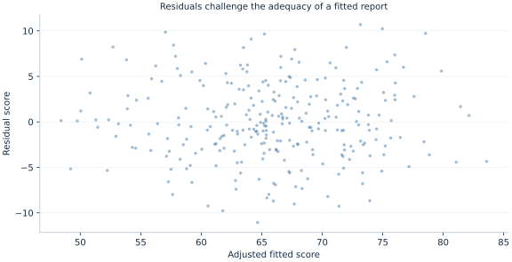

# Lab 20 · From Research Question to Finished Report

A school network wants to understand whether schools offering more tutoring
have higher end-of-year achievement. The dataset contains tutoring hours,
baseline scores, a resource index, and final scores. A useful report must do
more than fit a regression: it must define the question, describe the sample,
justify the comparison, quantify uncertainty, examine sensitivity, and state
what the available design can support.

This capstone follows that complete sequence with **original synthetic
observational schools**. The data are deliberately constructed so that adding
observed controls does not eliminate an important unobserved confounder.
The exercise therefore requires both technical accuracy and restraint in
interpretation. A small p-value can coexist with an unsupported policy claim.

The raw data are supplied in [school_tutoring.xlsx](school_tutoring.xlsx),
and the results come from executing [lab.py](lab.py) on that workbook.
They do not describe actual schools, pupils, or a tutoring program. The final
product is a
reproducible association report with an explicit causal limitation, rather
than an empirical recommendation to expand tutoring.

## 1. Turn a broad policy interest into a precise estimand

The broad question, “Does tutoring work?”, could refer to many different
populations, interventions, and outcomes. Here the observed treatment-like
variable is average weekly tutoring hours offered by a school. The outcome is
a school-level end-of-year achievement index. Each observation is one school;
the regression does not estimate an individual student's response.

The main statistical target is the **conditional association** between one
additional weekly tutoring hour and the final score, holding measured baseline
score and resources fixed. The fitted model is

$$
Final_i=\beta_0+\beta_T Tutoring_i
+\beta_P Prior_i+\beta_R Resources_i+e_i.
$$

The coefficient $\beta_T$ becomes a causal intervention effect only under
additional assumptions about assignment, omitted determinants, measurement,
and the model's relevant functional form. Schools do not receive tutoring
hours through a randomized design in this example. Administrators and
families may choose more tutoring in response to needs, resources, or
motivation, which can also affect outcomes.

Stating the statistical target first prevents the report from changing its
claim after seeing the coefficient. A significant adjusted association is
useful descriptive evidence. It does not by itself answer what would happen
if every school were assigned four more hours next year.

## 2. Describe what the synthetic analyst observes

The supplied workbook contains 300 independent synthetic schools. The
underlying design includes a latent motivation variable that affects both
tutoring and achievement. The analyst receives the observed columns below,
while the
motivation values remain unavailable in the analysis table.

| Variable | Definition | Unit |
| --- | --- | --- |
| `school` | Observation identifier | 1–300 |
| `prior_score` | Baseline achievement index | Score points |
| `resource_index` | Standardized school-resource measure | Index units, zero near the population mean |
| `tutoring_hours` | Weekly tutoring offered | Hours per week |
| `final_score` | End-of-year achievement index | Score points |

These scores are synthetic indices, not percentages bounded between zero and
one hundred. The resource index can be negative because it is standardized;
that does not mean a school has negative physical resources. Tutoring is
restricted to a positive minimum of 0.1 hour in the generator.

The structural outcome equation used to construct the data is

$$
Final_i=20+0.65Prior_i+1.2Tutoring_i
+2Resources_i+2Motivation_i+\varepsilon_i.
$$

Tutoring also increases with motivation and resources and responds negatively
to baseline achievement, with an independent assignment disturbance. The
outcome noise standard deviation increases with tutoring hours. Thus the
generator contains both an omitted-variable problem and heteroskedasticity.

The known structural tutoring coefficient is **1.2 score points per hour**.
Disclosing it helps us evaluate the exercise. The regression does not receive
the hidden motivation values, so observing that coefficient in the teaching
description does not make it identified by the analyst's measured data.

## 3. Make the sample a visible analytical choice

The resource index is unavailable for schools whose identifier is divisible
by 13. This creates **23 missing resource values**. The main analysis uses
the **277 schools** with complete outcome, tutoring, baseline score, and
resource information.

The exclusions are fixed by a transparent identifier rule unrelated to the
random draws in this synthetic construction. An actual missingness mechanism
could be more problematic: understaffed or low-performing schools might be
less likely to submit resource records. Complete-case analysis would then
require an argument about the resulting selection, rather than a statement
that the software successfully removed missing rows.

```python
data = load_data()
common = data.dropna(subset=[
    "final_score", "tutoring_hours", "prior_score", "resource_index"
]).copy().reset_index(drop=True)
print(len(data), len(common))
```

The unadjusted and adjusted main models both use `common`. This is important:
if one model used all 300 schools while the other used 277, a coefficient
change would combine a specification change with a sample change. The script
retains a separate all-school unadjusted fit to demonstrate the distinction,
but does not substitute it for the main same-sample comparison.

Within the fitting calls, `missing="raise"` ensures that an unexpected missing
value cannot quietly create another sample. The retained school identifiers
are preserved in the saved analysis state, even though the local DataFrame
index is reset for straightforward row handling during estimation.

## 4. Fit the report's declared models

Download [school_tutoring.xlsx](school_tutoring.xlsx) and [lab.py](lab.py). In OpenEconometrics,
import the workbook without changing its filename, then open `lab.py` in a
Python document and run the complete file. The workbook's first sheet,
`Data`, contains the observations; `Dictionary` explains the variables and units.

The script reads all 300 raw school records, retains the 23 blank resource
cells until the explicit sample-selection step, and displays the adjusted
model, a specification comparison, scenario mean predictions, and a
residual plot. Everyone using the supplied workbook starts
from the same observations and obtains the same reported results.

In ordinary Python, keep the workbook beside `lab.py` and run `python lab.py`
from an environment where OpenEconometrics is installed. To read a workbook
from another folder, use `from lab import run_lab`, then call
`run_lab(data_path="/path/to/school_tutoring.xlsx")`. The script writes no exports
unless an output directory is explicitly supplied.

The main adjusted call is

```python
adjusted = oe.ols(
    data=common,
    y="final_score",
    x=["tutoring_hours", "prior_score", "resource_index"],
    covariance="HC3",
    missing="raise",
    device="cpu",
)
print(adjusted.summary())
```

HC3 uses leverage-adjusted squared residuals in the covariance sandwich. It
accommodates unequal error variance for uncertainty about the chosen OLS
association, under the relevant exogeneity and regularity conditions. It does
not remove the latent motivation variable from the error or make tutoring
assignment exogenous.

| Model | Schools | Tutoring coefficient | HC3 SE | 95% interval |
| --- | ---: | ---: | ---: | --- |
| Unadjusted, common sample | 277 | 1.773228 | 0.283085 | [1.215939, 2.330517] |
| Baseline score and resources adjusted | 277 | 2.207961 | 0.162817 | [1.887425, 2.528498] |
| Baseline score only | 277 | 2.499820 | 0.178615 | [2.148187, 2.851452] |
| Unadjusted, all observed schools | 300 | 1.709912 | 0.265478 | [1.187463, 2.232361] |

The first three rows permit a same-sample specification comparison. The last
row isolates what the unadjusted coefficient looks like on a larger available
sample; it should be labeled clearly rather than mixed into the main
before-and-after-controls argument.

## 5. Interpret the primary estimate without changing its target

The adjusted tutoring estimate is **2.207961 score points per additional
weekly hour**, holding measured prior score and resources fixed. Its HC3
standard error is **0.162817**, with a **95% interval [1.887425, 2.528498]**
and Student t reference inference using **273 degrees of freedom**.

The fitted equation is approximately

$$
\widehat{Final}_i=12.7796+2.207961Tutoring_i
+0.687616Prior_i+1.96285Resources_i.
$$

The intercept describes a school with zero tutoring, zero prior score, and
a zero resource index. That combination lies far from the typical observed
school, so the intercept is mainly a component of the fitted equation rather
than a policy quantity of interest.

The ordinary **$R^2$ is 0.715558**. About 71.6% of this sample's final-score
variation is explained by the fitted linear combination. That descriptive
fit does not quantify how much outcome variation tutoring causally produces.

The confidence interval is narrow relative to the estimated coefficient, but
the known structural coefficient 1.2 lies below it. That is the central
lesson of this constructed report: measured controls and precise robust
inference can coexist with residual confounding. The interval quantifies
uncertainty about the fitted association under its statistical assumptions;
it does not include an automatic allowance for unobserved-variable bias.

## 6. Explain the sensitivity results using the data story

Adding baseline score and resources changes the tutoring coefficient from
1.773 to 2.208 on the same 277 schools. Removing resources while keeping
baseline score changes it further to 2.500. Controls can move an estimated
association upward or downward; there is no general rule that adjustment must
shrink a coefficient toward zero or toward its causal value.

Baseline achievement is related to both tutoring assignment and final scores.
Resources also predict tutoring and achievement. Their omitted contributions
can push a simple regression in different directions. The latent motivation
variable remains relevant after both are included, so the adjusted model can
still combine tutoring with an unobserved determinant of performance.

This sensitivity exercise is a reason to articulate a selection model and
substantive assumptions, not a reason to choose whichever specification gives
the preferred result. A report should state why a control belongs in the
model and whether it precedes treatment. Controlling for a variable caused by
tutoring could change the target or introduce additional bias; more controls
are not automatically better controls.

The all-school unadjusted coefficient, 1.710, also differs from the common-sample
unadjusted coefficient, 1.773. That difference arises from sample composition,
not from adding a regressor. Keeping the comparison organized makes it
possible to explain what each numerical change does and does not show.

## 7. Examine predictions and residuals as separate evidence

Suppose two hypothetical schools have prior score 60 and resource index zero,
but one offers two tutoring hours and the other six. The native prediction
call is

```python
scenarios = pd.DataFrame({
    "tutoring_hours": [2.0, 6.0],
    "prior_score": [60.0, 60.0],
    "resource_index": [0.0, 0.0],
})
prediction = adjusted.predict(data=scenarios, interval="mean")
print(prediction)
```

The fitted means are **58.452484** and **67.284329**, a difference of
**8.831846 score points**, equal to four times the fitted tutoring slope.
The respective mean intervals are **[57.347933, 59.557035]** and
**[66.690614, 67.878045]**. These are uncertainty intervals for conditional
mean predictions under the fitted model; they are not individual-school
prediction intervals and not intervals for a tutoring intervention effect.

Subtracting two interval endpoints is also not a valid way to obtain a
confidence interval for the difference between predictions. The predictions
share fitted parameters and therefore covariance. A contrast calculation
must account for that shared uncertainty.



Use the residual plot to inspect curvature, changing spread, and unusual
observations. A visually unremarkable residual cloud would not demonstrate
that motivation is absent from the error. Conversely, a visible pattern would
help motivate further modeling but would not identify its causal source on
its own. Diagnostics, fit, uncertainty, and identification are complementary
pieces of evidence rather than substitutes for one another.

## 8. Document and communicate the analysis

A report needs enough information for another reader to assess the claim.
One suitable result description is:

> In 277 synthetic schools with complete baseline-score and resource records,
> an additional weekly tutoring hour is associated with 2.21 higher final-score
> points, conditional on the measured controls. The HC3 95% interval is
> [1.89, 2.53]. The data-generating design includes unobserved motivation that
> affects both tutoring and achievement, so this adjusted association is not
> interpreted as an intervention effect.

The numerical paragraph should accompany a data description, exclusion rule,
model equation, covariance choice, sensitivity comparison, and limitations.
The report's causal qualification belongs beside the result, where the reader
can use it, rather than only in a distant technical appendix.

The publication [LaTeX table](table.tex) places the three common-sample
specifications together. Its title and notes identify synthetic schools,
the 277-observation sample, HC3 uncertainty, and the remaining confounding
limitation. These details are part of the result's meaning, not optional
decoration around a coefficient.

Reproducibility means another reader can reproduce the numerical result from
the supplied workbook and analysis code. It does not establish that the result
answers every substantive question. This report is computationally
reproducible while retaining a clearly documented identification limitation.

## 9. Questions for your analysis

1. State the main statistical estimand and explain the additional assumptions
   needed to interpret it as a tutoring intervention effect.
2. Explain the complete-case sample and distinguish the first three model
   comparisons from the all-school unadjusted comparison.
3. Interpret the primary coefficient, its unit, standard error, interval, and
   reference degrees of freedom without implying that robust inference removes
   unobserved confounding.
4. Use the data-generation story to explain why adding controls need not move
   a coefficient toward zero or toward the true structural parameter.
5. Interpret the two scenario predictions. Explain why their difference is
   not automatically a causal effect and why subtracting interval endpoints
   does not provide a valid contrast interval.
6. Identify what the residual plot can reveal and what it cannot reveal about
   the missing motivation variable.
7. Write a complete short report containing a question, sample statement,
   model, primary result, sensitivity finding, and an explicit limitation.
   Propose a stronger design or additional evidence for the policy question.
