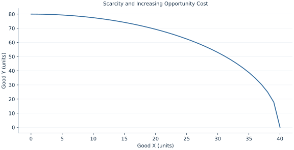

# Lab 01 · Scarcity and Increasing Opportunity Cost

> Why does producing more of X require an increasing sacrifice of Y?

## Start with the supplied observations

Download [production_frontier.xlsx](production_frontier.xlsx) and [the complete Python analysis](lab.py). Import the workbook into OpenEconometrics without renaming it. Open the complete Python file in an empty Python document and run the whole file. The first sheet, **Data**, contains the observations. **Dictionary** explains variables, coding, units and missing cells.

For ordinary Python, keep the workbook beside `lab.py`. For another location, use `from lab import run_lab`, then `run_lab(data_path="/path/to/production_frontier.xlsx")`. Keep the supplied workbook intact and use a copy for transformations. The [LaTeX result table](table.tex) accompanies the chapter.

The workbook contains **41 original synthetic observations**. Its observational unit is: One feasible production plan. These are teaching observations, not an empirical estimate about an actual business, population or policy. Every student starts from the same stored values and missing cells.

| Variable | Meaning | Unit or coding | Missing cells |
|---|---|---|---:|
| `x` | Good X output | units X | 0 |
| `y` | Frontier output of good Y | units Y | 0 |

## 1. Build the comparison

A production frontier lists the largest feasible amount of one good conditional on the other. Interior plans are feasible but inefficient within this technology; exterior plans cannot be produced with the stated resources. Moving along the frontier reallocates resources rather than increasing them.

Opportunity cost is a slope, expressed in units of the forgone good per extra unit of the chosen good. On this curved frontier the slope changes with the starting point. A finite move sacrifices an average amount over an interval; a derivative describes a very small move. These are different comparisons and need not agree numerically.

$$
x^2+(y/2)^2=1600,\quad y=2\sqrt{1600-x^2},\quad OC_X=-dy/dx=\frac{2x}{\sqrt{1600-x^2}}.
$$

Differentiate the square-root expression using the chain rule. As x approaches 40, the denominator becomes small and the marginal sacrifice becomes large. At x=24, substitute into the same formula rather than estimating a slope from the full-intercept line.

## 2. State the assumptions and sample

Technology and resources are fixed; goods are divisible and output is nonnegative. Workbook rows are feasible model plans, not sampled firms. The derivative is evaluated away from the endpoint where it diverges.

**Pause before running.** Does the marginal cost remain constant?

## 3. Follow the application

The complete file loads the supplied observations, applies the chapter's explicit sample rule, computes the procedure and displays the result, a chart and a compact numerical table. The following shortened call highlights the statistical operation. `load_data()` and the other chapter helpers are defined in the full file; run that file before using the snippet.

```python
import openecon as oe

raw = load_data()
point = raw.loc[raw.x == 24].iloc[0]
opportunity_cost = 2 * point.x / math.sqrt(1600 - point.x**2)
display(oe.DataFrame({"X": [point.x], "Y": [point.y], "Y_cost_per_X": [opportunity_cost]}))
```

Read the output in this order: establish which observations were used, identify the quantity being compared, inspect the amount of variation or uncertainty, and then interpret the result in the units of the question. A large statistic without its denominator, sample and comparison cannot explain the result. The final numerical table puts the quantities used in the worked discussion together; the procedure output retains the fuller set of tables.

## 4. Interpret the executed example

| Quantity | Computed value |
|---|---:|
| Chosen x | 24 |
| Frontier y | 64 |
| Marginal y cost per x | 1.5 |
| X intercept | 40 |
| Y intercept | 80 |

At X=24, frontier Y=64 and the marginal cost is 1.5 units of Y per X. Intercepts are 40 and 80. These quantities describe technological feasibility, not society’s preferred plan.



The chart is computed from the supplied scenarios using the stated equations. Its coordinates are retained with the numerical result. Read axis units before comparing its slopes; a change of scale can alter visual steepness without changing the underlying trade-off.

## 5. Decide what the evidence supports

A frontier cannot choose an allocation without preferences or values. A movement along it differs from an outward shift caused by new resources or technology.

## 6. Try it yourself

**A.** Does the marginal cost remain constant?

**B.** Calculate Y at X=24.

**C.** Is (0,0) infeasible?

**D.** Would an outward shift prove welfare increased?

## Further reading

[OpenStax, Principles of Microeconomics 3e](https://openstax.org/books/principles-microeconomics-3e/pages/1-introduction) is optional background reading. The models, scenarios, questions and analysis here are original; no textbook exercises or datasets are reproduced.
