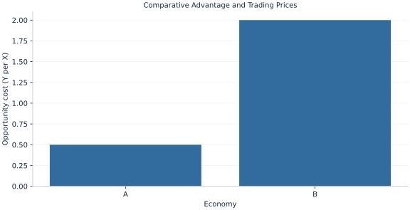

# Lab 02 · Comparative Advantage and Trading Prices

> Can both economies gain from trade even when productivity comparisons differ by good?

## Start with the supplied observations

Download [comparative_advantage.xlsx](comparative_advantage.xlsx) and [the complete Python analysis](lab.py). Import the workbook into OpenEconometrics without renaming it. Open the complete Python file in an empty Python document and run the whole file. The first sheet, **Data**, contains the observations. **Dictionary** explains variables, coding, units and missing cells.

For ordinary Python, keep the workbook beside `lab.py`. For another location, use `from lab import run_lab`, then `run_lab(data_path="/path/to/comparative_advantage.xlsx")`. Keep the supplied workbook intact and use a copy for transformations. The [LaTeX result table](table.tex) accompanies the chapter.

The workbook contains **2 original synthetic observations**. Its observational unit is: One synthetic economy and its unit labor requirements. These are teaching observations, not an empirical estimate about an actual business, population or policy. Every student starts from the same stored values and missing cells.

| Variable | Meaning | Unit or coding | Missing cells |
|---|---|---|---:|
| `economy` | Economy label | A or B | 0 |
| `labor_x` | Labor required per X | hours/X | 0 |
| `labor_y` | Labor required per Y | hours/Y | 0 |
| `hours` | Available labor | hours | 0 |

## 1. Build the comparison

Absolute advantage compares labor required for the same good. Comparative advantage compares the amount of the other good forgone. The economy with the lower X opportunity cost can produce X at a lower relative sacrifice, even if a different absolute-productivity ranking applies elsewhere.

A trading price between the two opportunity costs can benefit both sides. The seller obtains more Y per exported X than domestic production would release; the buyer gives up less Y than domestic X production would cost. Actual gains require a mutually feasible trade volume and consumption choices, not just an inequality about prices.

$$
OC_X^j=a_X^j/a_Y^j,\qquad OC_X^A<p_X/p_Y<OC_X^B.
$$

One X absorbs aX hours. Those hours could instead produce aX/aY units of Y. This converts labor requirements into a common opportunity-cost unit. With A specializing in X and B in Y, calculate available output before checking a proposed shipment.

## 2. State the assumptions and sample

Labor is the only input, technologies have constant unit requirements, labor is immobile internationally, goods trade without costs, and each economy has 120 hours. Labels identify model economies rather than actual countries.

**Pause before running.** Which economy has comparative advantage in X?

## 3. Follow the application

The complete file loads the supplied observations, applies the chapter's explicit sample rule, computes the procedure and displays the result, a chart and a compact numerical table. The following shortened call highlights the statistical operation. `load_data()` and the other chapter helpers are defined in the full file; run that file before using the snippet.

```python
import openecon as oe

raw = load_data()
cost = raw.labor_x / raw.labor_y
display(oe.DataFrame({"economy": raw.economy, "Y_cost_per_X": cost}))
```

Read the output in this order: establish which observations were used, identify the quantity being compared, inspect the amount of variation or uncertainty, and then interpret the result in the units of the question. A large statistic without its denominator, sample and comparison cannot explain the result. The final numerical table puts the quantities used in the worked discussion together; the procedure output retains the fuller set of tables.

## 4. Interpret the executed example

| Quantity | Computed value |
|---|---:|
| A y cost per x | 0.5 |
| B y cost per x | 2 |
| Trade price y per x | 1 |
| A specialized x | 60 |
| B specialized y | 40 |
| A gain y per exported x | 0.5 |
| B saved y per imported x | 1 |

A sacrifices 0.5 Y per X and B 2. A price of 1 Y per X lies between them. Specialization supplies 60 X in A and 40 Y in B.



The chart is computed from the supplied scenarios using the stated equations. Its coordinates are retained with the numerical result. Read axis units before comparing its slopes; a change of scale can alter visual steepness without changing the underlying trade-off.

## 5. Decide what the evidence supports

Opportunity costs alone do not determine the equilibrium world price or distribution of gains. Transport costs, adjustment, multiple factors and preferences can change the conclusion.

## 6. Try it yourself

**A.** Which economy has comparative advantage in X?

**B.** Check the proposed price.

**C.** Evaluate an exchange of 20 X for 20 Y.

**D.** Does specialization determine the trading price?

## Further reading

[OpenStax, Principles of Microeconomics 3e](https://openstax.org/books/principles-microeconomics-3e/pages/1-introduction) is optional background reading. The models, scenarios, questions and analysis here are original; no textbook exercises or datasets are reproduced.
