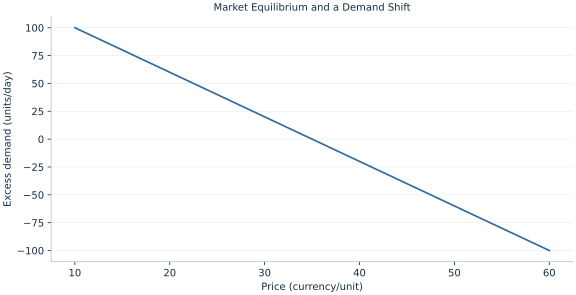

# Lab 03 · Market Equilibrium and a Demand Shift

> How does a demand shift differ from moving along a demand curve?

## Start with the supplied observations

Download [market_equilibrium.xlsx](market_equilibrium.xlsx) and [the complete Python analysis](lab.py). Import the workbook into OpenEconometrics without renaming it. Open the complete Python file in an empty Python document and run the whole file. The first sheet, **Data**, contains the observations. **Dictionary** explains variables, coding, units and missing cells.

For ordinary Python, keep the workbook beside `lab.py`. For another location, use `from lab import run_lab`, then `run_lab(data_path="/path/to/market_equilibrium.xlsx")`. Keep the supplied workbook intact and use a copy for transformations. The [LaTeX result table](table.tex) accompanies the chapter.

The workbook contains **51 original synthetic observations**. Its observational unit is: One hypothetical market price scenario. These are teaching observations, not an empirical estimate about an actual business, population or policy. Every student starts from the same stored values and missing cells.

| Variable | Meaning | Unit or coding | Missing cells |
|---|---|---|---:|
| `price` | Market price | currency/unit | 0 |
| `demand` | Quantity demanded | units/day | 0 |
| `supply` | Quantity supplied | units/day | 0 |

## 1. Build the comparison

A market equilibrium equates quantities demanded and supplied at a common price. A point away from equality represents excess demand or excess supply, not a second equilibrium. The graph here plots excess demand directly; its zero identifies the clearing price.

An own-price change moves along a fixed demand curve. An increase in the demand intercept changes desired purchases at every price, shifting the curve. When supply slopes upward, a positive demand shift raises both equilibrium price and quantity. This comparative static holds the supply equation fixed.

$$
Q_D=120-2P,\quad Q_S=-20+2P,\quad P^*=35,\ Q^*=50;\qquad Q_D^{new}=140-2P.
$$

Equate the two linear equations and collect four price terms on one side. Add 20 to the demand intercept for the new scenario, then solve again. Do not add 20 directly to equilibrium quantity because the induced price rise offsets part of the shift.

## 2. State the assumptions and sample

A homogeneous divisible good, price-taking behavior and a single static market are assumed. Curves are stipulated schedules, with no estimation noise. The workbook restricts prices so quantities remain nonnegative.

**Pause before running.** Solve the original equilibrium.

## 3. Follow the application

The complete file loads the supplied observations, applies the chapter's explicit sample rule, computes the procedure and displays the result, a chart and a compact numerical table. The following shortened call highlights the statistical operation. `load_data()` and the other chapter helpers are defined in the full file; run that file before using the snippet.

```python
import openecon as oe

raw = load_data()
demand_intercept = raw.demand.iloc[0] + 2 * raw.price.iloc[0]
supply_intercept = raw.supply.iloc[0] - 2 * raw.price.iloc[0]
price = (demand_intercept - supply_intercept) / 4
quantity = demand_intercept - 2 * price
display(oe.DataFrame({"price": [price], "quantity": [quantity]}))
```

Read the output in this order: establish which observations were used, identify the quantity being compared, inspect the amount of variation or uncertainty, and then interpret the result in the units of the question. A large statistic without its denominator, sample and comparison cannot explain the result. The final numerical table puts the quantities used in the worked discussion together; the procedure output retains the fuller set of tables.

## 4. Interpret the executed example

| Quantity | Computed value |
|---|---:|
| Equilibrium price | 35 |
| Equilibrium quantity | 50 |
| Shifted price | 40 |
| Shifted quantity | 60 |
| Excess demand at 30 | 20 |

The market clears at price 35 and quantity 50. The demand shift raises price to 40 and quantity to 60. At price 30, excess demand is 20 units/day.



The chart is computed from the supplied scenarios using the stated equations. Its coordinates are retained with the numerical result. Read axis units before comparing its slopes; a change of scale can alter visual steepness without changing the underlying trade-off.

## 5. Decide what the evidence supports

A static crossing does not describe adjustment speed, rationing institutions or uncertainty. Observed price/quantity pairs alone would not identify separate demand and supply slopes.

## 6. Try it yourself

**A.** Solve the original equilibrium.

**B.** What is excess demand at 30?

**C.** Why does quantity not rise by 20?

**D.** Would a supply shift have the same price sign?

## Further reading

[OpenStax, Principles of Microeconomics 3e](https://openstax.org/books/principles-microeconomics-3e/pages/1-introduction) is optional background reading. The models, scenarios, questions and analysis here are original; no textbook exercises or datasets are reproduced.
