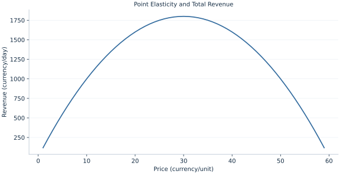

# Lab 04 · Point Elasticity and Total Revenue

> When does raising price increase revenue?

## Start with the supplied observations

Download [elasticity_revenue.xlsx](elasticity_revenue.xlsx) and [the complete Python analysis](lab.py). Import the workbook into OpenEconometrics without renaming it. Open the complete Python file in an empty Python document and run the whole file. The first sheet, **Data**, contains the observations. **Dictionary** explains variables, coding, units and missing cells.

For ordinary Python, keep the workbook beside `lab.py`. For another location, use `from lab import run_lab`, then `run_lab(data_path="/path/to/elasticity_revenue.xlsx")`. Keep the supplied workbook intact and use a copy for transformations. The [LaTeX result table](table.tex) accompanies the chapter.

The workbook contains **59 original synthetic observations**. Its observational unit is: One price on a linear demand schedule. These are teaching observations, not an empirical estimate about an actual business, population or policy. Every student starts from the same stored values and missing cells.

| Variable | Meaning | Unit or coding | Missing cells |
|---|---|---|---:|
| `price` | Own price | currency/unit | 0 |
| `quantity` | Demand 120−2P | units/day | 0 |

## 1. Build the comparison

Elasticity converts a slope into a unit-free local percentage response. A linear demand curve has a constant slope but varying elasticity because price and quantity change along it. At low prices its demand is relatively inelastic; near the choke price the same absolute quantity response becomes a large fraction of remaining demand.

Revenue is price times quantity. Differentiating gives quantity plus price times the demand slope. Rewriting that expression as Q(1+ε) connects the sign of a marginal revenue change with elasticity. Revenue maximization is not profit maximization unless marginal cost is zero.

$$
\epsilon=\frac{dQ}{dP}\frac{P}{Q}=-\frac{2P}{120-2P},\quad R=120P-2P^2,\quad dR/dP=Q(1+\epsilon).
$$

At P=20, Q=80 and elasticity is −.5. Revenue reaches an interior maximum where 120−4P=0, giving P=30 and unit elasticity. A discrete price increase should be checked with the exact revenue difference rather than treating the derivative as exact over a large interval.

## 2. State the assumptions and sample

The stipulated demand curve is differentiable; prices and quantities are positive. Its grid contains the analytic optimum exactly. Other determinants of demand remain fixed.

**Pause before running.** Does constant slope imply constant elasticity?

## 3. Follow the application

The complete file loads the supplied observations, applies the chapter's explicit sample rule, computes the procedure and displays the result, a chart and a compact numerical table. The following shortened call highlights the statistical operation. `load_data()` and the other chapter helpers are defined in the full file; run that file before using the snippet.

```python
import openecon as oe

raw = load_data()
revenue = raw.price * raw.quantity
elasticity = -2 * raw.price / raw.quantity
display(oe.DataFrame({"price": raw.price, "elasticity": elasticity, "revenue": revenue}))
```

Read the output in this order: establish which observations were used, identify the quantity being compared, inspect the amount of variation or uncertainty, and then interpret the result in the units of the question. A large statistic without its denominator, sample and comparison cannot explain the result. The final numerical table puts the quantities used in the worked discussion together; the procedure output retains the fuller set of tables.

## 4. Interpret the executed example

| Quantity | Computed value |
|---|---:|
| Evaluation price | 20 |
| Quantity at evaluation | 80 |
| Point elasticity | -0.5 |
| Revenue at evaluation | 1600 |
| Revenue max price | 30 |
| Maximum revenue | 1800 |

At 20, quantity is 80 and elasticity -0.5. Revenue is 1600. It peaks at price 30 with revenue 1800 currency/day.



The chart is computed from the supplied scenarios using the stated equations. Its coordinates are retained with the numerical result. Read axis units before comparing its slopes; a change of scale can alter visual steepness without changing the underlying trade-off.

## 5. Decide what the evidence supports

A local elasticity need not predict a large price change. Revenue excludes production costs, so its maximum is not a general recommendation for a firm’s price.

## 6. Try it yourself

**A.** Does constant slope imply constant elasticity?

**B.** Find the revenue maximum.

**C.** What happens to elasticity when quantity approaches zero?

**D.** Does the revenue optimum maximize profit with positive MC?

## Further reading

[OpenStax, Principles of Microeconomics 3e](https://openstax.org/books/principles-microeconomics-3e/pages/1-introduction) is optional background reading. The models, scenarios, questions and analysis here are original; no textbook exercises or datasets are reproduced.
