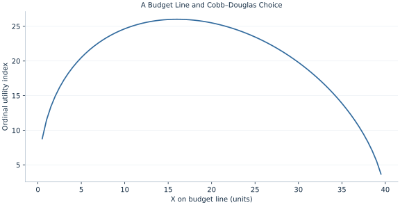

# Lab 05 · A Budget Line and Cobb–Douglas Choice

> How do preferences and a budget determine a consumption bundle?

## Start with the supplied observations

Download [consumer_choice.xlsx](consumer_choice.xlsx) and [the complete Python analysis](lab.py). Import the workbook into OpenEconometrics without renaming it. Open the complete Python file in an empty Python document and run the whole file. The first sheet, **Data**, contains the observations. **Dictionary** explains variables, coding, units and missing cells.

For ordinary Python, keep the workbook beside `lab.py`. For another location, use `from lab import run_lab`, then `run_lab(data_path="/path/to/consumer_choice.xlsx")`. Keep the supplied workbook intact and use a copy for transformations. The [LaTeX result table](table.tex) accompanies the chapter.

The workbook contains **79 original synthetic observations**. Its observational unit is: One candidate bundle on a budget line. These are teaching observations, not an empirical estimate about an actual business, population or policy. Every student starts from the same stored values and missing cells.

| Variable | Meaning | Unit or coding | Missing cells |
|---|---|---|---:|
| `x` | Candidate X consumption | units X | 0 |
| `y` | Affordable Y consumption | units Y | 0 |
| `income` | Budget | currency | 0 |
| `px` | Price X | currency/X | 0 |
| `py` | Price Y | currency/Y | 0 |
| `alpha` | X expenditure share parameter | fraction | 0 |

## 1. Build the comparison

The budget line records affordable combinations, with slope −pX/pY. Cobb–Douglas utility orders bundles by x^α y^(1−α). Its numerical level is an index, not a directly comparable measure of happiness across people. Positive prices, income and shares produce an interior solution.

At an interior optimum, marginal utility per currency unit is equal across goods. Equivalently, the marginal rate of substitution equals the price ratio. Combining this tangency with budget exhaustion yields fixed expenditure shares: α of income on X and 1−α on Y.

$$
\max_{x,y>0}x^\alpha y^{1-\alpha}\quad s.t.\ p_xx+p_yy=m;\quad x^*=\alpha m/p_x,\ y^*=(1-\alpha)m/p_y.
$$

Dividing marginal utilities gives MRS=αy/[(1−α)x]. Set it equal to pX/pY and substitute into the budget. At α=.4, m=120, pX=3 and pY=2, the resulting bundle is interior and affordable.

## 2. State the assumptions and sample

Preferences are strictly monotone and convex, goods divisible, prices positive and there is no saving or borrowing. The utility index is ordinal. Grid rows illustrate feasible bundles; the optimum is computed analytically, not chosen by a coarse grid search.

**Pause before running.** How much income is spent on X?

## 3. Follow the application

The complete file loads the supplied observations, applies the chapter's explicit sample rule, computes the procedure and displays the result, a chart and a compact numerical table. The following shortened call highlights the statistical operation. `load_data()` and the other chapter helpers are defined in the full file; run that file before using the snippet.

```python
import openecon as oe

raw = load_data()
budget = raw.iloc[0]
x = budget.alpha * budget.income / budget.px
y = (1 - budget.alpha) * budget.income / budget.py
display(oe.DataFrame({"optimal_x": [x], "optimal_y": [y]}))
```

Read the output in this order: establish which observations were used, identify the quantity being compared, inspect the amount of variation or uncertainty, and then interpret the result in the units of the question. A large statistic without its denominator, sample and comparison cannot explain the result. The final numerical table puts the quantities used in the worked discussion together; the procedure output retains the fuller set of tables.

## 4. Interpret the executed example

| Quantity | Computed value |
|---|---:|
| Optimal x | 16 |
| Optimal y | 36 |
| Utility index | 26.0273 |
| Spending x | 48 |
| Spending y | 72 |
| Mrs y per x | 1.5 |
| Price ratio | 1.5 |

The optimum is X=16 and Y=36. Spending is 48 on X and 72 on Y. MRS=1.5 equals the price ratio 1.5.



The chart is computed from the supplied scenarios using the stated equations. Its coordinates are retained with the numerical result. Read axis units before comparing its slopes; a change of scale can alter visual steepness without changing the underlying trade-off.

## 5. Decide what the evidence supports

Tangency is not universal: perfect substitutes or quantity constraints can produce corner solutions. This utility specification imposes constant shares rather than estimating preferences.

## 6. Try it yourself

**A.** How much income is spent on X?

**B.** Check affordability.

**C.** Can utility levels be compared across people?

**D.** What if prices and income all double?

## Further reading

[OpenStax, Principles of Microeconomics 3e](https://openstax.org/books/principles-microeconomics-3e/pages/1-introduction) is optional background reading. The models, scenarios, questions and analysis here are original; no textbook exercises or datasets are reproduced.
