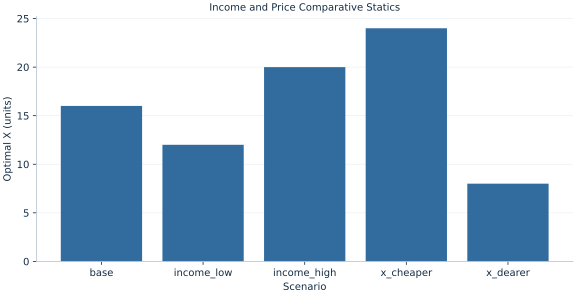

# Lab 06 · Income and Price Comparative Statics

> What changes when income rises, and what changes when only one price rises?

## Start with the supplied observations

Download [demand_comparative_statics.xlsx](demand_comparative_statics.xlsx) and [the complete Python analysis](lab.py). Import the workbook into OpenEconometrics without renaming it. Open the complete Python file in an empty Python document and run the whole file. The first sheet, **Data**, contains the observations. **Dictionary** explains variables, coding, units and missing cells.

For ordinary Python, keep the workbook beside `lab.py`. For another location, use `from lab import run_lab`, then `run_lab(data_path="/path/to/demand_comparative_statics.xlsx")`. Keep the supplied workbook intact and use a copy for transformations. The [LaTeX result table](table.tex) accompanies the chapter.

The workbook contains **5 original synthetic observations**. Its observational unit is: One consumer budget scenario. These are teaching observations, not an empirical estimate about an actual business, population or policy. Every student starts from the same stored values and missing cells.

| Variable | Meaning | Unit or coding | Missing cells |
|---|---|---|---:|
| `scenario` | Scenario label | text | 0 |
| `income` | Budget | currency | 0 |
| `px` | Price X | currency/X | 0 |
| `py` | Price Y | currency/Y | 0 |
| `alpha` | X share | fraction | 0 |

## 1. Build the comparison

Comparative statics vary one external parameter while holding the others fixed. An income change shifts the budget line in parallel; an X price change rotates it around the Y intercept. Cobb–Douglas demand makes these responses transparent because each good receives a constant expenditure share.

Both goods are normal here: a proportional income rise raises both quantities by the same proportion. X demand has own-price elasticity −1, while Y demand has zero uncompensated cross-price response to pX. That zero cross response is a feature of these preferences, not a general law for consumer demand.

$$
x=\alpha m/p_x,\quad y=(1-\alpha)m/p_y;\quad \eta_{xm}=1,\quad \epsilon_{xp_x}=-1,\quad \epsilon_{yp_x}=0.
$$

Differentiate X demand with respect to income and multiply by m/x to obtain one. Differentiating with respect to pX gives −αm/pX²; multiplying by pX/x yields −1. A common proportional scaling of all prices and income cancels from both demands.

## 2. State the assumptions and sample

Preferences and share α=.4 remain fixed across scenarios. Only labeled budget components change. Scenario rows are comparative-static model inputs, not repeated measurements from an observed household.

**Pause before running.** How does a 25% income rise affect quantities?

## 3. Follow the application

The complete file loads the supplied observations, applies the chapter's explicit sample rule, computes the procedure and displays the result, a chart and a compact numerical table. The following shortened call highlights the statistical operation. `load_data()` and the other chapter helpers are defined in the full file; run that file before using the snippet.

```python
import openecon as oe

raw = load_data()
x = raw.alpha * raw.income / raw.px
y = (1 - raw.alpha) * raw.income / raw.py
display(oe.DataFrame({"scenario": raw.scenario, "x": x, "y": y}))
```

Read the output in this order: establish which observations were used, identify the quantity being compared, inspect the amount of variation or uncertainty, and then interpret the result in the units of the question. A large statistic without its denominator, sample and comparison cannot explain the result. The final numerical table puts the quantities used in the worked discussion together; the procedure output retains the fuller set of tables.

## 4. Interpret the executed example

| Quantity | Computed value |
|---|---:|
| Base x | 16 |
| Base y | 36 |
| High income x | 20 |
| High income y | 45 |
| Dearer x | 8 |
| Dearer y | 36 |
| Income elasticity x | 1 |
| Own price elasticity x | -1 |

Base quantities are 16 X and 36 Y. With income 150 they become 20 and 45. Doubling pX produces 8 X while Y remains 36.



The chart is computed from the supplied scenarios using the stated equations. Its coordinates are retained with the numerical result. Read axis units before comparing its slopes; a change of scale can alter visual steepness without changing the underlying trade-off.

## 5. Decide what the evidence supports

These elasticities are imposed by Cobb–Douglas preferences. They do not establish actual consumer responses or substitution patterns across arbitrary goods.

## 6. Try it yourself

**A.** How does a 25% income rise affect quantities?

**B.** Why does Y remain unchanged when pX doubles?

**C.** Are these goods inferior?

**D.** Is zero cross-price response universal?

## Further reading

[OpenStax, Principles of Microeconomics 3e](https://openstax.org/books/principles-microeconomics-3e/pages/1-introduction) is optional background reading. The models, scenarios, questions and analysis here are original; no textbook exercises or datasets are reproduced.
