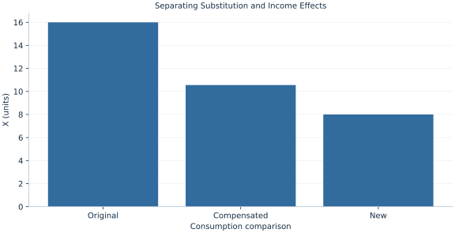

# Lab 07 · Separating Substitution and Income Effects

> How much of a price response reflects substitution rather than lost purchasing power?

## Start with the supplied observations

Download [substitution_income.xlsx](substitution_income.xlsx) and [the complete Python analysis](lab.py). Import the workbook into OpenEconometrics without renaming it. Open the complete Python file in an empty Python document and run the whole file. The first sheet, **Data**, contains the observations. **Dictionary** explains variables, coding, units and missing cells.

For ordinary Python, keep the workbook beside `lab.py`. For another location, use `from lab import run_lab`, then `run_lab(data_path="/path/to/substitution_income.xlsx")`. Keep the supplied workbook intact and use a copy for transformations. The [LaTeX result table](table.tex) accompanies the chapter.

The workbook contains **2 original synthetic observations**. Its observational unit is: One price scenario with a common preference specification. These are teaching observations, not an empirical estimate about an actual business, population or policy. Every student starts from the same stored values and missing cells.

| Variable | Meaning | Unit or coding | Missing cells |
|---|---|---|---:|
| `px` | X price | currency/X | 0 |
| `py` | Y price | currency/Y | 0 |
| `income` | Income | currency | 0 |
| `alpha` | X share | fraction | 0 |

## 1. Build the comparison

An own-price increase changes both relative prices and attainable utility. Hicks compensation adjusts income at the new prices to keep original utility attainable. Comparing original and compensated choices isolates substitution at fixed utility; comparing compensated and uncompensated new choices gives the income component.

This is a finite Hicks decomposition. It should not be called finite Slutsky compensation, which instead makes the original bundle just affordable. The two concepts coincide to first order for small changes but differ for a price doubling.

$$
m^c=m(p_x^{new}/p_x^{old})^\alpha,\quad \Delta x=[x^H(p^{new},u_0)-x_0]+[x_1-x^H(p^{new},u_0)].
$$

The Cobb–Douglas expenditure function scales with pX^α when other prices and original utility are fixed. Compute compensated income, then use constant expenditure shares at new prices. Verify original and compensated utility directly before adding the effects.

## 2. State the assumptions and sample

Prices are positive, only pX changes, preferences stay fixed, and compensation is Hicksian. Goods are normal and divisible; no quantity constraints or borrowing issue is introduced.

**Pause before running.** Do the two components sum correctly?

## 3. Follow the application

The complete file loads the supplied observations, applies the chapter's explicit sample rule, computes the procedure and displays the result, a chart and a compact numerical table. The following shortened call highlights the statistical operation. `load_data()` and the other chapter helpers are defined in the full file; run that file before using the snippet.

```python
import openecon as oe

raw = load_data()
old, new = raw.iloc[0], raw.iloc[1]
compensated_income = old.income * (new.px / old.px)**old.alpha
compensated_x = old.alpha * compensated_income / new.px
display(oe.DataFrame({"compensated_income": [compensated_income], "compensated_x": [compensated_x]}))
```

Read the output in this order: establish which observations were used, identify the quantity being compared, inspect the amount of variation or uncertainty, and then interpret the result in the units of the question. A large statistic without its denominator, sample and comparison cannot explain the result. The final numerical table puts the quantities used in the worked discussion together; the procedure output retains the fuller set of tables.

## 4. Interpret the executed example

| Quantity | Computed value |
|---|---:|
| Original x | 16 |
| New x | 8 |
| Hicks compensated income | 158.341 |
| Compensated x | 10.5561 |
| Hicks substitution effect | -5.44394 |
| Income effect | -2.55606 |
| Total effect | -8 |
| Original utility | 26.0273 |
| Compensated utility | 26.0273 |

X falls from 16 to 8. Compensated income is 158.341 and compensated X 10.5561. Substitution contributes -5.44394 X; the income component -2.55606. They sum to -8.



The chart is computed from the supplied scenarios using the stated equations. Its coordinates are retained with the numerical result. Read axis units before comparing its slopes; a change of scale can alter visual steepness without changing the underlying trade-off.

## 5. Decide what the evidence supports

For inferior goods the income effect can oppose substitution. This example’s signs follow from normal Cobb–Douglas demand. Compensated income is a hypothetical comparison, not an actual transfer received.

## 6. Try it yourself

**A.** Do the two components sum correctly?

**B.** What is held fixed by Hicks compensation?

**C.** Is the original bundle merely made affordable?

**D.** Why are both effects negative?

## Further reading

[OpenStax, Principles of Microeconomics 3e](https://openstax.org/books/principles-microeconomics-3e/pages/1-introduction) is optional background reading. The models, scenarios, questions and analysis here are original; no textbook exercises or datasets are reproduced.
