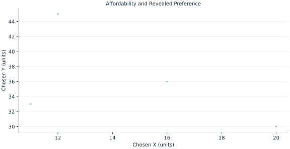

# Lab 08 · Affordability and Revealed Preference

> What can observed choices reveal when another bundle was affordable?

## Start with the supplied observations

Download [revealed_preference.xlsx](revealed_preference.xlsx) and [the complete Python analysis](lab.py). Import the workbook into OpenEconometrics without renaming it. Open the complete Python file in an empty Python document and run the whole file. The first sheet, **Data**, contains the observations. **Dictionary** explains variables, coding, units and missing cells.

For ordinary Python, keep the workbook beside `lab.py`. For another location, use `from lab import run_lab`, then `run_lab(data_path="/path/to/revealed_preference.xlsx")`. Keep the supplied workbook intact and use a copy for transformations. The [LaTeX result table](table.tex) accompanies the chapter.

The workbook contains **4 original synthetic observations**. Its observational unit is: One observed synthetic price/bundle choice. These are teaching observations, not an empirical estimate about an actual business, population or policy. Every student starts from the same stored values and missing cells.

| Variable | Meaning | Unit or coding | Missing cells |
|---|---|---|---:|
| `choice_id` | Choice identifier | ID | 0 |
| `px` | Price X | currency/X | 0 |
| `py` | Price Y | currency/Y | 0 |
| `income` | Income | currency | 0 |
| `x` | Chosen X | units | 0 |
| `y` | Chosen Y | units | 0 |

## 1. Build the comparison

If a consumer selects bundle A while bundle B is affordable, A is directly revealed preferred to B under stable preferences and utility maximization. Prices from the occasion of A’s choice determine whether B was affordable. Using B’s own prices for both comparisons would answer the wrong question.

The weak axiom rules out a strict reverse affordability pattern for distinct chosen bundles. This lab enumerates ordered two-choice comparisons and tests that condition with a declared numerical tolerance. It does not implement the full transitive GARP test, so passing this exercise must not be labeled a full nonparametric rationality certificate.

$$
p^i\!\cdot x^j\le m_i\Rightarrow x^iR^Dx^j;\qquad x^iR^Dx^j\Rightarrow p^j\!\cdot x^i\ge m_j\ \text{for the strict reverse check}.
$$

For each ordered pair i,j, value bundle j using prices i and compare with budget i. If affordable, value bundle i using prices j and check for a strict reverse inequality. Preserve pair direction; the two costs use different price vectors.

## 2. State the assumptions and sample

Preferences are stable, every chosen bundle exhausts its budget, measurement error is absent and ties use tolerance 1e−10. These choices are generated from the same monotone Cobb–Douglas preference. Only the stated WARP check is performed.

**Pause before running.** Which prices value an alternative in observation i?

## 3. Follow the application

The complete file loads the supplied observations, applies the chapter's explicit sample rule, computes the procedure and displays the result, a chart and a compact numerical table. The following shortened call highlights the statistical operation. `load_data()` and the other chapter helpers are defined in the full file; run that file before using the snippet.

```python
import openecon as oe

raw = load_data()
chosen = raw.iloc[0]
alternative_cost = chosen.px * raw.x + chosen.py * raw.y
display(oe.DataFrame({"alternative_id": raw.choice_id, "cost_at_first_prices": alternative_cost,
                      "affordable_at_first_budget": alternative_cost <= chosen.income + 1e-10}))
```

Read the output in this order: establish which observations were used, identify the quantity being compared, inspect the amount of variation or uncertainty, and then interpret the result in the units of the question. A large statistic without its denominator, sample and comparison cannot explain the result. The final numerical table puts the quantities used in the worked discussion together; the procedure output retains the fuller set of tables.

## 4. Interpret the executed example

| Quantity | Computed value |
|---|---:|
| Choices | 4 |
| Ordered direct comparisons | 4 |
| Warp violations | 0 |
| Max budget error | 0 |

There are 4 choices and 4 direct ordered affordability comparisons. Strict WARP violations total 0; maximum budget error is 0 currency.



The chart is computed from the supplied scenarios using the stated equations. Its coordinates are retained with the numerical result. Read axis units before comparing its slopes; a change of scale can alter visual steepness without changing the underlying trade-off.

## 5. Decide what the evidence supports

No observed violation does not identify unique preferences or prove consistency in unobserved budgets. A full GARP analysis would additionally examine transitive revealed-preference chains.

## 6. Try it yourself

**A.** Which prices value an alternative in observation i?

**B.** How many strict violations are found?

**C.** Does a pass identify α=.4 uniquely?

**D.** Is this a complete GARP test?

## Further reading

[OpenStax, Principles of Microeconomics 3e](https://openstax.org/books/principles-microeconomics-3e/pages/1-introduction) is optional background reading. The models, scenarios, questions and analysis here are original; no textbook exercises or datasets are reproduced.
