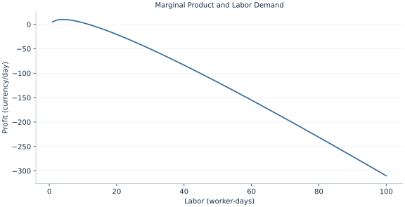

# Lab 09 · Marginal Product and Labor Demand

> When should a firm stop adding labor to a fixed technology?

## Start with the supplied observations

Download [production_input.xlsx](production_input.xlsx) and [the complete Python analysis](lab.py). Import the workbook into OpenEconometrics without renaming it. Open the complete Python file in an empty Python document and run the whole file. The first sheet, **Data**, contains the observations. **Dictionary** explains variables, coding, units and missing cells.

For ordinary Python, keep the workbook beside `lab.py`. For another location, use `from lab import run_lab`, then `run_lab(data_path="/path/to/production_input.xlsx")`. Keep the supplied workbook intact and use a copy for transformations. The [LaTeX result table](table.tex) accompanies the chapter.

The workbook contains **100 original synthetic observations**. Its observational unit is: One short-run labor input plan. These are teaching observations, not an empirical estimate about an actual business, population or policy. Every student starts from the same stored values and missing cells.

| Variable | Meaning | Unit or coding | Missing cells |
|---|---|---|---:|
| `labor` | Labor input | worker-days | 0 |
| `output` | Output 10 sqrt(L) | units/day | 0 |

## 1. Build the comparison

Marginal product is the extra output from a small increase in labor, holding fixed inputs constant. Diminishing marginal product means additional workers add less output as labor rises. A price-taking firm values this extra output at the market output price.

At an interior short-run profit maximum, value of marginal product equals the wage. A fixed cost lowers profit but does not change this marginal hiring condition. Whether a firm should enter, exit or produce zero is a separate question involving avoidable costs and the relevant horizon.

$$
q=10\sqrt L,\quad MP_L=5/\sqrt L,\quad \pi=2q-5L-10,\quad 2MP_L=5.
$$

Differentiate revenue minus variable cost with respect to L. Solve 10/sqrt(L)=5 to obtain L=4. The second derivative is negative, confirming the interior maximum. The grid includes L=4, allowing its numerical maximum to agree with the analytic solution.

## 2. State the assumptions and sample

Labor is divisible, capital fixed, output sells at price 2, wages are 5 and fixed cost 10 is incurred in the short run. Productivity is deterministic and known. Workbook rows are production alternatives, not random employees.

**Pause before running.** Find optimal labor.

## 3. Follow the application

The complete file loads the supplied observations, applies the chapter's explicit sample rule, computes the procedure and displays the result, a chart and a compact numerical table. The following shortened call highlights the statistical operation. `load_data()` and the other chapter helpers are defined in the full file; run that file before using the snippet.

```python
import openecon as oe

raw = load_data()
price, wage = 2., 5.
labor = (price * 5 / wage)**2
output = 10 * math.sqrt(labor)
display(oe.DataFrame({"labor": [labor], "output": [output]}))
```

Read the output in this order: establish which observations were used, identify the quantity being compared, inspect the amount of variation or uncertainty, and then interpret the result in the units of the question. A large statistic without its denominator, sample and comparison cannot explain the result. The final numerical table puts the quantities used in the worked discussion together; the procedure output retains the fuller set of tables.

## 4. Interpret the executed example

| Quantity | Computed value |
|---|---:|
| Output price | 2 |
| Wage | 5 |
| Optimal labor | 4 |
| Optimal output | 20 |
| Marginal product at optimum | 2.5 |
| Profit after fixed cost | 10 |
| Grid profit maximum | 10 |

Optimal labor is 4 worker-days, output 20 units/day and profit after fixed cost 10 currency/day. Marginal product 2.5 times price equals the wage.



The chart is computed from the supplied scenarios using the stated equations. Its coordinates are retained with the numerical result. Read axis units before comparing its slopes; a change of scale can alter visual steepness without changing the underlying trade-off.

## 5. Decide what the evidence supports

The first-order condition assumes an interior choice and price taking. It does not account for indivisible workers, adjustment costs or an uncertain output price.

## 6. Try it yourself

**A.** Find optimal labor.

**B.** Calculate output.

**C.** Would doubling fixed cost change the interior hiring rule?

**D.** What if the firm had monopoly power?

## Further reading

[OpenStax, Principles of Microeconomics 3e](https://openstax.org/books/principles-microeconomics-3e/pages/1-introduction) is optional background reading. The models, scenarios, questions and analysis here are original; no textbook exercises or datasets are reproduced.
